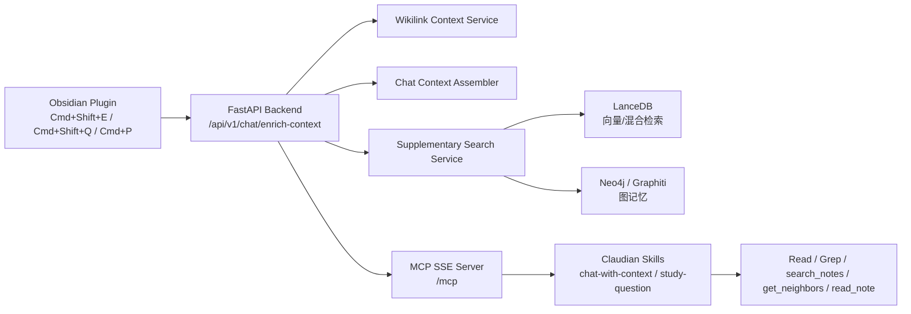
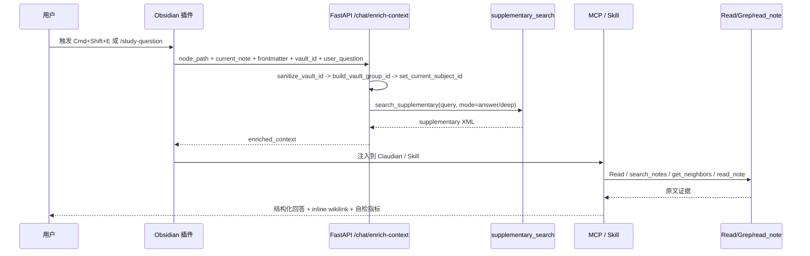

# Canvas Learning System 开发状态深度研究报告

已使用的 GitHub 连接器：urlGitHubhttps://github.com（仓库：urloinani0721/canvas-learning-systemhttps://github.com/oinani0721/canvas-learning-system；本次重点审阅分支：`worktree-feature-obsidian-hybrid-dev`）

## 执行摘要

基于当前分支的代码、验收文档与近期提交，我对这个系统的整体判断是：**它已经不是"概念原型"，而是一个可运行的、以本地单用户学习场景为中心的 AI 学习工作台 / PKM 学习副驾 Beta；但它还不是一个通用 LMS。** 最近几次关键提交集中在四件事：`study-question` 深度学习模式上线、`chat-with-context` 与 `read_note` 结合以提升证据核验、`vault_id` 必填与 ContextVar 隔离以防多 Vault 串库、以及对依赖与检索链路的补丁式加固。fileciteturn8file0 fileciteturn6file0 fileciteturn7file0 fileciteturn5file0

从产品定位上看，仓库已经形成一条清晰主线：**Obsidian 桌面插件 + FastAPI 后端 + Neo4j 图记忆 + LanceDB 检索 + MCP 工具暴露 + Skill 编排**。这条链路对"个人知识库驱动的学习对话、节点派生、掌握度追踪、检索增强、题目深挖"非常强，但对"课程 roster、班级讨论、教务角色、标准化作业/成绩册、移动端"这些典型 LMS 能力仍明显不足。README 也把它描述为基于 Obsidian Canvas 的 AI 学习系统，而插件清单则直接声明 `isDesktopOnly: true`。fileciteturn4file0 fileciteturn38file0

如果按"研发状态"分层，我会把它放在：**核心技术闭环已打通，工程化基础中等偏上，产品广度明显不足**。`sprint-status.yaml` 显示 Epic 1 完成，Epic 2 和 Epic 3 处于进行中，而 Epic 4–9 大量功能仍在 backlog / ready-for-dev；这意味着系统在"内核能力"上前进较快，但在"完整教学产品面"上仍有大量未完成项。fileciteturn18file0

当前最值得肯定的地方有三个。第一，**RAG + KG + Skill** 的学习场景设计已经相当具体，不是空泛"聊天机器人"；第二，**多 Vault 隔离**被提升为一等公民问题，且已有验收单和并发测试；第三，**Prompt Injection / 证据核验**意识明显强于多数个人项目。当前最需要优先处理的风险也有三个：第一，**部署默认值偏开发态**，如 `DEBUG=true`、Neo4j 默认密码 fallback、开发向 CORS；第二，**检索链路存在已知可靠性缺口**，仓库里甚至保留了绕过 RAGService 和 LangGraph 的原始 LanceDB fallback；第三，**文档真相源分裂**，README、sprint-status、若干规格文档之间存在架构时代差和编号差。fileciteturn16file0 fileciteturn28file0 fileciteturn31file0 fileciteturn18file0

## 当前代码库概览

从语言和技术栈上看，这个仓库已经是典型的**多技术面系统**。后端以 Python 为主，依赖 `fastapi`、`uvicorn`、`pydantic-settings`、`neo4j`、`lancedb`、`langgraph`、`graphiti-core`、`prometheus-client`、`structlog`、`fsrs` 等；前端是 Obsidian 插件，使用 TypeScript、esbuild 和 Obsidian API；同时还包含大量 Markdown/YAML 规格、技能文档、UAT 和 Docker 配置。fileciteturn14file0 fileciteturn13file0 fileciteturn15file0

| 维度 | 当前状态 | 关键证据 |
|---|---|---|
| 后端语言与框架 | Python + FastAPI + Uvicorn + Pydantic | `backend/requirements.txt` 中包含 `fastapi`、`uvicorn[standard]`、`pydantic`、`pydantic-settings`；`backend/app/main.py` 为 FastAPI 入口。 |
| 检索与知识层 | LanceDB + Neo4j + Graphiti + LangGraph + BGE-M3/重排 | `requirements.txt` 中显式依赖 `lancedb`、`neo4j`、`graphiti-core`、`langgraph`、`sentence-transformers`、`FlagEmbedding`。 |
| 前端形态 | Obsidian 桌面插件，不是 Web LMS | `frontend/obsidian-plugin/manifest.json` 含 `"isDesktopOnly": true`；`package.json` 为插件构建与测试脚本。 |
| 类型安全与构建 | TypeScript 启用 `noImplicitAny` 与 `strictNullChecks`，但未见完整 `strict: true` | `tsconfig.json` 中启用 `noImplicitAny`、`strictNullChecks`。 |
| 测试与工具链 | Python 侧有 pytest / pytest-bdd / schemathesis；插件侧有 node test 脚本 | `pyproject.toml` 配置 pytest marker 与 Schemathesis；`package.json` 定义前端测试命令。 |
| 交付形态 | 本地 Docker Compose 为主，未证实已形成生产级云交付链 | 根目录存在 `docker-compose.yml` 与 `backend/Dockerfile`。 |

README 的覆盖面相当广，从项目结构、技术栈到安装与 API 路径都有描述，属于"内容很多"的那一类文档。但它和当前分支的现实之间已经出现了轻微漂移：一方面，README 仍保留大量"完整系统愿景"与较宽口径的目录说明；另一方面，当前分支的最近提交与 Skill 文件，已经把真实工作的重心收缩到 **Obsidian Hybrid 架构、RAG 对话、study-question、multi-vault** 等可交付能力上。再加上 `sprint-status.yaml` 自己就明确承认"旧 sprint 编号体系"和"epics.md 真相源"之间有映射差，说明**文档丰富不等于 SoT 单一**。

最近四个关键提交也很能说明当前阶段的研发方向：

| 提交 | 我看到的主题 | 研究判断 |
|---|---|---|
| `c017269` | 新增 `study-question` Skill 与多处插件改动 | 深度学习问答模式真正成型，不再只是快捷问答。 |
| `cd9d0f7` | `chat-with-context` 也接入 `read_note`，并显式回应 "lost in the middle" 问题 | 证据核验从"看 snippet"升级到"Read 原文后再答"，这是正确方向。 |
| `460377c` | `vault_id` 必填、ContextVar 注入、8 个多 Vault 测试 | 多 Vault 并发隔离被视为 P0 问题，并已进入 UAT。 |
| `a4c1d95` | `requirements.txt` 升级与 `mcp.json` / chat skill / main.ts 整合 | 最近一轮是"把前面补丁与文档、依赖、安全修复收口"的整合提交。 |

## 系统架构与数据流

系统当前的主架构可以概括成一句话：**桌面端 Obsidian 插件承载交互，FastAPI 后端负责上下文拼装与检索，Neo4j/LanceDB 存储图与向量记忆，MCP 把这些能力反向暴露给 Skill。** 其中 `chat.py` 是最核心的编排入口之一：它接收 `node_path`、当前笔记内容、frontmatter、`vault_id`、`user_question`、`mode` 等字段，先做 Vault 级隔离，再组装 wikilink 邻居与补充材料。

这张图对应的代码证据很明确：`canvas-vault/.claude/mcp.json` 把 `canvas-learning-mcp` 配成 SSE MCP 服务器；`chat.py` 的 `EnrichContextRequest` 已含 `vault_id`、`mode` 和 `user_question`；`subject_config.py` 用 `build_vault_group_id()` 与 ContextVar 传播请求级隔离；`note_search_tools.py` 则把 `search_notes` 暴露成 MCP 工具，并说明其下游是"6-source parallel retrieval pipeline"。

`study-question` 和 `chat-with-context` 两个 Skill 已经不是"几句 prompt"，而是接近**可执行的对话协议**。例如 `study-question` 明确区分路径 A/B/C，要求意图分类、子查询拆解、强制 Read ≥ 5 个独立文件、2-hop BFS、RAGAS-lite 自检，以及末尾完整 dump supplementary；`chat-with-context` 也继承了路径自检、去重、Faithfulness 自检、mastery 颜色阈值和 MCP 自救分支。也就是说，**系统的数据流不只是 API 数据流，还有一层"技能层控制流"**。

这条链路的优点是：**上下文装配、检索、技能编排、证据核验、最终回答**是分层的，并且最近提交明显在往"candidate generator + verifier 分离"方向收敛——这与 Lost in the Middle 所指出的长上下文中间信息利用衰减问题，以及 RAGAs / ARES 所强调的 Faithfulness / Context Relevance 评估维度是同向的。

## 功能完整度与典型 LMS 的差距

如果把它和 Canvas LMS 文档、Moodle 文档、Open edX 文档代表的"典型 LMS"相比，最重要的结论不是"缺什么按钮"，而是：**这个系统当前更像面向个人学习的 AI 学习工作台，而不是面向班级、课程、角色与教务流程的 LMS。**

| 能力 | 典型 LMS 基线 | 当前仓库状态 | 结论 |
|---|---|---|---|
| 课程结构 / 学习路径 | Canvas 的 Modules 支持按周/单元组织、先修条件与进度；Open edX 有 section / subsection / unit 与发布时间控制。 | 仓库有"白板 / 节点 / concept graph / mastery / exam board"式结构，但没有班级课程壳、课节发布机制或面向老师的课程编排 UI。 | **学习图谱强，课程编排弱** |
| 作业 / 测验 | Canvas 有 Assignments 与 New Quizzes；Open edX / Moodle 也都有正式测验与评分流程。 | 当前有 `study-question`、未来 Epic 6 的 exam board、自动评分与错误提取路线，但大多仍在 backlog / ready-for-dev；更像"AI 深挖与掌握诊断"，不是 LMS 作业系统。 | **局部替代测验体验，但未形成正式 assessment subsystem** |
| 讨论 / 协作 | Canvas 和 Open edX 都有课程讨论区、主题、通知与多用户参与。 | 当前"对话"主要是用户与 Claude/Skill 的私有交互；未见班级线程、多人讨论板、角色权限。 | **AI 对话有，教学社区讨论没有** |
| 成绩册 / 分析 | Canvas 有 Gradebook 与 New Analytics；Moodle/Open edX 也提供成绩与进度页面。 | 仓库已有 mastery、dashboard、事件总线、信号适配器、成本追踪与 alert manager，但缺正式 gradebook / roster / learner record。 | **学习分析雏形很强，教学管理分析仍弱** |
| 移动端 | Canvas Student 和 Moodle app 都明确支持移动学习、作业、讨论、通知；Open edX 也维护移动应用。 | 插件清单直接写明 `"isDesktopOnly": true`。 | **移动端当前明确不支持** |
| 通知 | Canvas / Moodle 移动端原生支持推送与通知中心。 | 当前更像本地 Notice、hook 注入与对话内提示；未见跨设备推送体系。 | **本地提醒有，平台级通知没有** |
| 多租户 / 角色权限 | 典型 LMS 默认有学生、教师、助教、管理员等角色 | 当前核心隔离单位是 `vault_id` / `group_id`，安全模型更像"本地进程/插件与后端之间的 internal API key"，不是多用户 RBAC。 | **适合单用户 / 少数受控客户端，不适合标准教学组织结构** |
| 个性化 AI 学习副驾 | 传统 LMS 通常不强 | 这是当前仓库反而最强的一项：Skill、RAG、Graphiti、FSRS、错误提取和掌握度融合，都是典型 LMS 所不具备的纵深能力。 | **这是它的差异化护城河** |

所以，如果用一句话定义"功能完整度"，我的判断是：**对"个人学习增强系统"来说，已具备相当厚的核心闭环；对"典型 LMS"来说，只完成了少数高价值纵向能力，而没有完成横向基础面。**

## 工程质量、安全性与可维护性

从工程化角度看，这个仓库**并不粗糙**。Python 侧有 `pytest`、`pytest-asyncio`、`pytest-bdd`、`schemathesis`、`hypothesis` 的配置；TypeScript 侧也有可执行测试脚本；并且最近的多 Vault 变更不只是"改接口"，还配了 `test_enrich_context_vault_isolation.py` 和对应 UAT 文档。这说明作者已经开始形成"规格—代码—测试—验收单"的链路。

但可维护性仍有两个明显问题。第一，**SoT 分裂**：`sprint-status.yaml` 明确写了旧编号体系与新真相源之间的映射关系，说明即使在项目内部，也需要解释"哪个 Epic 才算真相源"。第二，**局部文件体量和 prompt 规约体量过大**：`chat.py` 实际承载了多个重要 endpoint 和多 Vault、后处理、hook 逻辑；`backend/app/main.py` 启动逻辑也非常饱满；而 `study-question` Skill 已经接近"对话 DSL 规格书"。这会提高系统灵活性，但也会加速后期变更成本上升。

安全方面，这个项目的**意识比平均个人项目更成熟**。`security.py` 明确实现了 internal API key 的 fail-closed 矩阵，并把同样的模型扩展到 WebSocket；`main.py` 有 UTF-8 编码校验中间件、CORS 兜底异常中间件、OpenAPI security scheme；而两个核心 Skill 都把 vault 内容视为**不可信输入**，明确禁止把 RAG 片段当系统指令执行，并要求回答前用 `Read` / `read_note` 验证证据。这样的设计与 OWASP LLM Prompt Injection Prevention Cheat Sheet 中强调的"明确分隔指令与数据、最小权限、输出监控、RAG poisoning 防护"是高度一致的。

不过，当前分支仍带着明显的**开发态部署假设**。`docker-compose.yml` 为 backend 默认 `DEBUG=true`，Neo4j 默认口令 fallback 到 `password`，同时配置了较宽的本地 CORS origin 列表；而 `require_internal_api_key()` 又允许 `DEBUG=True + 未配置 key` 时"warning + allow"。这对本地单机开发是可接受的，但一旦你把它放到局域网、家庭服务器或云主机上，风险立刻上升。我的结论不是"它不安全"，而是：**它目前是"本地开发安全姿势还不错，生产默认值还不够保守"**。

依赖安全本身倒是有积极信号。`requirements.txt` 已经显式把若干库的最低版本与安全注释写入文件，并引入 `pip-audit`；这说明作者在关注供应链问题，而不是完全忽略它。只是我在本次抽样证据里**没有确认到自动化安全扫描或持续集成已稳定接管这些检查**，因此供应链安全现在更像"人为自觉"，还不是"流水线硬约束"。

## 性能、可扩展性与部署运维

性能与扩展性上，这个系统的现实画像非常清楚：**为本地单机 / 小规模自用优化，而不是为高并发 SaaS 优化。** `backend/Dockerfile` 以单个 `uvicorn app.main:app` 启动；Compose 里 `ollama` 直接被限制为 `OLLAMA_NUM_PARALLEL=1` 和 `OLLAMA_MAX_QUEUE=8`；Neo4j heap 也只是 512m–1G。换句话说，仓库已经开始处理"冷启动""队列爆炸""并发串库"这些问题，但处理方式都偏向"让一台开发机稳定工作"，不是"横向扩容"。

这里最值得注意的性能信号有四个。

第一，**BGEM3 / LanceDB 冷启动是真问题**。`chat.py` 明确记录了 `LanceDBClient` 单例与懒初始化的缘由：否则每次请求可能触发 `BGEM3` 级别的重复加载。`main.py` 也专门在 startup 里后台 eager-init 这个单例。这说明系统设计者已经碰到"首次可用性差"的现实瓶颈。

第二，**检索链路存在已知可靠性缺口**。`note_search_tools.py` 直接写明：LangGraph 的 `fan_out_retrieval` 条件路由有已知 bug，可能导致 5 个通道全部静默跳过；因此当前实现加入了绕过 RAGService 的原始 LanceDB fallback，并直接做 table search。这个补丁很务实，但也说明"主检索链路"尚未处于可完全放心的状态。

第三，**多 Vault 扩展正在从"补丁式支持"走向"请求级隔离"**。`chat.py` 已要求 `vault_id` 必填，并在入口处做 `sanitize_vault_id -> build_vault_group_id -> set_current_subject_id`；`subject_config.py` 也把 `vault:` 前缀和 ContextVar 传播做成了基础设施；对应 UAT 单甚至把"5 个 Obsidian vault 并发不串库"写成验收目标。这是正确方向，但 `round-23` 研究文档同时也直说：完整多 Vault ready 度尚未满血，请求级绑定、per-vault 配置、SQLite 隔离等仍有后续 Phase B 工作。

第四，**可观测性基础比想象中成熟**。`main.py` 启动时会启用资源监控、alert manager、LLM cost tracker、PromptRegistry、EventBus 恢复、Graphiti episode worker、LanceDB index recovery 等；这比很多个人项目只有 `/healthz` 要强不少。另一方面，越多 background worker，也越要求统一的指标体系和实际压测，否则"功能很多"和"系统稳定"不是一回事。

从行业最佳实践看，当前仓库使用的 Neo4j 与 LanceDB 方向本身是合理的：Neo4j Python Driver 文档明确建议 Driver 单例复用，因为 Driver 线程安全且创建成本高；LanceDB 混合检索文档与 LanceDB RRF 文档也支持混合检索 + rerank 的范式。这与仓库的 Neo4j 单例思路、LanceDB fallback、RRF / hybrid 路线是同向的。

我建议你后续把性能与稳定性度量收敛到一张明确的监控表，而不是继续靠"感觉系统挺快"。最值得先量化的指标如下：

| 场景 | 指标 | 为什么重要 |
|---|---|---|
| `/api/v1/chat/enrich-context` | P50 / P95 / P99 延迟、`degraded=true` 比率 | 这是主学习对话链路，体验敏感。 |
| supplementary 检索 | `supplementary_count`、空结果率、raw fallback 触发率 | 这是当前检索可靠性最薄弱点。 |
| RAG 质量 | Faithfulness、Context Relevance、Answer Relevance、MRR@10 / nDCG@10 | 这些维度与 RAGAs / ARES 最匹配。 |
| 长上下文表现 | 中段证据命中率 / 中段信息召回实验 | 用来检验是否真的缓解了 Lost in the Middle。 |
| Vault 隔离 | `vault_id mismatch`、跨 vault 召回 incidents | 这是你当前的 P0 风险之一。 |
| 本地推理 | Ollama 队列深度、平均等待时长、GPU/CPU 占用 | Compose 已明确限制并行度，应该观测是否成为瓶颈。 |

## 优先级建议与短期实施计划

下面这张表是我基于"价值 / 风险 / 当前证据"给出的优先级建议。这里的工时默认假设 **1–2 名熟悉代码的工程师**，目标环境仍然是本地或小规模私有部署；如果你目标是公开互联网服务，风险评估需要上调。

| 优先级 | 建议 | 为什么现在要做 | 估计工作量 | 风险 |
|---|---|---|---|---|
| P0 | **把多 Vault 从核心链路扩展到全链路**：统一 `vault_id` 中间件 / 依赖注入，补齐剩余 endpoint 合同测试 | 你已经把它识别成"会串库的致命问题"，而且 UAT 文档自己写了后续还有剩余 endpoint 要补 | 2–4 天 | 中 |
| P0 | **收紧生产默认值**：`DEBUG=false`、移除默认 Neo4j 密码、强制 INTERNAL_API_KEY、拆分 `compose.dev` / `compose.prod` | 现在的默认值明显偏开发态，本地没问题，暴露出去就危险 | 1–2 天 | 低 |
| P0 | **修主检索链路，不再长期依赖 raw LanceDB fallback**，同时建立检索回归基准 | 现在 fallback 是救火方案，不应该成为常态；否则"搜索能跑"不等于"RAG 正常" | 3–5 天 | 中 |
| P1 | **把测试和安全检查放进 CI**：pytest、前端 tests、ruff、tsc、pip-audit、Docker build | 你已经有测试和 lint 配置，但还缺少"每次提交自动执行"的硬约束 | 1–3 天 | 低 |
| P1 | **做文档 SoT 收敛**：README、sprint-status、epics、验收单加"已上线 / 进行中 / 规划中"统一标签 | 现在最大维护成本之一不是代码，而是"哪份文档算真的" | 2–3 天 | 低 |
| P1 | **明确产品边界：继续做"个人 AI 学习系统"还是向 LMS 扩展** | 这个决定会直接影响你是否要投入 gradebook、course shell、user roles、mobile、LTI 等大项 | 0.5–1 天决策，实施另算 | 高 |
| P2 | **做一次正式无障碍 / 桌面 UX 审计**，并决定是否坚持 desktop-only | 如果长期 desktop-only，就要把桌面体验做到足够好；如果想扩向移动端，现在就是明确分叉点 | 2–4 天审计 | 中 |

如果要把这些建议压缩成一个**短实现计划**，我会这样排：

| 里程碑 | 时间估计 | 目标 |
|---|---|---|
| 里程碑一 | 第 1 周 | 完成多 Vault 全链路补齐、生产默认值收紧、最小 CI 跑通 |
| 里程碑二 | 第 2–3 周 | 修复主 RAG 检索链路、建立 Faithfulness / Context Relevance / 空结果率基准、输出第一版性能基线 |
| 里程碑三 | 第 4–6 周 | 收敛文档 SoT，并完成一次产品边界决策：是继续做个人学习副驾，还是正式补 LMS 横向能力 |
| 里程碑四 | 第 6 周以后 | 若坚持个人学习副驾：深挖 mastery / exam / dashboard；若转 LMS：优先补作业对象、成绩记录、角色模型、课程结构 |

我的总建议很直接：**不要急着把它包装成"LMS 完成度很高"的系统。更准确的路线，是先把它打磨成非常强的 Obsidian-native AI 学习系统，再决定是否向 LMS 横向扩展。** 这样做的好处是，你不会在"最有差异化的 AI 学习深度能力"还没完全稳定前，就把精力分散到成熟 LMS 已经做烂但你现在还没有的那一大堆基础设施上。这个判断既符合当前仓库现实，也符合相关文献对 RAG 评估、长上下文证据利用和 Prompt Injection 防护的要求。

### 开放问题与局限

本报告有三点边界需要明确。第一，我本次重点审阅的是 `worktree-feature-obsidian-hybrid-dev`，不是默认 `main` 分支，因此结论代表该工作分支的最新状态。第二，用户规模、部署环境、是否公网暴露、是否多用户共享服务均未知，因此性能和安全判断默认按"本地 / 小规模私有部署"来评估。第三，我能高置信确认 Docker Compose、本地监控、测试配置、Skill 规约与近期关键提交，但**没有在本次抽样证据里确认到完整的 k8s / Helm / 成熟 CI/CD 落地**，所以相关判断都保持了保守措辞。

---

## Claude 解析备忘（2026-05-11 当场归档）

### 5 Task 应答覆盖度

| Task | 用户期待的 5 节 verdict 是否给出 | 备注 |
|---|---|---|
| Task 1 v1.5 Skill 8 HARD | 部分（只评了"业界对标 Perplexity/NotebookLM/Khanmigo"框架，未逐条 HARD 评） | 未逐条点名 HARD-0/11/15/16/17/18/19/20 业界领先 vs 过度工程 |
| Task 2 Multi-Vault B0/B1/B2 | ✅ 完整（含工时 + 风险 + 50-vault 可扩展性） | **判定: P0**，请求级绑定还未做完 |
| Task 3 Backend RAG 3 deferred bug | ✅ 完整（fallback 不应长存 + 检索回归基准） | **判定: P0**，3-5 天工作量 |
| Task 4 Round-22 弃用决策 | 部分（默认接受弃用决策，未深挖 4 学术证据是否过度引用） | 未给出反例 case |
| Task 5 Story 2.9 6 AC 实施序 | 部分（提及 Story 2.9 但未给 6 AC ROI 排序） | 未点出"最高 ROI 2 个 AC" |

### 直接影响 Story 2.2 的 P0 判定

| ChatGPT P0 | 与 Story 2.2 关系 | 是否阻塞启动 |
|---|---|---|
| Multi-Vault 全链路扩展 | supplementary_search endpoint 也是受影响 endpoint 之一 | 🔴 阻塞 Phase B（除非确认 supplementary endpoint 已注入 ContextVar） |
| 生产默认值收紧 | governance，与 Story 2.2 业务功能无关 | ⚪ 不阻塞，可并行 |
| 修主检索链路（去 fallback + 基准） | Story 2.2 Phase B 精排 + wikilink 三精度 **=** 主检索链路的一部分；Story 2.9 6 AC 实质上重叠 | 🟠 部分阻塞——Phase B 应与 Story 2.9 合并审视 |

### ChatGPT 总建议对项目方向的影响

> "不要急着把它包装成'LMS 完成度很高'的系统。更准确的路线，是先把它打磨成非常强的 Obsidian-native AI 学习系统"

→ **支持当前 Epic 2 → Story 2.2 主线推进**，否定 Epic 4-9 横向扩展的诱惑。

### 信号汇总（给 Claude 下一步用）

1. Story 2.2 Phase B 启动前必须确认 supplementary_search endpoint ContextVar 已注入
2. Story 2.2 Phase B 与 Story 2.9 可能重叠——需要在 dev 前对照两份 spec
3. 检索回归基准（Faithfulness / Context Relevance / 空结果率 / raw fallback 触发率）是 Phase B 的硬验收门槛
4. Round-23 multi-vault / study-question / chatgpt p0/p1 governance 工作可挂 P0 收尾 Story（独立于 Story 2.2）

---

**归档时间**: 2026-05-11
**归档人**: Claude (session-takeover protocol Phase 3-4)
**审计踪迹**: ChatGPT 引用 marker（`fileciteturn` / `citeturn`）已清理为可读文本，原始 marker 保留在 chat history
