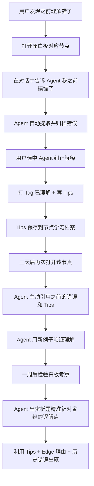
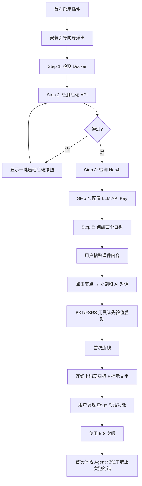
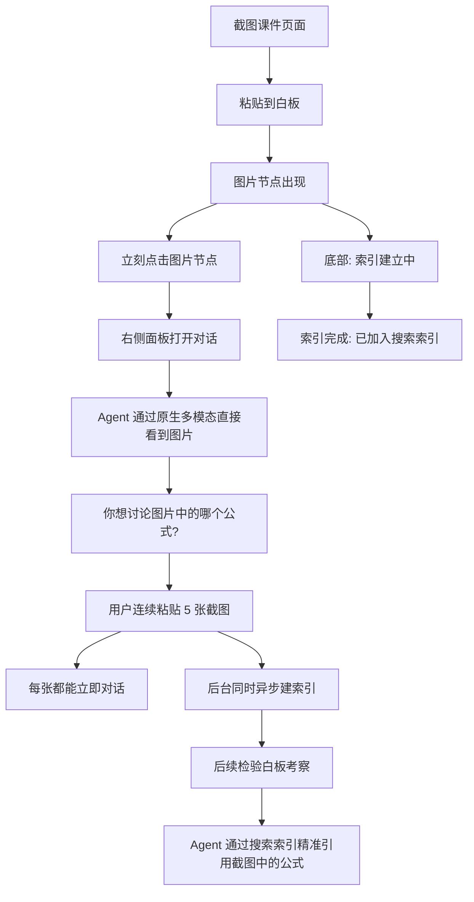
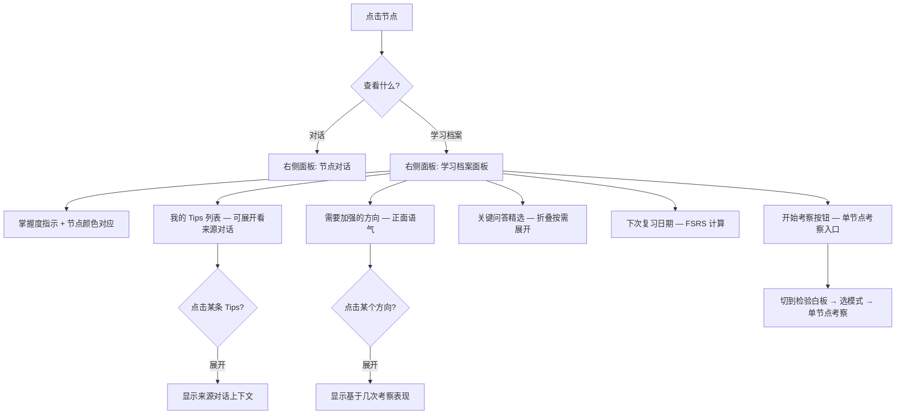

# UX Design Specification Canvas Learning System

**Author:** ROG
**Date:** 2026-03-16

---

## Executive Summary

### Project Vision

Canvas Learning System 是一个 Obsidian 插件，将可视化知识图谱与 AI 对话式学习深度融合。核心体验是"**系统越来越懂你**"——Agent 精准记住用户的 Tips、Edge 理由、犯过的错误，并在对话和考察中精准利用这些记忆。

产品差异化：全球无任何现有产品同时整合可视化知识图谱 + AI 节点对话 + 精通度追踪 + 间隔重复 + 递归考察检验 + 元认知校准（竞品最多覆盖 4/9 组件）。

### Target Users

| 维度 | 描述 |
|------|------|
| 身份 | 大学生（CS 专业），Obsidian 日常用户 |
| 技术水平 | 中等（会用 Obsidian + Docker，非技术专家） |
| 设备 | 桌面电脑（Win/Mac/Linux），不支持移动端 |
| 使用场景 | 课后复习、考前检验、日常知识拆解 |
| 核心诉求 | 被系统考察、发现知识盲区，而非被动看笔记 |
| 当前痛点 | 传统笔记无法检验理解深度，Anki 只能背卡片不能考推理 |

### Key Design Challenges

1. **双白板模式的认知负荷** — "原白板（学习）"与"检验白板（考察）"功能重叠但模式不同，需自然区分
2. **信息密度与可发现性** — 每个节点承载大量信息（对话、Tips、精通度、FSRS、学习档案），需渐进展示
3. **Obsidian 环境约束** — 右侧面板空间有限，CSS 隔离，Plugin API 限制
4. **递归考察的深度控制** — 需要清晰的退出点和进度反馈，避免"无底洞"焦虑
5. **对话框多模式统一** — 普通问答/命令技能/Edge 对话/检验考察共用统一对话 UI

### Design Opportunities

1. **处方性 OLM** — "建议复习 X"而非"你只有 40%"，积极引导而非评判
2. **已有 9 个有效 Pencil 场景** — 直接基于已确认范式编写 UX 规范，减少不确定性
3. **Edge 连线即对话** — 全球独创交互，可成为产品标志性体验

### Pencil UI 范式映射（权威参考 — MVP 有效）

| 场景 | PRD 对应 |
|------|---------|
| Agent 双向链接引用 | FR-RET-02/03 |
| 对话拉出节点 | FR-CONV-08 |
| 笔记精准推送 | FR-RET-01~05 |
| Dashboard（去掉 Vault 智能 Tab） | FR-DASH-01~03 |
| 节点 Edge 对话 | FR-EDGE-01~04 |
| 检验白板完整流程 | FR-EXAM-01~15 |
| 对话内联批注（打 Tag + 写 Tips） | FR-CONV-05/06 |
| Edge → 右侧面板切换 Agent Q&A | FR-EDGE-01~04 |
| 检验白板修正工作流（双重策略） | FR-EXAM-11~13 |

| 废弃/延后场景 | 原因 |
|-------------|------|
| ~~内联标注（标记理解程度）~~ | 被"打 Tag + 写 Tips"替代 |
| ~~Edge 对话弹窗~~ | 改为右侧面板切换 |
| ~~OLM 三层渐进展示~~ | Phase 2 延后 |
| ~~OLM 重设计 · 处方性+可协商~~ | Phase 2 延后 |

## Core User Experience

### Defining Experience

**最频繁的用户操作**：**点击知识节点 → 右侧面板打开 AI 对话**。这是产品的原子交互——所有高级功能（Edge 对话、检验考察、/命令技能、对话拉出节点）都建立在"节点 + 对话"这个基础之上。

**最关键的用户操作**：**检验白板递归考察循环**（Pencil 场景 A→H 八步流程）：
- A-D：Dashboard 选白板 → 空白生成 → Agent 出题考察 → 发现新盲区拉出节点
- E-H：点击新节点继续剖析 → 递归考察 → 再生新节点（闭环）

**核心体验循环**：
```
学习（原白板对话+标注）→ 考察（检验白板出题）→ 发现盲区 → 回到学习
```

### Platform Strategy

| 维度 | 决策 |
|------|------|
| 宿主平台 | Obsidian Plugin（Electron 桌面环境） |
| UI 框架 | Svelte（1.6KB bundle，内置 CSS 隔离） |
| 主交互区 | 右侧面板（对话+Dashboard 共用，上下文切换） |
| 输入方式 | 鼠标+键盘（非触屏） |
| 离线策略 | 白板浏览/编辑正常，AI 功能显示"离线模式" |
| 主题适配 | Obsidian CSS 变量体系，支持 Light/Dark |

### Effortless Interactions

| 交互 | 应当无感知/零思考 |
|------|------------------|
| 点击节点 → 切换对话 | 对话上下文瞬间切换，无加载感 |
| Edge 连线 → 右侧面板变为 Agent Q&A | 自动触发，无需手动切换模式 |
| Agent 引用笔记/Tips | 自动内嵌双向链接引用，用户无需手动搜索 |
| 对话中选文字 → 拉出节点 | 选中即出现操作面板，拖拽到画布即生成 |
| 考察后精通度更新 | 自动计算+节点颜色变化可视化，无需用户操作 |
| FSRS 复习提醒 | Dashboard 自动展示待复习节点，无需用户记忆 |
| 对话中打 Tag + 写 Tips | 选中文字即弹出标注面板，一键标记 |

### Critical Success Moments

| 时刻 | 体验 |
|------|------|
| **"它记住了我的错误"** | Agent 在对话中主动引用用户之前犯的错/写的 Tips |
| **"原来我不知道这个"** | 检验白板考察精准击中知识盲区 |
| **"它知道我为什么连在一起"** | 连线后告诉 Agent 理由，之后 Agent 能在对话和考察中引用 |
| **"这段话值得记下来"** | 选中 Agent 回复拉出为新知识节点 |
| **首次使用成功** | 粘贴内容 → 点击节点 → 立刻能和 AI 对话 |

### Experience Principles

1. **节点即入口** — 一切从点击节点开始。对话、标注、考察、档案都通过节点触达
2. **右侧面板即上下文** — 右侧面板根据用户操作自动切换内容，不弹窗、不新开页面
3. **记忆无感知** — 用户只负责"说"和"标注"，系统负责"记住"和"在对的时候想起来"
4. **考察即发现** — 检验白板的目标是"发现盲区"而非"打分"。不想继续就不点，无强制深度
5. **渐进展示** — 信息按需出现。节点默认只显示标题+颜色，点击才展开，深入才看档案

## Desired Emotional Response

### Primary Emotional Goals

| 情感 | 触发场景 | 用户内心独白 |
|------|---------|------------|
| **被理解** | Agent 引用我之前说过的话/犯过的错 | "它真的记住了" |
| **有收获** | 检验白板发现了我没意识到的盲区 | "幸好考了，不然一直以为自己会" |
| **掌控感** | 节点颜色变化、FSRS 提醒下次复习时间 | "我知道自己什么会什么不会" |

### Emotional Journey Mapping

| 阶段 | 期望情感 | 设计要点 |
|------|---------|---------|
| **首次使用** | 简单、能上手 | 粘贴内容→点击→立刻对话，零配置门槛感 |
| **日常学习** | 自然、不打断 | 对话和标注融入白板操作，不觉得在"使用工具" |
| **Edge 连线** | 自然、顺手 | 就是告诉 Agent 为什么连在一起，不觉得在"做练习" |
| **检验考察** | 好奇、有挑战 | "来看看我到底会不会"——适度紧张但不焦虑 |
| **发现盲区** | 惊讶但不沮丧 | "原来这个我不清楚"——正面发现而非失败 |
| **精通度提升** | 满足、有进步 | 节点颜色变化是无声的肯定 |
| **出错/断连** | 不慌、知道怎么办 | 清晰的错误提示，不丢数据，知道下一步 |
| **再次打开** | 期待、有方向 | Dashboard 告诉我今天该复习什么 |

### Micro-Emotions

| 要培养的情感 | 要避免的情感 | 设计手段 |
|-------------|-------------|---------|
| **信任** — Agent 说的话是有依据的 | **怀疑** — "它是不是在乱说" | Agent 回答时引用具体笔记/对话来源 |
| **安全** — 我的数据不会丢 | **焦虑** — "万一数据没了" | 所有操作即时保存，离线不丢数据 |
| **成就** — 我在进步 | **挫败** — "我什么都不会" | 强调进步（"比上次好"），不强调绝对分数 |
| **好奇** — 想看看还有什么 | **疲惫** — "又要学习了" | 认知负荷控制，适时休息提醒 |
| **自主** — 我决定学什么、考什么 | **被迫** — "系统让我做这做那" | 用户驱动终止，不强制深度/频率 |

### Design Implications

| 情感目标 | 具体设计 |
|---------|---------|
| "被理解" → | Agent 回复中嵌入双向链接引用，让用户看到"Agent 是从哪里想起来的" |
| "有收获" → | 考察后展示"本次发现"审查面板，把盲区转化为可操作的新节点 |
| "掌控感" → | 节点颜色即精通度，一眼看全貌。Dashboard 展示待复习列表 |
| "不沮丧" → | 用"需要加强的方向"替代"错误列表"。强调"发现"而非"不及格" |
| "安全感" → | 后端不可达时明确提示+引导，不静默失败。健康面板随时可查 |

### Emotional Design Principles

1. **正面框架** — 所有反馈使用正面语言。"建议复习"而非"你忘了"，"需要加强"而非"你错了"
2. **Agent 是学伴，不是考官** — 即使在检验白板中，Agent 的语气也是"一起探索"而非"我来考你"
3. **进步可见** — 用户每次使用后都应能感知到某种进步（节点颜色变化、新的 Tips、盲区被发现）
4. **失败安全** — 任何系统错误都不应让用户感到恐慌。数据不丢、提示清晰、恢复路径明确
5. **用户掌控节奏** — 学多久、考多深、休不休息，全部由用户决定。系统只建议，不强制

## UX Pattern Analysis & Inspiration

### Inspiring Products Analysis

**1. Anki — 间隔重复的极简交互**

| 维度 | 分析 |
|------|------|
| 核心做对的事 | 复习流程极度简洁——翻卡→自评→下一张，零干扰 |
| 让人回来的原因 | 每天打开就知道今天要复习什么，不用想 |
| UX 亮点 | 自评按钮上直接显示下次复习间隔，用户立刻理解自评的后果 |
| UX 痛点 | 界面老旧、制卡繁琐、不支持推理类考察 |

**2. Heptabase — 可视化知识图谱的空间感**

| 维度 | 分析 |
|------|------|
| 核心做对的事 | 白板上自由拖拽卡片+连线，右侧面板展开卡片内容 |
| 让人回来的原因 | "看到知识的全貌"——空间位置本身就是记忆线索 |
| UX 亮点 | 点击卡片→右侧面板平滑展开，不离开白板上下文；连线拖拽流畅 |
| UX 痛点 | 没有 AI 对话、没有考察检验、没有精通度追踪 |

**3. Claude Code — AI 对话的工具调用透明性**

| 维度 | 分析 |
|------|------|
| 核心做对的事 | `/命令`调用技能、Agent 工具调用过程可见，信任感强 |
| 让人回来的原因 | AI 不是黑箱——能看到它在做什么、引用了什么 |
| UX 亮点 | 对话中嵌入工具调用结果，流式输出，`/`弹出命令列表可模糊搜索 |
| UX 痛点 | 纯 CLI 界面，没有可视化 |

### Transferable UX Patterns

| 来源 | 可迁移模式 | 用在哪里 |
|------|----------|---------|
| Anki | 自评后立刻显示后果 | 检验白板评分后显示精通度变化+下次复习时间 |
| Anki | 每天打开就知道做什么 | Dashboard 待复习列表 |
| Heptabase | 点击卡片→右侧面板展开 | 点击节点→右侧对话面板 |
| Heptabase | 白板空间布局不被打断 | 对话/Edge 对话都在右侧面板，不弹窗覆盖白板 |
| Heptabase | 连线拖拽的流畅感 | Edge 建立的手感要丝滑 |
| Claude Code | `/`命令弹出+模糊搜索 | `/命令`技能系统 |
| Claude Code | 工具调用过程可见 | Agent 检索时展示引用来源（双向链接） |
| Claude Code | 流式输出 | Agent 回复流式显示 |

### Anti-Patterns to Avoid

| 来源 | 要避免的模式 | 为什么 |
|------|------------|-------|
| Anki | 界面毫无情感 | 学习应用需要正面情感 |
| Anki | 自评是唯一的精通度信号 | 我们有 AI 评分+多信号融合 |
| Heptabase | 连线只是静态标签 | 我们的 Edge 有 Agent 对话 |
| Claude Code | 纯文本无可视化 | 我们需要白板+节点颜色+空间布局 |

### Design Inspiration Strategy

**Adopt（直接采用）：** Heptabase 的点击→右侧面板模式、Claude Code 的 /命令+模糊搜索、Claude Code 的引用来源展示、Anki 的打开就知道做什么

**Adapt（适配改造）：** Anki 自评→改为精通度变化+节点颜色更新、Heptabase 连线→加 Agent Q&A、Claude Code 流式输出→适配 Obsidian 面板空间

**Avoid（不采用）：** Anki 冷淡功能性界面、Heptabase 纯静态内容、任何弹窗覆盖白板的设计

## Design System Foundation

### Design System Choice

**Obsidian 原生设计系统 + Svelte 自定义组件**——作为 Obsidian 插件，必须融入 Obsidian 视觉体系。

### Rationale for Selection

| 因素 | 分析 |
|------|------|
| 平台约束 | Obsidian 插件必须使用 Obsidian CSS 变量体系 |
| 用户预期 | 用户打开的是 Obsidian，期望一致的视觉风格 |
| Light/Dark 主题 | 使用 CSS 变量可自动适配 |
| 技术栈 | Svelte scoped CSS + Obsidian CSS 变量 = 隔离性+一致性 |

### Implementation Approach

**三层设计体系：**

| 层 | 来源 | 用途 |
|----|------|------|
| Layer 1：Obsidian 基础 | Obsidian CSS 变量 | 颜色、字体、间距、圆角——继承 Obsidian 主题 |
| Layer 2：Canvas Learning 扩展 | 自定义 CSS 变量 | 精通度颜色映射、考察状态、Agent 对话气泡 |
| Layer 3：Svelte 组件 | 自建 Svelte 组件库 | 对话面板、Dashboard、检验白板、内联标注 |

### Customization Strategy

**精通度颜色系统：**

| 状态 | 颜色语义 | 说明 |
|------|---------|------|
| 未学习 | Obsidian 默认节点色 | 还没和这个节点有过任何交互 |
| 学习中 | 蓝色系 | 有对话但未被考察 |
| 薄弱 | 红/橙色系 | 考察表现不佳 |
| 掌握 | 绿色系 | 考察表现好 |
| 待复习 | 黄色系 | FSRS 提醒该复习了 |

**对话 UI 设计系统：** 用户消息右对齐深色气泡，Agent 消息左对齐带渐变 avatar 浅色气泡+引用卡片，`/命令`弹出列表覆盖+模糊搜索，流式输出逐字出现。

**核心 Svelte 组件清单：** ChatPanel、DashboardView、ExamPanel、InlineAnnotation、NodeColorIndicator、EdgeDialogTrigger

## Defining Core Experience

### Defining Experience

**一句话定义**："白板上点个节点，就能和 AI 聊这个知识点——它还记得你之前说过什么。"

### User Mental Model

| 用户带来的心理模型 | 设计如何匹配 |
|------------------|-------------|
| "白板 = 可以拖拽的画布"（Heptabase/Obsidian） | 白板操作不改变 |
| "点击 = 查看详情"（通用交互） | 点击节点→右侧面板打开对话 |
| "连线 = 表示关系"（Obsidian Canvas） | 一致，加了 Agent Q&A 增强 |
| "AI 对话 = 一个聊天框"（ChatGPT/Claude） | 对话面板体验一致 |
| "考试 = 紧张的评判"（传统教育） | 需重塑——检验白板是"发现"不是"考试" |

### Success Criteria

| 标准 | 具体表现 | FR 来源 |
|------|---------|---------|
| "这就能用了" | 粘贴内容→点击节点→Agent 回复 | FR-CONV-01 |
| "它记住了" | 第二次打开同一节点，Agent 引用之前的 Tips | FR-CONV-02/03 |
| "连线有意义" | 连线后 Agent 问为什么，说了理由后 Agent 后续用到 | FR-EDGE-02/03 |
| "考到了我不会的" | 检验白板第一个问题命中薄弱点 | FR-EXAM-02/03 |

### Novel UX Patterns

| 模式 | 新颖度 | 教育方式 |
|------|--------|---------|
| 点击节点→右侧对话 | 已知（Heptabase） | 无需教育 |
| `/命令`调用技能 | 已知（Claude Code） | 输入 `/` 自动弹出列表 |
| 选中文字→拉出新节点 | 半新 | 选中时出现浮动操作面板引导 |
| Edge 连线→Agent 问为什么 | 新（全球独创） | 连线上出现小图标+提示文字 |
| 检验白板对话式考察 | 全新（零竞品） | 首次使用时 Agent 引导说明 |
| 对话中打 Tag + 写 Tips | 半新 | 选中时弹出标注面板 |

### Experience Mechanics

**核心交互 1：点击节点 → AI 对话**

| 步骤 | 用户动作 | 系统响应 | FR 来源 |
|------|---------|---------|---------|
| 1. 发起 | 点击白板上的节点 | 右侧面板切换为该节点独立对话窗口 | FR-CONV-01 |
| 2. 对话 | 输入消息 | Agent 回复，自动注入该节点+相关节点的学习上下文 | FR-CONV-02/03 |
| 3. /命令 | 输入 `/` | 弹出已注册技能列表，模糊搜索 | FR-SKILL-01 |
| 4. 标注 | 选中对话文字 | 弹出标注面板（打 Tag / 写 Tips） | FR-CONV-05 |
| 5. 拉出 | 拖拽选中文字到白板 | 生成新节点+自动建议关系 | FR-CONV-08 |
| 6. 引用 | — | Agent 引用笔记时附带可点击 Obsidian 双向链接 | FR-RET-13 |

**核心交互 2：Edge 连线 → Agent Q&A**

| 步骤 | 用户动作 | 系统响应 | FR 来源 |
|------|---------|---------|---------|
| 1. 连线 | 拖拽建立 Edge | 连线上出现可交互图标 | FR-EDGE-01 |
| 2. 触发 | 点击 Edge 图标 | 右侧面板切换为 Edge 对话 | FR-EDGE-02 |
| 3. 对话 | Agent 问为什么连在一起，用户回答 | 记录理由为 Edge 语义标签 | FR-EDGE-03 |
| 4. 策略 | — | 对话同时激活 EI+SE 双重学习策略 | FR-EDGE-04 |

**核心交互 3：检验白板考察**

| 步骤 | 用户动作 | 系统响应 | FR 来源 |
|------|---------|---------|---------|
| 1. 启动 | Dashboard 选白板→选考察模式 | 系统推荐模式，用户可覆盖 | FR-DASH-03, FR-EXAM-11/12 |
| 2. 生成 | — | 空白检验白板生成 | FR-EXAM-01 |
| 3. 出题 | — | Agent 从原白板知识图谱中基于 FSRS+BKT 选薄弱节点出题 | FR-EXAM-02/03 |
| 4. 对话 | 用户回答，答不出来可用 `/命令` 自助 | Agent 多轮对话式考察 | FR-EXAM-07 继承 FR-CONV-04 |
| 5. 评分 | — | Agent 考完当前节点、切换到下一个节点时，后台 AutoSCORE 对已讨论节点评分 → BKT/FSRS 更新 → 节点颜色变化 | FR-EXAM-04, FR-MAST-01/02 |
| 6. 校准 | Agent 话题切换时顺带询问"你觉得评分准确吗"（可选） | 用户可回应偏高/偏低/准确，也可忽略 | FR-EXAM-15 |
| 7. 发现 | 用户选中对话文字→拖到白板生成新节点 | 和原白板拉节点操作一致 | FR-EXAM-07 继承 FR-CONV-08 |
| 8. 递归 | 点击新节点继续探索（可选） | 继承原白板所有功能 | FR-EXAM-06/07 |
| 9. 休息 | — | 持续考察一段时间后给出休息提醒 | FR-EXAM-08 |

## Visual Design Foundation

### Color System

**策略：继承 Obsidian CSS 变量，不自定义品牌色。**

| 层级 | 来源 | 用途 |
|------|------|------|
| 基础色 | Obsidian CSS 变量（`--background-primary`, `--text-normal`, `--interactive-accent` 等，官方 400+ 变量） | 所有 UI 基础元素 |
| 语义色 | Obsidian 内置（`--text-error`, `--text-success` 等） | 状态反馈 |
| 精通度色 | 映射到节点颜色（具体方案待 Pencil 范式定义） | 节点颜色表示掌握程度 |

### Typography System

**策略：完全继承 Obsidian 字体体系，不引入额外字体。**

- 正文：`--font-text-theme`
- 代码：`--font-monospace-theme`
- UI 控件：`--font-interface`

### Spacing & Layout Foundation

| 维度 | 方案 | 依据 |
|------|------|------|
| 主交互区 | Obsidian 右侧面板（ItemView，官方支持 Svelte 挂载） | Platform Strategy |
| 面板最小宽度 | 200px（Obsidian 硬编码） | 官方约束 |
| 间距 | Obsidian 内置 `--size-*` 变量 | 与 Obsidian 其他面板一致 |
| 白板渲染 | 自建 Svelte Canvas 组件（完全自建，非 Obsidian 原生 Canvas） | 用户确认 |
| 白板数据存储 | IndexedDB 本地存储（local-first）+ 后端异步 delta 同步到 Neo4j | 方案 D，tldraw 同款架构 |

### Accessibility Considerations

| 维度 | 方案 |
|------|------|
| 对比度 | 继承 Obsidian 主题 |
| Light/Dark | Obsidian CSS 变量自动适配（`.theme-light` / `.theme-dark`） |
| 字号 | 继承 Obsidian 用户设置 |
| CSS 隔离 | Svelte scoped CSS + 唯一类名前缀 `canvas-learning-` |

### Obsidian 插件技术约束

| 约束 | 说明 | 来源 |
|------|------|------|
| CSS 变量 | 官方 400+ 变量，四层层级（Foundation/Semantic/Component/Context） | 官方文档 |
| Svelte 挂载 | 官方推荐 `new SvelteComponent({target: contentEl})` | 官方文档 |
| Canvas API | 不使用（白板完全自建） | 用户确认 |
| 主题兼容 | 只用官方文档记录的 CSS 变量和类名，Svelte scoped styles | 官方指南 |

## Design Direction Decision

### Design Directions Explored

作为 Obsidian 插件，视觉方向唯一：融入 Obsidian 原生风格（Catppuccin Mocha 暗色主题）。无需多方向对比。

### Chosen Direction

**Obsidian 原生风格 + Catppuccin Mocha 暗色主题**——基于 17 个 Pencil 场景范式验证。

### Pencil 范式覆盖（17 个场景，覆盖 PRD 全部前端交互）

| # | 场景 | PRD FR |
|---|------|--------|
| 1 | 节点对话面板 | FR-CONV-01~03, FR-RET-13 |
| 2 | 检验白板考察对话 | FR-EXAM-02~04/15/16 |
| 3 | Dashboard | FR-DASH-01~03 |
| 4 | Edge 连线 Agent Q&A | FR-EDGE-01~04 |
| 5 | 对话内联批注（Tag + Tips） | FR-CONV-05 |
| 6 | /命令自动补全列表 | FR-SKILL-01 |
| 7 | 对话拉出节点交互 | FR-CONV-08 |
| 8 | 节点学习档案面板 | FR-TRACE-01~04, FR-EXAM-17 |
| 9 | 白板主界面全貌 | FR-KG-01~03 |
| 10 | 图片节点+异步索引 | FR-KG-06/07 |
| 11 | 安装引导向导 | FR-SYS-01 |
| 12 | 系统健康面板 | FR-SYS-04 |
| 13 | 模型配置面板 | FR-SYS-02/03 |
| 14 | 认知负荷休息提醒 | FR-EXAM-08 |
| 15 | 考察模式选择面板 | FR-EXAM-11/12 |
| 16 | 离线降级提示 | PRD 离线策略 |
| 17 | 同步状态指示器 | 方案 D 架构 |

### Design Rationale

- Obsidian 插件必须融入宿主视觉体系
- Catppuccin Mocha 是 Pencil 已有设计的基础主题
- 18 个场景覆盖 PRD 全部前端交互（含 FR-EXAM-19 给我提示），经 Pencil 验证视觉效果

## User Journey Flows

### 旅程 1：日常学习（原白板）

```mermaid
flowchart TD
    A[打开 Obsidian 白板] --> B[白板上有知识节点+连线]
    B --> C{用户操作}
    C -->|点击节点| D[右侧面板切换为节点对话]
    D --> E[和 Agent 对话]
    E --> F{对话中的操作}
    F -->|选中文字打 Tag/写 Tips| G[弹出标注浮层 → 保存]
    F -->|选中文字拖到白板| H[生成新节点 + 建议关系]
    F -->|输入 /命令| I[弹出技能列表 → 执行]
    F -->|继续对话| E
    G --> E
    H --> C
    I --> E
    C -->|拖线连接两节点| J[Edge 创建 → 连线上出现图标]
    J --> K{点击 Edge 图标?}
    K -->|是| L[右侧面板切换为 Edge Q&A]
    L --> M[Agent 问为什么连在一起]
    M --> N[用户回答理由]
    N --> O[Agent 记录理由 ✓]
    O --> C
    K -->|否| C
    C -->|粘贴图片| P[图片节点出现]
    P --> Q[底部显示"🔄 索引建立中..."]
    Q --> R[可立刻点击对话]
    R --> E
    Q --> S[索引完成 → "✅ 已加入搜索索引"]
```

FR 覆盖：FR-CONV-01~08, FR-EDGE-01~04, FR-SKILL-01, FR-KG-06/07, FR-RET-13

### 旅程 2：检验白板考察

```mermaid
flowchart TD
    A{考察入口} -->|Dashboard 选白板| B[选择考察模式面板]
    A -->|学习档案开始考察| B
    B --> C[点对点 / 综合题 / 混合]
    C --> D[空白检验白板生成]
    D --> E[Agent 从原白板薄弱节点出题]
    E --> F[用户回答]
    F --> G{答不出来?}
    G -->|点击给我提示| H1[4级渐进提示: 方向→关键词→框架→脚手架]
    H1 --> F
    G -->|用 /命令自助| H2[/四层解释 /例题教学 等]
    H2 --> F
    G -->|跳过这题| H3[标记未作答 不惩罚BKT → 下一题]
    H3 --> E
    G -->|正常回答| I[Agent 多轮对话式考察]
    I --> J{Agent 切换到下一个节点?}
    J -->|是| K[后台 AutoSCORE 评分 → BKT/FSRS 更新 → 节点颜色变化]
    K --> L[Agent 顺带问: 评分准确吗? 可选]
    L --> E
    J -->|否| I
    I --> M{用户选中对话文字?}
    M -->|拖到白板| N[生成新节点 → 实时同步回原白板]
    N --> O{点击新节点继续?}
    O -->|是| P[和原白板一样的对话交互 → 递归]
    P --> I
    O -->|否| I
    M -->|打 Tag/Tips| Q[标注 → 同步回原白板对应节点]
    Q --> I
    I --> R{持续考察时间?}
    R -->|15/25/35/45分钟| S[休息提醒消息]
    S --> T{继续 or 休息?}
    T -->|继续| I
    T -->|休息| U[结束考察]
    U --> V[考察记录永久保存 → Dashboard 可查看历史]
```

FR 覆盖：FR-DASH-03, FR-EXAM-01~08/11~13/15~20, FR-CONV-04/05/08

### 旅程 3：错误修正与记忆闭环



FR 覆盖：FR-CONV-03/05/06, FR-EXAM-03, FR-RET-03, FR-TRACE-02/03

### 旅程 4：新用户初次使用



FR 覆盖：FR-SYS-01~04, FR-CONV-01, FR-EDGE-01, FR-KG-01~03

### 旅程 5：图片密集型学习



FR 覆盖：FR-KG-06/07, FR-CONV-01/03, FR-RET-01/05

### 旅程 6：查看学习档案



FR 覆盖：FR-TRACE-01~04, FR-EXAM-17, FR-MAST-03/04

### Journey Patterns

| 模式 | 出现在哪些旅程 |
|------|-------------|
| 点击→右侧面板切换 | 全部 6 个 |
| 选中文字→浮动操作条 | 旅程 1/2/3 |
| 数据实时同步 | 旅程 2/3 |
| Agent 记忆引用 | 旅程 1/2/3 |
| 渐进式引导 | 旅程 4 |
| 异步状态反馈 | 旅程 5 |

### Flow Optimization Principles

1. **最短路径到价值** — 粘贴内容→点击→对话，3 步即可开始学习
2. **不打断当前操作** — 评分隐形、同步后台、标注浮层不遮挡对话
3. **错误可恢复** — 离线不丢数据、后端断连有提示、操作可撤销
4. **一致性** — 检验白板和原白板操作方式完全一致，无需重新学习

## Component Strategy

### Design System Components（Obsidian 原生）

| 组件 | API | 用途 |
|------|-----|------|
| ItemView | `ItemView` 类 | 右侧面板容器 |
| Modal | `Modal` 类 | 安装引导/模式选择弹窗 |
| Setting | `Setting` 类 | 设置页面 |
| Notice | `Notice` 类 | 轻量通知 |
| Menu | `Menu` 类 | 右键菜单 |
| MarkdownRenderer | `MarkdownRenderer.render()` | Agent 回复渲染（含 wikilink 跳转） |

### Custom Svelte Components（30 个，7 组）

**A 组 — 对话系统**：ChatPanel, MessageBubble, InputBar, CommandPalette, WikilinkCard, InlineAnnotation, SelectionToolbar

**B 组 — 检验白板特有**：ExamModeSelector, HintButton, SkipButton, CalibrationPrompt, RestReminder

**C 组 — Dashboard**：DashboardView, CanvasCard, ReviewItem

**D 组 — 学习档案**：LearningProfile, TipCard, WeakPointItem, StartExamButton

**E 组 — 白板**：CanvasView, CanvasNode, CanvasEdge, EdgeDialogTrigger, ImageNode, NodeColorIndicator

**F 组 — 系统运维**：SetupWizard, HealthPanel, ModelConfig

**G 组 — 全局状态**：SyncIndicator, OfflineBanner

### Implementation Strategy

- Svelte scoped CSS + 类名前缀 `cl-`
- 所有颜色/字体/间距使用 Obsidian CSS 变量
- IndexedDB 数据通过 Svelte writable store 驱动 UI
- ChatPanel 三模式复用（普通/考察/Edge），props 切换

### Implementation Roadmap

**Phase 1（核心）**：CanvasView + CanvasNode + CanvasEdge + ChatPanel + MessageBubble + InputBar + DashboardView + CanvasCard + EdgeDialogTrigger + CommandPalette + WikilinkCard

**Phase 2（检验白板）**：ExamModeSelector + HintButton + SkipButton + CalibrationPrompt + RestReminder + NodeColorIndicator

**Phase 3（档案+标注+系统）**：InlineAnnotation + SelectionToolbar + LearningProfile + TipCard + WeakPointItem + SetupWizard + HealthPanel + ModelConfig + SyncIndicator + OfflineBanner + ImageNode

## UX Consistency Patterns

### 面板切换模式

右侧面板永远只显示一个视图，切换即替换不叠加。点击节点→对话，点击 Edge→Q&A，点击 Dashboard 项→对应视图。

### 反馈模式

| 类型 | 样式 | 持续时间 |
|------|------|---------|
| 成功 | 绿色 ✓ + 文字 | 2 秒自动消失 |
| 评分更新 | 节点颜色变化（隐形） | 永久 |
| 同步状态 | 右下角小图标 | 持续显示 |
| 错误 | 橙色通知条（面板顶部） | 持续到恢复 |
| 提示 | 灰色浮层 | 自动消失 |
| 休息提醒 | 对话内特殊消息 | 用户操作后消失 |

### 按钮层级

- **主操作**：紫色/渐变填充（"开始考察""保存"）
- **次操作**：边框按钮（"给我提示""继续提示"）
- **文字操作**：灰色文字（"跳过""关闭"）

### 空状态

所有空状态提供引导文字 + 操作建议。Agent 回复用流式输出不用 loading spinner。

### 选中文字交互

选中对话文字 → 浮动操作条（拉出节点/打 Tag/复制）跟随选中位置，不遮挡选中文字。

### 模态框

最少使用。仅安装引导和考察模式选择用模态框，其余在右侧面板内完成。

### 键盘快捷键（Claude Code 迁移）

| 快捷键 | 功能 | 来源 |
|--------|------|------|
| Enter | 发送消息 | `chat:submit` |
| Shift+Enter | 换行不发送 | 多行输入 |
| Escape | 停止生成 / 关闭补全 | `chat:cancel` + `autocomplete:dismiss` |
| / | 触发斜杠命令菜单 | 斜杠命令前缀 |
| @ | 触发笔记引用补全 | `@` 文件提及 |
| Tab | 接受补全建议 | `autocomplete:accept` |
| Up/Down | 浏览补全选项 | `autocomplete:previous/next` |
| Up（输入框为空） | 编辑上一条消息 | `history:previous` |

所有快捷键仅在对话框输入框获得 focus 时生效。

### 白板操作交互（与 Obsidian Canvas 一致）

| 操作 | 交互方式 | 说明 |
|------|---------|------|
| 移动节点 | 左键点击节点 header 区域拖拽 | body 区域保留给文字选取 |
| 移动白板 | 右键按住拖拽 / 中键按住拖拽 | 平移画布 |
| 缩放白板 | 鼠标滚轮 | 放大/缩小 |
| 选中节点 | 左键点击节点 | 右侧面板切换为该节点对话 |
| 多选节点 | Ctrl+左键 / 框选 | — |
| 创建连线 | 从节点边缘拖出到另一个节点 | Edge 创建后出现对话图标 |
| 创建节点 | 双击白板空白处 | 或从对话中拖拽文字到白板 |
| 删除节点/连线 | 选中 + Delete/Backspace | — |
| 选中文字（节点内） | 左键在节点 body 区域拖选 | 与节点拖拽共存（Session D 已验证） |

核心原则：操作逻辑与 Obsidian Canvas 保持一致，用过 Obsidian Canvas 的用户零学习成本。

### Settings Tab 布局（Obsidian PluginSettingTab）

Settings Tab 位于 Obsidian 设置页面（Ctrl+,），使用 Obsidian 原生 Setting API 构建。

| 区域 | 内容 | FR 来源 |
|------|------|---------|
| 系统状态 | Docker/后端/Neo4j/LLM/LanceDB 5 个组件状态灯 + 重新检测按钮 | FR-SYS-04 |
| 对话模型 | 供应商下拉 + 模型下拉 + API Key 输入 + 测试连接 | FR-SYS-02/03 |
| 评分模型 | 供应商下拉 + 模型下拉 + API Key 输入 | FR-SYS-02/03 |
| 嵌入模型 | bge-m3 (Ollama) 状态显示（只读） | FR-SYS-02 |
| 后端连接 | 后端地址输入 + Neo4j 地址输入 + 一键启动按钮 | FR-SYS-05 |
| 数据管理 | 手动备份按钮 + 重建索引按钮 | FR-SYS-06 |

注意：Settings Tab（PluginSettingTab）和右侧面板的 Dashboard（ItemView）是两个不同的东西。HealthPanel 和 ModelConfig 组件（F 组）在 Settings Tab 中通过 Obsidian Setting API 实现。

## Responsive & Accessibility

### 响应式策略

本产品为 Obsidian 桌面插件（Electron），不支持移动端（PRD 明确标注）。无需响应式设计。

右侧面板宽度由 Obsidian 控制（最小 200px，用户可拖拽调整）。组件需适配面板宽度变化：
- 对话消息气泡：`width: fill_container`
- Dashboard 卡片：`width: fill_container`
- 白板区域：填充剩余空间

### 无障碍策略

| 维度 | 方案 | 优先级 |
|------|------|--------|
| 对比度 | 继承 Obsidian 主题（社区主题经大量用户验证） | MVP |
| Light/Dark | Obsidian CSS 变量自动适配 | MVP |
| 字号 | 继承 Obsidian 用户设置，不覆盖 | MVP |
| 键盘导航 | 对话框内 Tab/Escape/Enter 基础键盘支持 | MVP |
| ARIA 标签 | 自建组件添加基础 ARIA 属性 | Phase 2 |
| 屏幕阅读器 | WCAG 2.1 AA 完整支持 | Phase 3（推广阶段） |

PRD 领域合规章节确认：个人使用阶段无障碍非紧急，推广时补充 WCAG 2.1 AA。

## UX Design Specification — Complete

### 文档总结

本 UX 设计规范覆盖 Canvas Learning System 的完整前端交互设计：

| 章节 | 内容 |
|------|------|
| Executive Summary | 项目愿景、目标用户、设计挑战、Pencil 范式映射 |
| Core User Experience | 定义交互、平台策略、无感交互、关键成功时刻、5 条体验原则 |
| Desired Emotional Response | 3 个情感目标、8 阶段情感旅程、5 组微情感、5 条情感设计原则 |
| UX Pattern Analysis | Anki/Heptabase/Claude Code 灵感分析、Adopt/Adapt/Avoid 策略 |
| Design System Foundation | Obsidian 原生 + Svelte 三层体系、IndexedDB local-first 存储 |
| Design Direction | 18 个 Pencil 场景覆盖全部 PRD 前端交互 |
| Defining Core Experience | 3 个核心交互 Experience Mechanics（每步标注 FR 来源） |
| Visual Design Foundation | Obsidian CSS 变量、Svelte scoped CSS |
| User Journey Flows | 6 个旅程 Mermaid 流程图 + Journey Patterns |
| Component Strategy | 30 个自建 Svelte 组件 + 6 个 Obsidian 原生 = 36 个，3 阶段路线图 |
| UX Consistency Patterns | 面板切换/反馈/按钮/空状态/选中文字/模态框/快捷键 |
| Responsive & Accessibility | 桌面专用、继承 Obsidian 主题、渐进式无障碍 |

### PRD 同步更新

本 session 中同步更新了 PRD 以下 FR：
- FR-EXAM-05/09/10/14 修改/废除
- FR-EXAM-15/16/17/18 修改/新增
- FR-MAST-03 修正
- FR-RET-13 更新（章节级精准跳转）

### Pencil UI 范式

18 个场景的 Pencil 提示词已交付并通过视觉验证，存储在 `UI 相关设计样式.pen` 中。
