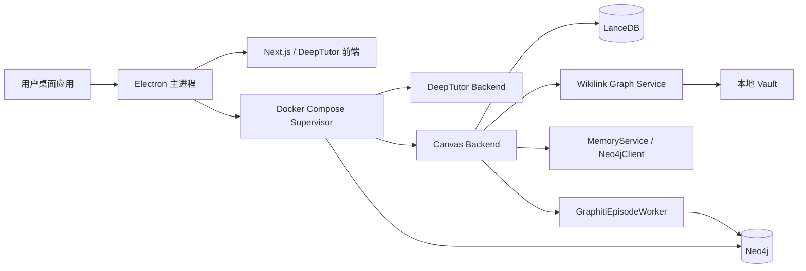
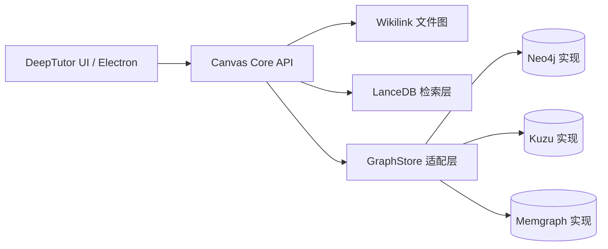

# Canvas × DeepTutor 桌面端数据库改造可行性深度研究报告

> **本文档**：ChatGPT Deep Research 在 effort=max 模式下产出的完整调研报告（用户 2026-05-07 paste，原文不动 + Claude 加 frontmatter / footer）
>
> **触发**：本仓库 `_bmad-output/research/round-22-chatgpt-dr-prompt-desktop-db-decision-2026-05-07.md` 的 prompt
>
> **决策性质**：BMAD R4 升级触发条件全部命中（5 internal Explore agent 后仍无定论 + 两对立方案各有论据 + 影响 5+ Story）— DR 升级合规

---

## 执行摘要

已启用并实际使用的连接器只有 **GitHub**；本次代码审查严格限定在用户指定仓库 `oinani0721/canvas-learning-system`，且聚焦你上传文档中明确要求的内容：围绕 Epic-11 桌面化、五大核心特性保真、B1/B2/B3/B4/B5 方案评估、以及"**能否在不保留 Docker Desktop 的前提下**完成交付"的 yes/no 级别判定。未审查任何其他 GitHub 仓库；外部补充资料仅使用官方文档与高可信原始资料。

**核心结论先给出**：
**否。以当前仓库状态与文档约束组合来看，若同时要求**
- 保留 Canvas 五大核心能力；
- 不重写当前关键 Neo4j / Cypher / Graphiti 路径；
- 5–10 人日内落地；
- 安装包控制在 500MB 内；
- 首次可用启动时间尽量接近 Epic-11 既定目标；

那么**不能去掉 Docker Desktop**。当前仓库与内部方案文档本身也已经把 Epic-11 锁定为 **C+：Electron 仅做 GUI + Docker Compose Supervisor，Neo4j/Canvas/DeepTutor 继续作为现有服务栈运行**。这不是"保守偏好"，而是当前代码耦合度、测试资产、Graphiti 接入方式、以及桌面打包复杂度共同推出来的工程性结论。

但这次审查也得到一个**重要的正向发现**：你文档里把 `wikilink_graph_service.py` 视为 Neo4j 依赖点，但当前代码实际上是 **obsidiantools + NetworkX 的内存图**，并非 Neo4j 持久化图。这意味着"原白板 / wikilink 双链"并不是当前去 Docker 的主要阻碍；真正的锁定点在 **MemoryService / Neo4jClient / GraphitiEpisodeWorker / exam session 持久化** 这一条链路。换句话说，**未来做无 Docker 化并非毫无可能，但必须先抽象掉图数据库访问层，再做数据库替换**；最佳后续研究方向不是 B3（Memgraph），而是 **"先保留 C+ 交付 MVP，再开一个 Kuzu/Graphiti 适配分支做技术预研"**。

## 已启用连接器与研究边界

本报告先使用了 **GitHub 连接器** 来确认目标仓库与目标工作线，并以该仓库中的代码、Epic 文档、验收单、Docker 配置和单测作为第一证据层；随后才补充使用官方网络资料验证 Graphiti、Neo4j、Kuzu、Memgraph、Electron、Apple 安全模型、以及几个桌面 AI / 本地优先产品的工程先例。这个顺序与您文档中"**先覆盖指定 GitHub 仓库，再补充高质量网络资源**"的要求一致。

研究边界也需要明确两点。第一，我没有使用任何其他 GitHub 仓库，因此对 DeepTutor 上游代码本体没有做仓库级 diff；DeepTutor 相关判断主要来自**本仓库内的 Round-22 / Epic-10 / Epic-11 设计文档**。第二，用户文档里把若干组件设定为"Neo4j 依赖点"，但代码事实与文档假设并不完全一致；因此本报告优先以仓库现状为准，并把偏差单独标出，而不是机械复述提示词里的前提。

## 仓库事实核查与关键校正

### 当前桌面化方案在仓库内部已经被锁定为 C+

仓库内部 Round-22 主决策报告与 Epic-11 README 写得非常明确：Epic-11 不是"把数据库塞进 Electron 包里"，而是 **Electron 做 GUI 包装与服务监督，Docker Compose 继续托管 Canvas backend、DeepTutor backend、Neo4j 以及前端服务**。其中 Story 11.2 甚至直接把原本的"spawn 单个 FastAPI subprocess"修订为"**Docker Compose Supervisor**"，理由就是 Canvas 五大核心仍然 100% 依赖现有 Canvas backend、Neo4j、LanceDB、Graphiti 等链路，贸然改成本地嵌入数据库会推翻已验证架构。

这一点在当前 `docker-compose.yml` 里也有直接落地：Neo4j 5.26-community 被固定为基础图数据库，APOC 插件通过 `NEO4J_PLUGINS=["apoc"]` 开启；Canvas backend 使用 `bolt://neo4j:7687` 连接图数据库，同时还挂载 `/vault`、LanceDB 数据卷和其它工作目录。换言之，**当前系统并不是"准备去 Docker，只差数据库替代"的状态，而是"文档和代码都围绕 Docker 栈形成了共识"**。

### 你文档里最关键的一个前提需要修正：wikilink 图当前不是 Neo4j 图

`backend/app/services/wikilink_graph_service.py` 当前基于 `obsidiantools` 解析 vault，使用 `networkx.DiGraph()` 构建有向图，并在内存中维护 `self._graph`、`self._neighbors_cache`、`self._path_cache` 等结构；它的 2-hop 邻居、路径、提及图，都是直接在这张内存图上计算，不是 Neo4j 持久化查询。Story 10.3 验收单也证明了这一点：`/api/v1/wikilink/build` 读取本地 vault 中的 md 文件后，返回的是 `total_nodes` / `total_edges` 一类构图结果。

这意味着：
**"原白板 + wikilink 双链 + 2-hop 邻居"这一块并不是当前数据库替换的主阻塞点。**
如果未来真的要做无 Docker 化，最难的不是这条链，而是下面这些真正直连 Neo4j / Graphiti 的部分。

### 真正的图数据库锁定点在 Memory / Graphiti / Exam 持久化链路

`backend/app/services/episode_worker.py` 是当前 Graphiti 的核心接入点。代码里直接构造 `Graphiti(neo4j_uri, neo4j_user, neo4j_password)`，并调用 `build_indices_and_constraints()` 初始化图结构，在处理 episode 时继续调用 `add_episode(...)`，关闭时再执行 `close()`。这是一条很强的运行时耦合：**当前实现不是"抽象图存储接口 + 可切换驱动"，而是"直接按 Neo4j 风格启动 Graphiti 客户端"**。

`backend/app/services/memory_service.py` 和 `backend/app/clients/neo4j_client.py` 则是第二个重耦合层。`memory_service.py` 至少直接确认了一条 Neo4j DDL：自动创建 `episode_content` 全文索引；而更重要的是，它大量依赖 `Neo4jClient` 这个真实驱动实现。`neo4j_client.py` 使用官方 Python 驱动的 `AsyncGraphDatabase.driver(...)`，通过 Bolt URI 建立连接，并在 `_run_query_neo4j()` 中将通用 Cypher 模板交给 `session.run(query, params)` 执行。Neo4j 官方文档也说明 Python 驱动就是通过 Bolt 连接数据库，这与仓库实现完全一致。

`backend/app/services/exam_service.py` 进一步说明，当前并不是只有"记忆系统"依赖图数据库。它至少直接定义了 4 段显式 Cypher：
- 查询 Canvas 类型；
- 将 exam session 持久化为 Neo4j 节点；
- 按 session_id 回读；
- 按 canvas_name 列表回读。

这些查询虽然复杂度中等，但已经属于业务语义而不是底层基础设施，因此**一旦数据库替换，测试、事务语义、时间类型、排序、返回结构都要重新验证**。

### `cypher_helpers.py` 是"策略性耦合点"，但不是大量业务查询堆积点

`backend/app/utils/cypher_helpers.py` 的作用不是存放很多完整的业务查询，而是提供 `cypher_with_group_filter()` 这一类**查询拼装辅助函数**：它把 `WHERE n.group_id = $group_id` 或 `AND ...` 注入到既有 Cypher 中，从而实现 vault / subject 级隔离。配套单元测试 `test_cypher_helpers.py` 也围绕这个拼装逻辑进行验证。换句话说：
- **它本身不是"几十条查询的大仓库"**；
- **它却是你未来要做数据库抽象时，最该保留的"语义入口"**，因为 group_id 隔离逻辑一旦散落回业务层，迁移成本会更高。

就"我直接看到并能确认的查询数量"而言：
- `cypher_helpers.py`：**0 条完整业务查询**，只有 1 个查询过滤拼装器；
- `subject_config.py`：**1 条** Neo4j 查询，用于列出 `Concept.group_id`；
- `exam_service.py`：**4 条**；
- `memory_service.py`：**至少 1 条**直接确认的 DDL（全文索引）；
- `neo4j_client.py`：在已显示的片段里还至少能确认 **4 段以上**的查询模板，包括 `MERGE` 学习关系、带/不带 `group_id` 的 review 查询、学习历史查询构造器。

因此，**在本次直接审阅到的文件片段中，已确认的显式 Cypher 模板下界是 10 段以上；真实总数更高，因为 `neo4j_client.py` 的后半段被连接器输出截断了。** 同时，我在这批 Tier-1 文件中**没有直接发现 `CALL apoc.*` 的运行期调用**；APOC 目前更多体现为容器层已启用、而非这些目标文件中的显式调用。

### LanceDB 与 vault 隔离已经做得比图数据库更"可桌面化"

`backend/lib/agentic_rag/clients/lancedb_client.py` 已经通过 `resolve_table_name()` 把 `vault_id` 编进表名，单测 `test_lancedb_vault_isolation.py` 也覆盖了前缀隔离、动态切换、默认 vault 行为。`subject_config.py` 则通过 `build_vault_group_id()` 构造 `vault:<vault_id>:<subject>` 样式的分层 group_id，配套单测 `test_subject_config_vault.py` 验证了中英文 vault_id、`canvas_path` 提取、旧格式兼容等行为。**这部分已经相当接近桌面多 vault 的理想状态。**

### 后端主程序证明：Neo4j / Graphiti / Wikilink / LanceDB 已在启动流程交织

`backend/app/main.py` 的 lifespan 中会预热 `MemoryService`、尝试创建 Neo4j 全文索引、恢复 LanceDB 索引、初始化 `GraphitiEpisodeWorker`、并在启动时 eager-build wikilink graph；`backend/app/api/v1/router.py` 则聚合了 memory、exam、canvas、wikilink、vault、sync、mastery、review 等多条路由。它不是"玩具后端"，而是一个已经形成较强启动序与基础设施依赖的服务。你如果在 Epic-11 里强行去掉 Docker，又要保证这些服务继续在桌面端以稳定方式启动，本质上是在重做一遍进程编排。

## 可行性结论与 yes/no 判定

### 对用户问题的直接回答

如果问题是：

> **"在不保留 Docker Desktop 的前提下，能否在当前代码基础上保住五大核心功能，并且不大改现有 Neo4j/Cypher/Graphiti 关键路径？"**

我的结论是：**不能。**

更准确地说，存在两种"能"：

- **理论上的能**：可以通过更大范围的架构改造做到。
- **在你文档约束下的能**：**不能**，因为它不再是 5–10 人日的 Epic-11 桌面化，而是一个新的"图存储抽象与运行时重构 Epic"。

### 为什么当前最稳妥答案仍然是保留 C+

原因有四个。

第一，**仓库内部文档已将 C+ 锁定为主方案**，并且锁定理由与代码事实一致：GraphitiEpisodeWorker、Neo4jClient、exam session、Docker 编排、Electron IPC、vault 选择器、Apple 签名/书签恢复，已经形成一套完整的分工边界。推翻它不是参数级修改，而是路径级重做。

第二，**Graphiti 在"当前仓库写法"下仍然是数据库耦合件，而不是纯逻辑库**。Graphiti 官方文档显示，当前版本既支持 Neo4j，也支持 FalkorDB，且最新 Kuzu 配置页已经提供 `KuzuDriver`；PyPI 的 `graphiti-core` 0.28.x 也声明了 `kuzu`、`falkordb` 等可选依赖。也就是说，**Graphiti 生态本身已经开始脱离 Neo4j 单一路径**。但是你的仓库代码还停留在 `Graphiti(neo4j_uri, neo4j_user, neo4j_password)` 这一种初始化方式上，没有做 driver 抽象。换句话说，**Graphiti"理论可切换"不等于你当前项目"立刻可切换"**。

第三，**Kuzu 的确是未来最像"无 Docker"答案的候选**, 因为官方文档把它定义为 embedded graph engine，支持 on-disk/in-memory 模式，并且 Graphiti 已给出 KuzuDriver 连接方式。可问题在于，Kuzu 官方也明确说它实现的是基于 openCypher 的方言，而且"与 Neo4j 的差异"里明确写了：**不支持手工创建自定义属性索引/约束**，很多 Neo4j 函数名和行为也不完全一致。你仓库当前既有手工全文索引初始化，又有 Neo4j 驱动直连，又有 exam/memory 业务查询，因此它不是"换个 pip extra 就跑"的级别。

第四，**即使不重写图查询，B4 这种"内置 Neo4j 服务进程"路径也不满足当前工期与交付风险目标**。官方 Neo4j Desktop 文档说明桌面安装本身就会携带 DBMS/JDK 运行需求；PyInstaller 官方文档则说明 onefile 会在启动时解包到临时目录，天然慢于 onedir。再考虑仓库自己的 Epic-11 文档已经把 Electron 包体估算到大约 150MB 量级，若再叠加独立 Python backend、Neo4j/JDK 和跨平台签名公证，它很难在 5–10 人日内既保真又稳妥地压在 500MB 以内并把首启体验做顺。这里我用的是"工程推断"而不是硬测包体，因此我把它标为**高概率不满足**，而非数学意义上的绝对不可能。

## 方案对比与推荐路径

### 当前状态与目标状态

这张图里最重要的一点是：**当前只有 Wikilink 图是"天然可文件化"的；Memory / Graphiti / Exam 仍然是明显的图数据库路径。**

### 方案比较

| 方案 | 核心思路 | 对现有代码改动 | 五大核心保真度 | 5–10 人日可交付性 | 主要风险 | 结论 |
|---|---|---:|---:|---:|---|---|
| **B5 / C+ 现方案** | 保留 Docker Desktop；Electron 做 GUI + Supervisor | 低 | 高 | **高** | 安装 Docker 门槛、首拉镜像较大 | **推荐立即执行** |
| **B4 内置 Neo4j 服务进程** | 不用 Docker，Electron/主进程托管本地 Neo4j + 后端 | 中高 | 高 | 低 | 包体、签名、公证、进程治理、跨平台路径/权限 | **可行但不适合当前 Epic** |
| **B2 Kuzu 迁移** | Graphiti 改接 `KuzuDriver`，其余图访问抽象化后逐步迁移 | 高 | 中高 | 很低 | Cypher 差异、索引/约束差异、现有 Neo4jClient 重写 | **中期最有前途，但不是现在** |
| **B3 Memgraph 本地服务** | 用兼容 Bolt/Cypher 的服务替 Neo4j | 中高 | 中 | 低 | Graphiti 当前仓库写法未显式支持、仍是服务进程 | **不如 B4/B2 稳** |
| **B1 SQLite / JSON 彻底替代** | 以 SQLite/JSON/文件系统重写图与记忆层 | 很高 | 低到中 | 极低 | 语义回归大、图检索与时间关系处理重做 | **当前不建议** |

### 推荐决策

**主决策：保留 B5 / C+ 作为 Epic-11 的交付路径。**
这与仓库内部文档一致，也与代码耦合现实一致。它不是"最优理想态"，但它是**最符合当前时间预算、风险预算、回滚要求与测试资产复用**的方案。

**次决策：把"去 Docker Desktop"从 Epic-11 移出，单开一个后续 spike。**
这个 spike 不应该直接做 B3，更不该先做 B1；应该先做一个**适配层 / 仓储层抽象**，把 `MemoryService`、`Neo4jClient`、`GraphitiEpisodeWorker` 的直连关系拆出来，再并行试验 **Kuzu** 与 **内置 Neo4j 服务进程**。如果只能选一个研究方向，我建议先做 **Kuzu 预研**，因为它已经具备 embedded 形态与 Graphiti 官方适配入口，长期更符合"不要 Docker、要本地、要安装轻"的目标。

### 值得保留的架构骨架

这张图表达的不是"现在就能切"，而是**下一步该先补的抽象边界**。没有这层 `GraphStore` / `EpisodeStore` 适配层，任何去 Docker 讨论都会被具体数据库实现细节反噬。

## 建议路线图与里程碑

### 现在就该做的事

**阶段一：按 C+ 交付 Desktop MVP**
继续沿用 Epic-11 已写好的 Story 11.1–11.4：Electron 包装、Docker Compose Supervisor、Vault Picker、IPC 到 Canvas backend、`media://` 或 localhost URL、自动更新、macOS 书签与签名。这条路线在仓库文档里已经具备相当细的 AC、任务拆分和验收项。

**阶段二：补一个"图访问抽象层"小重构**
把以下三块从"具体数据库实现"里解耦出来：
- episode 写入与检索；
- exam session 图持久化；
- learning relationship / review suggestions。

这一阶段不要求换数据库，只要求建立 **接口边界**、统一测试夹具、定义最小兼容契约。建议把 `cypher_helpers.py` 的 group_id 语义抽出来，升格为数据库无关的过滤契约，而不是继续让它表现成"Neo4j string helper only"。

**阶段三：做 Kuzu spike，而不是立刻切主线**
这个 spike 的目标不是"一次性全迁"，而是回答三个小问题：
- Graphiti 的 `KuzuDriver` 能否替代当前 `Graphiti(neo4j_uri, ...)` 初始化；
- 当前 review / history / exam 这几段查询能否在 Kuzu 方言下维持语义一致；
- 启动体积与首启速度是否明显优于"内置 Neo4j 服务进程"。

只要这三项里有两项过不了，就应停止 no-Docker 正式化，而不是把 Epic-11 拖进重构泥潭。

### 粗略工作量估算

| 工作包 | 人日估算 | 说明 |
|---|---:|---|
| 按 C+ 完成 Epic-11 桌面化 | 8–12 人日 | 与仓库中 `~80h` 量级基本一致 |
| 图访问抽象层小重构 | 4–6 人日 | 不换库，只抽接口、补测试 |
| Kuzu 技术 spike | 5–8 人日 | 只做 POC，不承诺上线 |
| 内置 Neo4j 服务进程方案 | 15–25 人日 | 打包、路径、权限、公证、回滚都需要补 |
| 完整 no-Docker 正式切换 | 20–35 人日 | 取决于 Kuzu / Neo4j 内置路径是否通过 spike |

### 应参考的桌面产品先例

从 UX 与包装策略上，仓库当前方案与几类成熟产品的做法更一致。
- **Obsidian**：本地 vault 就是文件夹，首次打开即选择/创建 vault，并支持多 vault 管理，这与 Epic-11 的 Vault Picker / Recent Vaults 设计高度同类。
- **AnythingLLM Desktop**：官方文档与桌面页面突出"desktop、local by default、documents stored locally"，适合作为"桌面 AI 应用如何表达本地优先"的产品先例；但它的文档也说明其桌面产品不是你当前 vault 直接读写模型的等价参考，因此仓库内部文档把它限定为 **Electron 工程实践参考** 而不是数据流参考，这个判断是合理的。
- **LM Studio**：官方文档明确支持本地桌面安装、离线运行、以及 localhost / 局域网 API server；它证明"桌面 GUI + 本地服务"本身是主流形态，但 LM Studio 的核心是 LLM runtime，不承担你当前系统里的图数据库 / Graphiti / exam session 复杂度，所以只能拿来做"本地服务 UX 先例"，不能直接类比数据库改造成本。

## 开放问题与局限

第一，DR 没有审查任何其他 GitHub 仓库，这是用户明确要求的约束；因此对 DeepTutor 上游代码、AnythingLLM 源码、Graphiti 源码都没有做仓库级验证。相关判断只基于本仓库内部文档与官方公开文档。

第二，`neo4j_client.py` 和 `memory_service.py` 的连接器输出存在截断，因此 DR 给出的"显式 Cypher 数量"是**保守下界**，不是全仓精确总数。不过这并不影响主结论，因为主结论依赖的是**耦合类型与运行时形态**，而不是多出 3 条还是 8 条查询。

第三，DR 这次明确修正了原 prompt 文档中的一个前提：`wikilink_graph_service.py` 当前并不依赖 Neo4j。这不是抬杠，而是会直接改变改造边界划分：未来若要 no-Docker，**应优先迁出 Memory / Graphiti / Exam 链，而不是优先动 Wikilink**。

---

## Claude 后续行动注解（2026-05-07 接收）

> **本节由 Claude 在保存 DR 报告时添加，不属于 DR 原文。**

### DR 报告对仓库的关键修正

1. **wikilink 错位修正**：原 prompt（`round-22-chatgpt-dr-prompt-desktop-db-decision-2026-05-07.md` Tier 1 清单）将 `wikilink_graph_service.py` 列为"Neo4j 锁定证据文件"，DR 实读后证实它**完全不依赖 Neo4j**（obsidiantools + NetworkX 内存图）。这意味着我们 multi-vault 设计中的 wikilink 链路天然桌面友好，不阻塞去 Docker。
2. **真实 Cypher 锁定下界**：10+ 段（DR 实读已截断保守值）。**没发现 APOC.* 运行期调用**，APOC 仅在容器层启用。
3. **Graphiti 库已脱离 Neo4j 单一路径**：`graphiti-core` 0.28+ PyPI 提供 `kuzu` / `falkordb` 可选依赖，但**我们仓库代码仍硬编码 `Graphiti(neo4j_uri, neo4j_user, neo4j_password)`**，未做 driver 抽象。

### 决策建议（待用户确认）

DR 推荐路径与本仓库 Epic-11 既定 spec **高度 corroborate**：

- **主决策（保留 C+，无需修订 spec）**：Epic-11 Story 11.2 当前的 Docker Compose Supervisor 设计是 DR 实读后独立得出的最优答案。8-12 人日估算 = 我们 ~80h 既定工作量 ✓
- **次决策（新建 spike Story，不进 Epic-11）**：图访问抽象层重构（4-6 人日）+ Kuzu spike（5-8 人日）单独立项，作为 Epic-12 候选或 Epic-11 完成后的 spike

### 待 Claude 执行的回流动作（用户确认后启动）

1. ✅ **保存 DR 原文**：`_bmad-output/research/round-22-desktop-db-decision-deep-research-2026-05-07.md`（本文档）
2. ⏸️ **建立 D19 决策批注**：`_bmad-output/决策批注/D19-desktop-db-stack-2026-05-07.md`（含主/次决策 + DR 修正点）
3. ⏸️ **修订 Story 11.2 spec**：仅加 Dev Notes 注解引用 D19 + DR 报告，C+ 方案核心不变
4. ⏸️ **修订 sprint-status.yaml**：epic-11 加 D19 引用 + DR 报告路径
5. ⏸️ **新建 spike candidate**：`_bmad-output/research/spike-graph-store-abstraction-roadmap-2026-05-07.md`（阶段二/三的 spike 提案，不是 Epic）

### 与 Round-22 决策链衔接

| Decision ID | 锚定 | 状态 |
|---|---|---|
| **D17** | Round-22 fork MVP（Epic-10 起点） | ✅ 已锁定 |
| **D18** | Desktop App Electron + AnythingLLM 模式 | ✅ 已锁定 + Round-22 二轮澄清 |
| **D19** | Desktop DB Stack — C+ 主路径 + Kuzu 后续 spike | ⏸️ 待用户确认本 DR 后产出 |

---

*DR 报告原文 by ChatGPT (effort=max) 2026-05-07. Footer/frontmatter by Claude Opus 4.7 接收时添加。*
