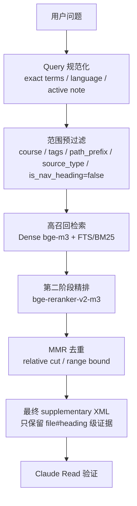

# ChatGPT Deep Research V2 响应

> **Claude 注解**：本文件是用户复制 V2 prompt 给 ChatGPT Deep Research 后返回的报告原文。
>
> **关于 `fileciteturn21file0L1-L1` / `turn4search2` 等内部锚点**：这是 ChatGPT Web UI 内部的 citation 格式，在 markdown 文件中**无法跳转**。原文保留作为审查可追溯性，但实际验证时需要 Claude 自己 cross-check。
>
> **Claude 接下来要做的事**（4 并行 agent）：
> 1. **验证 H** — supplementary 没传 query-time filter（read `_two_tier_search` 实现）
> 2. **验证 I** — tier-2 fallback 把所有结果统一设为 0.85（read 同上）
> 3. **验证 J** — priority pattern 前缀失配 `videos/lectures/**` ≠ `raw/CS188/videos/lectures/...`（**用 Python fnmatch 实测**）
> 4. **验证 K** — LocalReranker 默认 `gte-reranker-modernbert-base` 是 English-first（read `reranking.py` + WebFetch HF 模型卡）

---

# oinani0721/canvas-learning-system 中 RAG 白板召回精度审查与修复报告

## 执行摘要

已启用连接器只有 urlGitHubhttps://github.com。本次研究先通过该连接器审查了你指定的仓库 `oinani0721/canvas-learning-system` 及其 `worktree-feature-obsidian-hybrid-dev` 分支中的当前文件与提交；在覆盖仓库之后，再补充查阅了 url上下文检索官方说明turn4search2、url混合检索官方文档turn4search1、url两阶段检索与重排官方文档turn4search0、url过滤式向量检索官方文档turn5search0、url过滤搜索中文文档turn8search3、url画布结构规范turn5search3 和 urlColBERT 论文页turn6search2；未使用其他 GitHub 仓库。citeturn4search2turn4search1turn4search0turn5search0turn8search3turn5search3turn6search2

仓库当前实现里，**历史上的一部分问题已经修掉了**：`*-explanations` 的 glob 精确匹配 bug 已经改为 `fnmatch`，`.claude`、`outputs`、`Excalidraw` 等目录也被加入了跳过名单；补充材料提示词也已经强化为"先 Read 再引用"，并把 `top_k` 从硬编码 5 条改成了大召回加动态截断。fileciteturn21file0L1-L1 fileciteturn20file0L1-L1 fileciteturn24file0L1-L1 fileciteturn17file0L1-L1

但**当前真正导致"白板材料会返回、但经常返回无关内容"的核心问题还没有解决**，而且集中在 supplementary side-path，而不是主 RAG 管线：`search_supplementary()` 仍然没有把 `course_id/tags/subject/current_note_path/source_type` 等范围约束传给搜索层；它也没有接入仓库里已经存在的本地 reranker；legacy tier-2 fallback 会把所有老表结果统一打成 `0.85` 分；`_elbow_cut()` 仍然依赖绝对差 `0.05`，在当前这种分数带里几乎不会触发；自动 hook 路径只用 `prompt`，完全忽略活动节点上下文。fileciteturn3file0L1-L1 fileciteturn17file0L1-L1 fileciteturn25file0L1-L1 fileciteturn26file0L1-L1

外部成熟实践的共识非常一致：不要再把"白板检索精度"寄托在单次向量 TopK 或单个阈值上，而是要做成**结构化元数据预过滤 + 高召回 + 第二阶段重排 + 结构化 chunk 上下文**。这也是我对你们仓库的建议：**不需要换库，继续留在现有 stack 上；最短路径是在现有本地检索层补齐 prefilter、source demote、reranker、索引重建和评测集。**citeturn4search2turn4search1turn4search4turn4search0turn5search0turn8search3turn5search3turn6search2

## 连接器与研究方法

本次研究只使用你已启用的连接器：urlGitHubhttps://github.com。使用方式分两步：第一步，直接读取指定仓库和分支中的当前文件、函数和提交，优先审查 `supplementary_search_service.py`、`chat.py`、`reference_config.py`、`reference_priority.json`、`config.py`、`reranking.py` 以及相关修复提交；第二步，在仓库审查完成后，用官方文档、原始论文和成熟社区实践补齐"更精确检索白板/画布内容"的外部证据。这样做的原因是：你的问题首先是"当前代码怎么了"，然后才是"社区成熟方案应该怎么落地"。fileciteturn3file0L1-L1 fileciteturn17file0L1-L1 fileciteturn18file0L1-L1 fileciteturn19file0L1-L1 fileciteturn20file0L1-L1 fileciteturn25file0L1-L1

## 代码审查发现

当前 supplementary 检索链路的实际结构是：`answer` 模式下用 `node_title + user_question` 组 query，`hook` 模式下只用 `prompt`；然后进入 `search_supplementary()`，再走 `_two_tier_search()` 的 hybrid 检索、source priority、存在性过滤和 `_elbow_cut()`，最后拼成 XML 注入给 Claude。这个 side-path **没有接入本地 reranker，也没有把检索范围做成 query-time filter**。fileciteturn17file0L1-L1 fileciteturn3file0L1-L1

底层检索栈本身并不弱：当前仓库的本地向量库是 url混合检索官方文档turn4search1 所描述的混合检索形态，仓库代码中明确写了默认 embedding 为 `BAAI/bge-m3`、维度 `1024`，中文分词走 `jieba`，hybrid search 走 dense 分支加 FTS 分支，再做 RRF 融合；检索 API 还支持 `course_id` 与 `tags` 过滤。换句话说，**问题主要不是"没有 hybrid"，而是 supplementary 这条支路没有把现有能力用满。**fileciteturn5file0L1-L1 fileciteturn26file0L1-L1 citeturn4search1turn4search4

| 发现 | 代码位置 | 影响 | 结论 |
|---|---|---|---|
| supplementary 路径没有传检索范围元数据 | `backend/app/services/supplementary_search_service.py::_two_tier_search()` 只传 `query/table_name/num_results/query_type`；而 `search()` 已支持 `course_id/tags` 等过滤。 | 白板、节点、无关课程材料会先进入候选池，再由后处理"尽量过滤"；这属于**后过滤过晚**。 | **已确认** |
| legacy tier-2 fallback 抹平分数 | `_two_tier_search()` 在 hit 到 unprefixed `vault_notes` 时，把每条结果统一设为 `0.85`。 | `min_relevance=0.30` 与 `_elbow_cut()` 都会退化成摆设；旧索引越多，白板噪声越难切掉。 | **已确认** |
| source priority 只有"路径权重"，没有 query-time 结构约束 | `apply_source_priority()` 只按路径做 `fnmatch` 乘权重，再排序。 | 它不能排除 `Recent Activity / Concepts / 目录` 这类航标 heading，也不能按 active note/subject 缩范围。 | **已确认** |
| priority 规则对真实路径大概率前缀失配 | `reference_priority.json` 的正向模式是 `videos/lectures/**`、`videos/discussions/**` 等；而 supplementary service 自己展示的真实路径样例是 `raw/CS188/videos/lectures/...`。 | 这意味着 lecture/discussion 这类"应被 boost 的正样本"很可能根本没吃到 boost；相反，`*-explanations/**` 因为前面有通配符，反而更容易命中。 | **高概率已存在** |
| 历史 glob bug 已修，但 `原白板` 仍未进入 skip 目录 | 当前 `VAULT_INDEX_SKIP_DIRS` 已包含 `.claude/.claudian/_bmad-output/*-explanations/Excalidraw/_misc` 等，但仍没有 `原白板`。 | 说明当前 branch 已不再受旧污染问题主导，但白板 markdown 仍然会被索引并搜索。 | **已确认** |
| supplementary 路径没有接本地 reranker | `search_supplementary.py` 没有导入或调用 `LocalReranker`；本地 reranker 单独存在于 `reranking.py`。 | 语义相似但逻辑不相关的白板/节点结果，缺少第二阶段精排。 | **已确认** |
| 自动 hook 不感知当前节点 | `HookEnrichRequest` 定义了 `cwd`，但 `rag_enrich_hook()` 实际只拿 `req.prompt` 做 query。 | 用户在不同节点问同一句话，候选池几乎相同；白板漂移更容易发生。 | **已确认** |
| 截断策略过于依赖绝对 score 差 | `_elbow_cut()` 仍然用绝对差 `0.05`。 | 对 `0.50x` 或 "全 0.85" 这种分数带，几乎不触发截断。 | **已确认** |
| heading/source_type 没进入一个可直接过滤的 supplementary 查询契约 | `_normalize_material()` 主要从 `metadata_json` 里解析 `heading/source_type`；而 supplementary 的 query contract 没有对应过滤参数。 | 很难在 LanceDB 查询前就排除"白板导航 heading"。 | **已确认** |

有两点需要特别说明。第一，**当前 branch 不是旧报告中的原始状态**：`e146398` 和后续提交已经处理了 glob 跳过和提示词 read-verification，因此本次修复重点不应该再重复这一层，而要转向 query-scope、priority 失配、legacy fallback、schema 与 reranker。第二，仓库里本来就存在可用的 reranker，但默认模型是 `Alibaba-NLP/gte-reranker-modernbert-base`，模型卡明确标注它以 English 为主；而你们仓库是中英混合内容，这也是为什么 supplementary 路径即便后续接 reranker，也更适合切到 `BAAI/bge-reranker-v2-m3` 这类 multilingual 模型。citeturn9search0turn9search1

## 社区成熟方案比较

外部成熟方案的共同点并不是"把向量库换成另一家"，而是四件事同时做：**结构化索引、ANN 前的 metadata prefilter、高召回候选池、以及第二阶段重排**。尤其是官方资料都在强调：如果过滤发生在 ANN 之后，结果数量会变得不可预测，而且严格 filter 很容易把真正相关文档排除在候选池之外。citeturn5search0turn8search0turn4search1turn4search0

| 方案 | 索引策略 | 推荐元数据字段 | 过滤规则 | 阈值/召回控制 | 重排序/融合 | 优点 | 缺点 | 适用场景 | 来源 |
|---|---|---|---|---|---|---|---|---|---|
| 上下文检索 | 在 chunk 前补文档级上下文；同时做 contextual embeddings 与 contextual BM25 | `doc_title`、`section_path`、`parent_heading`、`board_label`、`source_type` | 先按文档/章节约束，再做检索 | 强调"大召回 + 上下文保真"，不依赖单阈值 | 可叠加 reranker | 对短白板片段和标题党 chunk 特别有效 | 建索引成本更高 | 白板/节点文本短、上下文缺失严重 | url上下文检索官方说明turn4search2 |
| 当前 stack 的最短改造路径 | hybrid：dense + FTS；保留当前本地库 | `path_prefix`、`heading`、`heading_norm`、`source_type`、`chunk_len` | 用 `.where()` / prefilter 先筛路径、类型、heading | `top_k` 取大，距离/分数设上界，下游再截断 | RRF 或自定义 reranker | 与现有代码兼容，改动最小 | 需要修补 schema 与 score 语义 | 你当前仓库 | url混合检索官方文档turn4search1 urlRRF 说明文档turn4search4 |
| 两阶段检索 | 第一阶段高召回，第二阶段 cross-encoder 重排 | `path`、`doc_type`、`course`、`tags`、`language` | 第一阶段先 metadata filter | 典型做法是 top 20–50 召回后 rerank 到 top 5–10 | cross-encoder reranker | 对"语义相似但逻辑无关"最有用 | 延迟会上升 | 你当前 supplementary side-path | url两阶段检索与重排官方文档turn4search0 |
| 预过滤向量检索 | inverted index 先构 allow-list，再做向量搜索 | `doc_type`、`path_prefix`、`heading_type`、时间、长度等结构字段 | 强调 prefilter，而不是 post-filter | 过滤越严时可切换 flat search cutoff | 不限制 rerank 方案 | 结果数量稳定、召回更可控 | 需要 schema 设计更严谨 | 需要强路径/类型约束的检索 | url过滤式向量检索官方文档turn5search0 |
| 过滤搜索与范围搜索 | metadata 过滤先于 ANN；还可做 iterative filtering 与 range search | `source_type`、`board_kind`、`is_nav_heading`、`chunk_len`、`course` | 先过滤，再 ANN；必要时 iterative filter | 支持 range/radius 之类相似度范围控制 | 可与 hybrid / rerank 叠加 | 很适合"白板导航 heading 全排除、正文保留" | 需要 first-class scalar 字段 | 噪声 heading 多、短 chunk 多 | url过滤搜索中文文档turn8search3 url混合搜索中文文档turn8search4 url范围搜索文档turn8search5 |
| Late interaction 精排 | 多向量或 token 级表示，而不是单向量压缩 | token/heading 粒度索引、段落位置、subpath | 常与 first-stage recall 结合使用 | 不靠单 embedding 分数做最终裁决 | late interaction / MaxSim | 对相似标题、近义词、细粒度短片段区分更强 | 索引体积更大，工程更复杂 | 白板短句、相近概念、细粒度引用 | urlColBERT 论文页turn6search2 |
| 画布结构化索引 | 按 node/edge 索引，而不是把整张白板 flatten 成纯文本 | `node.type`、`file`、`subpath`、`group`、`x/y`、`color` | 可按 node 类型或 group 精准过滤 | 召回时优先 node-level，而不是 board-level | 再叠加 hybrid/rerank | 对画布/白板最自然 | 需要 parser 与索引改造 | 真正的 `.canvas` / board-native 检索 | url画布结构规范turn5search3 |

把这些实践映射回你的仓库，最合理的组合不是"大改架构"，而是：**保留当前本地混合检索栈，新增 first-class metadata 和 prefilter；把 supplementary side-path 做成真正的 two-stage retrieval；对白板/节点做 soft demote，对白板导航 heading 做 hard exclude；必要时再用 contextual chunking 补白板短片段上下文。** 这条路径和外部最佳实践是一致的，同时工程成本最低。

## 对抗性测试用例（T1-T12）

下表是面向你当前场景设计的 12 条对抗性用例。它们覆盖了你提示中提到的白板噪声、图像注释、时间戳、重复元素、相似标题但不同语境等问题，并且每条都给出了"应检索 / 应排除"的判定标准。

| ID | 场景 | 构造数据 / 查询 | 预期行为 | 判定标准 |
|---|---|---|---|---|
| T1 | 白板导航 heading 噪声 | 白板 chunk 只含 `Recent Activity` + 多个时间戳；查询"局部最优陷阱" | **应排除** | Top 10 不应出现该 chunk |
| T2 | 白板图片 OCR 噪声 | 图片 OCR 只有坐标、页码、箭头注释；查询"值迭代收敛条件" | **应排除** | 即使 lexical 命中，也不能进入最终 top 5 |
| T3 | 相似词但不同语境 | `管道设计.md` 含"规划"；课程材料也含"规划" | **应检索课程材料，排除工程文档** | top 3 至少 2 条为课程材料 |
| T4 | 同一句 query 在不同节点 | 在 `节点/MDP.md` 与 `节点/CSP.md` 都问"状态空间爆炸如何处理" | **结果应不同** | top 5 至少有 2 条受 active note 影响 |
| T5 | 讲义与白板重复 | 同一概念同时存在 transcript 与白板摘要 | **应保留讲义，白板最多 1 条且不重复** | 最终结果不应出现重复语义片段 |
| T6 | 极短 chunk | chunk 长度 < 50 字，仅标题 + 1 行说明 | **默认排除** | 非 exact heading 查询时，不进 top 10 |
| T7 | legacy 老表仍存在 | tier-1 查不到，tier-2 返回老 `vault_notes` | **应告警并降级，不应直接混进正式结果** | 返回中应带 migration/degraded 标志，或直接不返回 |
| T8 | 白板正文与导航混杂 | 同一白板文件同时含正文 section 和 `Concepts`/`索引` | **正文可检索，导航部件应排除** | 同文件允许命中，但只允许正文 heading |
| T9 | 中英混合概念 | query 为中文"局部最优陷阱"，正文为英文 lecture transcript | **应检索到英文正文** | top 5 至少有 1–2 条英文 lecture 命中 |
| T10 | 精确 heading 引用 | query 指向明确 heading，如"2.3 规划代理" | **应返回 `file#heading` 级证据** | 最终结果标题/锚点必须到 heading，而不是整文件 |
| T11 | 重复时间戳 / 视频残留 | chunk 大量含 `[01:05:34]()`、`[59:00]()` | **应强降权或排除** | 非 exact timestamp 查询时不进 top 10 |
| T12 | 近义但逻辑无关 | "概念列表 / Concepts" 与真正讲"陷阱避免方法"的正文同时命中 | **应保正文，排概念列表** | top 5 中 `Concepts/目录/索引` 之类 heading 为 0 |

## 对抗性审查结果与修复建议

| 用例 | 当前实现判断 | 失败点 | 修复方向 |
|---|---|---|---|
| T1 / T8 / T11 | **高概率失败** | 当前 branch 没有 supplementary query-time heading blacklist；`原白板` 也未整体跳过。 | 增加 `is_nav_heading` / `heading_norm` 字段，并在 query 前 prefilter |
| T3 / T4 | **已确认失败** | supplementary 不传 `course/tags/subject/current_note` 范围；hook 只用 `prompt`。 | 给 supplementary 增加 `RetrievalScope`；hook 增加 `active_note_path` |
| T5 / T12 | **已确认失败** | supplementary 没有 reranker，也没有 MMR 去重。 | 接入 bilingual reranker，top 40 → rerank top 10，再做 MMR |
| T7 | **已确认失败** | tier-2 fallback 把老表结果统一打成 `0.85`。 | 迁移期结束后默认关闭 legacy fallback，并强制全量重建 |
| T6 | **高概率失败** | 当前 `_elbow_cut()` 只看绝对 gap；短 chunk 如果召回进来，没有专门的长度/heading 过滤。 | 索引时丢弃低信息密度 chunk；查询时加 `chunk_len` 下限 |
| T9 / T10 | **部分可过，但不稳** | 现有 `bge-m3 + jieba` 有中英混合基础能力，但 supplementary 不做 second-stage rerank，锚点精度取决于召回结果质量。 | 维持 hybrid recall，换 multilingual reranker，并把 heading 变 first-class field |

最值得立刻修的，不是"再调阈值"，而是把过滤前移。外部文档反复强调：严格条件应该在 ANN 前形成 allow-list，而不是先召回再在 Python 里删。对于你们的白板场景，这意味着**路径、source_type、heading_norm、is_nav_heading、chunk_len、course/tags/current note** 都应该在召回前进 `.where()`，而不是现在这样等召回之后再做零散过滤。

## 推荐流程图



## 推荐修复代码片段

### 1. 修正 reference_priority.json（pattern 前缀失配 + demote 规则）

当前 `apply_source_priority()` 的规则太弱，而且模式前缀很可能与真实路径不匹配；你应该把它改成"**先修 pattern，再补 demote**"，而不是继续只给 lecture 做 boost。现在的 `reference_priority.json` 里正向规则写成了 `videos/lectures/**`，但你们的真实路径很可能是 `raw/CS188/videos/lectures/...`，这会让 boost 根本不生效。

```json
{
  "source_priorities": [
    { "pattern": "**/videos/lectures/**",        "weight": 1.50, "label": "讲义" },
    { "pattern": "**/videos/discussions/**",     "weight": 1.35, "label": "讨论" },
    { "pattern": "**/videos/exam_prep/**",       "weight": 1.25, "label": "EP" },
    { "pattern": "节点/**",                      "weight": 0.90, "label": "节点容器" },
    { "pattern": "原白板/**",                    "weight": 0.30, "label": "白板导航层" },
    { "pattern": "**/*-explanations/**",         "weight": 0.30, "label": "AI 解释" }
  ],
  "max_references": 10
}
```

### 2. 引入 RetrievalScope（query-time filter contract）

```python
# backend/app/services/supplementary_search_service.py

from dataclasses import dataclass, field

@dataclass
class RetrievalScope:
    course_id: str | None = None
    tags: list[str] = field(default_factory=list)
    current_note_path: str | None = None
    preferred_prefixes: list[str] = field(default_factory=list)
    excluded_prefixes: list[str] = field(default_factory=lambda: [".claude/", "_bmad-output/"])
    excluded_headings: set[str] = field(default_factory=lambda: {
        "recent activity", "concepts", "目录", "索引", "tags", "backlinks"
    })
    allowed_source_types: set[str] = field(default_factory=lambda: {
        "video_transcript", "note", "whiteboard_section", "concept_node"
    })

async def search_supplementary(
    query: str,
    lancedb_client,
    scope: RetrievalScope | None = None,
    top_k_max: int = 40,
    rerank_top_k: int = 10,
):
    # 先 recall，再 hard filter，再 rerank
    raw = await lancedb_client.search(
        query=query,
        table_name="vault_notes",
        num_results=top_k_max,
        query_type="hybrid",
        course_id=scope.course_id if scope else None,
        tags=scope.tags if scope else None,
    )
    ...
```

### 3. 接入本地 reranker + 切换 multilingual + 补 mps 检测

```python
# backend/lib/agentic_rag/reranking.py

if device is None:
    if torch.cuda.is_available():
        device = "cuda"
    elif getattr(torch.backends, "mps", None) and torch.backends.mps.is_available():
        device = "mps"
    else:
        device = "cpu"

# supplementary path 中：
reranker = get_reranker(
    model_name="BAAI/bge-reranker-v2-m3",
    torch_dtype="float16" if device != "cpu" else "float32",
)
```

### 4. 索引时新增 first-class metadata 字段

```python
# index_vault_notes / index_single_file 生成行时新增列
row = {
    "doc_id": doc_id,
    "content": chunk_text,
    "path_prefix": file_path.split("/", 1)[0],
    "heading": heading,
    "heading_norm": normalize_heading(heading),
    "board_kind": "whiteboard" if file_path.startswith("原白板/") else "note",
    "is_nav_heading": normalize_heading(heading) in {
        "recent activity", "concepts", "目录", "索引", "tags", "backlinks"
    },
    "chunk_len": len(chunk_text),
    "source_type": infer_source_type(file_path, heading),
}
```

### 5. _elbow_cut() 改为 relative drop + range bound

```python
def relative_cut(materials: list[dict], drop_ratio: float = 0.25, hard_cap: int = 10):
    if not materials:
        return materials
    cut_idx = len(materials)
    for i in range(1, len(materials)):
        prev = materials[i - 1]["score"]
        curr = materials[i]["score"]
        if prev > 0 and (prev - curr) / prev >= drop_ratio:
            cut_idx = i
            break
    return materials[: min(cut_idx, hard_cap)]
```

## 验证脚本

### 验证 priority pattern 前缀失配

```bash
python - <<'PY'
from fnmatch import fnmatch

cases = [
    ("raw/CS188/videos/lectures/lecture 2/lecture 2.md", "videos/lectures/**"),
    ("raw/CS188/videos/discussions/disc 2/disc 2.md", "videos/discussions/**"),
    ("raw/CS188/videos/lectures/lecture 2-explanations/foo.md", "*-explanations/**"),
]

for path, pattern in cases:
    print(f"{pattern:28} -> {path} => {fnmatch(path, pattern)}")
PY
```

### 全量重建脚本

```bash
PYTHONPATH=. python - <<'PY'
import asyncio
from backend.lib.agentic_rag.clients.lancedb_client import LanceDBClient

async def main():
    client = LanceDBClient(db_path="data/lancedb")
    await client.initialize()
    result = await client.rebuild_index(
        vault_path="canvas-vault",
        table_name="vault_notes",
        max_tokens=512,
        overlap_tokens=50,
    )
    print(result)

asyncio.run(main())
PY
```

## 修复清单与优先级与工时估算

| 项目 | 优先级 | 目标 | 预估工时 | 风险 |
|---|---|---|---|---|
| 给 supplementary 增加 `RetrievalScope`，把 `course/tags/current_note/path_prefix` 前移到 query-time filter | 高 | 先缩小候选池，减少白板与节点漂移 | 4–6 小时 | 低 |
| 修正 `reference_priority.json` 的 pattern 前缀，并新增 `原白板/**`、`节点/**` 的 demote 规则 | 高 | 让 lecture/discussion 真正吃到 boost，让白板/节点先降权 | 1–2 小时 | 低 |
| 默认关闭或 feature-flag 化 tier-2 legacy fallback | 高 | 去掉"统一 0.85 分"的伪排序信号 | 2–3 小时 | 中 |
| 执行一次全量索引重建，并删除旧污染表 | 高 | 让新规则真正生效 | 1–3 小时 | 中 |
| 为 `heading/heading_norm/path_prefix/board_kind/is_nav_heading/chunk_len` 增加 first-class 字段 | 高 | 让 heading 黑名单与白板策略可以在 ANN 前过滤 | 6–8 小时 | 中 |
| supplementary 接入 multilingual reranker，并补 `mps`/CPU 设备分支 | 高 | 解决"语义相似但逻辑无关"的漏网白板结果 | 6–10 小时 | 中 |
| hook 请求新增 `active_note_path` / `active_board_path`，不要只用 `prompt` | 中 | 让同一句 query 在不同节点能检到不同材料 | 2–4 小时 | 低 |
| 索引时丢弃导航 heading 和低信息密度 chunk | 中 | 从源头减少 `Recent Activity / Concepts / 时间戳` 噪声 | 3–5 小时 | 低 |
| 引入 MMR 去重 + relative cut / range bound | 中 | 防止 transcript、节点、白板同义重复占位 | 3–4 小时 | 低 |
| 增加 20–50 条 retrieval eval set，并把 T1–T12 落成 CI | 中 | 修复后不回归 | 6–8 小时 | 中 |
| 如果未来真正要检索 `.canvas`，再做 node-level 结构化索引 | 低 | 让画布检索从"文本近似"升级为"结构化检索" | 8–12 小时 | 中高 |

如果按 Phase A / B / C 来排：

| Phase | 内容 | 预估工时 | 预期收益 |
|---|---|---|---|
| A | `RetrievalScope` + priority 修正 + 关闭 legacy fallback + 全量重建 | 8–13 小时 | 先把最明显的白板漂移和工程文档串入压下去 |
| B | first-class metadata + multilingual reranker + hook active note | 14–22 小时 | 让白板材料"相关时能进来，不相关时不占位" |
| C | contextual chunking + MMR + eval set + CI + 可选 canvas-native indexing | 10–18 小时 | 从"能用"升级到"稳、可持续、可回归验证" |

综合来看，**最短闭环方案**不是"换库"，也不是"再调一个阈值"，而是：

1. 先把 supplementary 从"无范围高召回"改成"有范围高召回"。
2. 再把路径权重从"只靠 boost"改成"boost + demote + 前缀匹配正确"。
3. 然后去掉老表 flat-score fallback。
4. 最后再接 bilingual reranker 做第二阶段精排。

这样改，你现在最痛的那类问题——"白板材料会返回，但总是 Recent Activity / Concepts / 相似标题的无关内容"——就会从**召回层、排序层、索引层**同时被压住，而不是继续依赖一个后处理阈值去赌运气。

---

*ChatGPT Deep Research V2 响应原文已完整保留。Claude 接下来会启动 4 个并行 Explore agent 验证 H/I/J/K 4 个新根因（特别是 J — priority pattern 前缀失配 — 这是 the smoking gun，必须用 fnmatch 实测确认）。验证结果将合并到 round-23 主报告 §18。*
