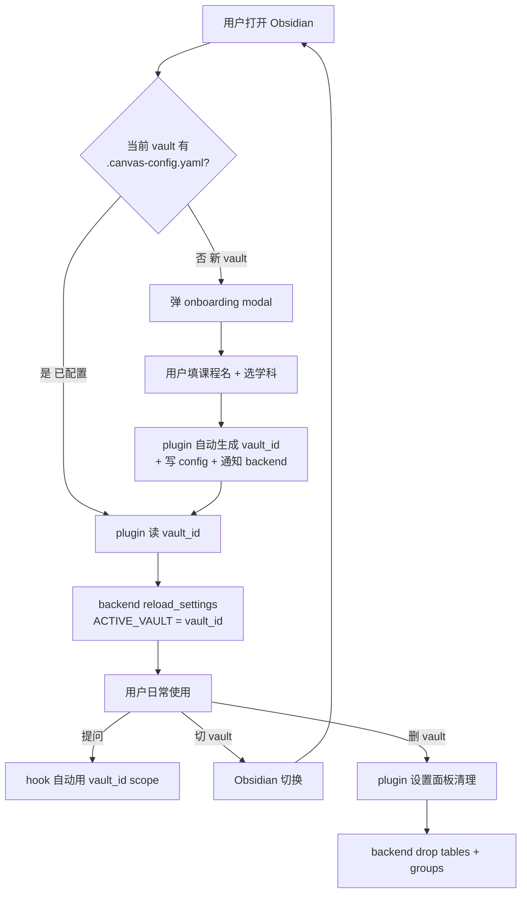

# 多 Vault 解决方案完整设计报告

> 核心问题：**用户未来要用很多不同 vault（每门课程一个），当前架构 35% ready，还有 65% 工作要做**

---

## 1. 执行摘要

### 1.1 当前真实状况

Phase A0.5（commit ecf16f2）解决的是**单 vault 内的安全攻击面**（L hook 鉴权 + P taint 扫描 + N Graphiti 规范），**不是多 vault 准备度**。

| 维度 | 当前 ready | 加第 2 个 vault 会怎样 |
|---|---|---|
| LanceDB 物理隔离 | ✅ 100% | 表名前缀正常工作 |
| Graphiti 命名空间 | ✅ 80% | 新数据用 `vault:` 规范，旧数据要跑 migration |
| **中文 vault 命名** | 🚨 **0%** | **两个中文 vault 共享 'default' 表 → 数据泄漏** |
| **per-vault 配置** | 🚨 **0%** | **新 vault 用全局 priority pattern，跨学科必失配** |
| **请求级 vault 绑定** | 🚨 **0%** | **进程切换 ACTIVE_VAULT 时并发请求会串库** |
| **SQLite 数据隔离** | 🚨 **0%** | **qa_metrics.db 跨 vault 数据混淆** |
| onboarding 自动化 | ⚠️ 40% | 5 步手工，小白友好度 3/5 |

**综合 ready 度: 35%**（用户加第 2 个 vault 立刻翻车）

### 1.2 核心论点

1. **业界共识**（NotebookLM / AnythingLLM / Logseq）：**强物理隔离 + per-workspace 配置 + 默认拒绝跨 vault 搜索**
2. **当前架构是"补丁式多 vault"** — 把单 vault 假设打补丁延伸到多 vault，需要升级为 **first-class 多 vault**
3. **修复优先级 = 数据正确性 > 用户体验 > 开发效率** — 必须在用户加第 2 个 vault 之前修 M（中文坍缩）

### 1.3 推荐路线（3 子阶段）

```
Phase A0.5 (DONE) ✅           — 单 vault 安全（L+N+P）
       │
       ▼
Phase B0 (P0, 5-8h) 🚨        — 加第 2 vault 不 break
       │   └─ M sanitize_vault_id 中文支持
       │   └─ .canvas-config.yaml 加 vault_id 显式字段
       │   └─ plugin onboarding 自动生成
       ▼
Phase B1 (P1, 8-12h)          — per-vault 配置就绪
       │   └─ apply_source_priority(vault_id)
       │   └─ .canvas-config.yaml 加 retrieval_hints
       │   └─ SQLite qa_metrics 加 vault_id 列
       ▼
Phase B2 (P2, 6-10h)          — 请求级 vault 绑定
       │   └─ Hook + Chat 加 vault_id 校验
       │   └─ LanceDBClient 显式 vault_id（禁全局读）
       │   └─ Plugin 调用必带 vault_id
       ▼
Phase B 完成 → 多 vault ready 度 95%
```

---

## 2. 当前架构现状评估

### 2.1 已就绪（Phase A0.5 + 历史积累，不动）

| 组件 | 实现 | 状态 |
|---|---|---|
| LanceDB 单 DB 多 table 前缀 | `{vault_id}_vault_notes` | ✅ Story 1.9 ready |
| Graphiti group_id 隔离 | `vault:<vault_id>:<subject>:<canvas>` | ✅ Phase A0.5-N ship |
| Backend hot-reload | `reload_settings()` | ✅ 无需 restart |
| API endpoint vault_id 必填 | `/api/v1/chat/enrich-context` | ✅ Story 2.5.Y |
| migrate_group_ids.py | 旧格式 → vault: 规范 | ✅ ready |
| Hook + Chat 鉴权 | `require_internal_api_key` | ✅ Phase A0.5-L ship（DEBUG 透明） |
| Supplementary taint 扫描 | quarantine/review/clean 三级 | ✅ Phase A0.5-P ship |

### 2.2 致命 Gap（必须修才能加第 2 vault）

#### Gap 1: 中文 Vault Sanitize 坍缩（Phase B0 必修）

```python
# backend/app/config.py:896-905 当前实现
def sanitize_vault_id(name: str) -> str:
    s = re.sub(r"[^a-z0-9]", "", name.lower())  # ⛔ 剥离所有非 ASCII
    return s if s else "default"

# 实测后果
sanitize_vault_id('数学101')  → 'default'  ⚠️
sanitize_vault_id('英语写作')  → 'default'  ⚠️ (与"数学101"共享 LanceDB table!)
```

**用户场景**：
- 用户有 vault "数学101" 写满数学笔记
- 用户加新 vault "英语写作" 写英语笔记
- backend 把两个 vault 都映射到 `default_vault_notes` table
- → 用户问"梯度下降"时召回到英语作文笔记
- → **跨 vault 数据泄漏 + 召回噪声爆炸**

`backend/tests/unit/test_vault_switch.py:64` 已 `assert sanitize_vault_id("笔记库") == "default"` 但**作为 expected behavior** — 这是反 pattern。

#### Gap 2: `.canvas-config.yaml` 缺 vault_id 字段（Phase B0 必修）

```yaml
# canvas-vault/.canvas-config.yaml 当前 schema
subject: cs-61b
subject_display: "CS 61B 数据结构"
active_board: null
schema_version: "1.0-flat-architecture-2026-04-20"
deprecated_paths: [...]
```

vault_id 全靠 `sanitize_vault_id(ACTIVE_VAULT)` 推断 — 用户改 vault 文件夹名 → vault_id 静默改变 → 数据丢失。

#### Gap 3: per-vault Config 全部缺失（Phase B1 必修）

```
backend/data/reference_priority.json   全局单一 ❌
backend/app/core/reference_config.py:apply_source_priority(results)  无 vault_id 参数 ❌
backend/data/qa_metrics.db  无 vault_id 列 ❌
```

后果：CS61B vault 用 `videos/lectures/` 命中 boost；但加新数学 vault 用 `课件/讲座/` → 全失配（Phase A0 修的 J 在多 vault 下问题重现）。

#### Gap 4: 请求级 Vault 绑定缺失（Phase B2 修复）

进程全局 `ACTIVE_VAULT` env → 多客户端并发或 hook 切换时间窗口 → 跨 vault 串库。

---

## 3. 技术解决方案

### 3.1 Phase B0 — 加第 2 Vault 不 Break（P0，5-8h）

**目标**：让用户加第 2 个 vault（含中文名）不会立刻 break。

#### 3.1.1 修 M — sanitize_vault_id 中文支持（2-3h）

```python
# backend/app/config.py
import unicodedata, hashlib, re

def sanitize_vault_id(name: str) -> str:
    """Phase B0: Unicode-aware vault_id 归一化, 替代旧 default 坍缩.

    优先级:
    1. NFKC 归一化（如 'café' → 'cafe' 后保留）
    2. 保留 ASCII alnum + 中日韩 + 下划线/横线
    3. 全空兜底用 SHA-256 hash 后缀
    """
    if not name:
        return "default"
    # NFKC: 兼容字符归一化
    normalized = unicodedata.normalize("NFKC", name).strip().lower()
    # 保留 ASCII alnum + 中日韩 + dash/underscore
    slug = re.sub(r"[^\w一-鿿぀-ゟ゠-ヿ-]+", "_", normalized).strip("_")
    if slug:
        return slug[:64]
    # 全特殊字符兜底用 hash
    digest = hashlib.sha256(name.encode("utf-8")).hexdigest()[:12]
    return f"vault_{digest}"
```

**测试用例**：
```python
sanitize_vault_id('CS 61B')   → 'cs_61b'         ✅
sanitize_vault_id('数学101')   → '数学101'         ✅ (保留中文)
sanitize_vault_id('英语写作')  → '英语写作'         ✅
sanitize_vault_id('café')     → 'cafe'           ✅ (NFKC)
sanitize_vault_id('***')      → 'vault_a3f5b...' ✅ (hash 兜底)
sanitize_vault_id('')         → 'default'        ✅
```

**迁移影响**：
- 当前所有数据已经写入 `default_vault_notes` table（如果用户用过中文 vault）
- 升级后新 vault 写入 `数学101_vault_notes` 等
- 旧 'default' table 数据**保留兼容读取**（`canonical_group_id` 已有 fallback）
- 用户主动迁移：`POST /api/v1/vault/migrate-from-default` (新 endpoint)

#### 3.1.2 修 .canvas-config.yaml schema v2（1-2h）

```yaml
# canvas-vault/.canvas-config.yaml v2
vault_id: "cs_61b"          # ⭐ 显式字段，不再依赖文件夹名推断
vault_display_name: "CS 61B 数据结构"
subject: cs-61b
active_board: null
schema_version: "2.0-multi-vault-2026-05-10"
created_at: "2026-04-20T10:00:00Z"
last_indexed_at: "2026-05-10T11:00:00Z"
deprecated_paths: [...]
```

**Backend 改动**：
- `backend/app/services/canvas_config_service.py` 优先读 `vault_id` 字段
- `Settings.vault_id` property 改为：先读 .canvas-config.yaml `vault_id` → fallback 到 `sanitize_vault_id(ACTIVE_VAULT)`
- 写 schema migration 自动给老 .canvas-config.yaml 加 `vault_id` 字段（用 sanitize 当前 ACTIVE_VAULT）

#### 3.1.3 Plugin onboarding 自动生成（2-3h）

```typescript
// frontend/obsidian-plugin/src/main.ts
async onload() {
    const configPath = '.canvas-config.yaml'
    if (!await this.app.vault.adapter.exists(configPath)) {
        await this.showOnboardingModal()
    }
}

async showOnboardingModal() {
    new VaultOnboardingModal(this.app, async (config) => {
        // 自动生成 vault_id 从 display name
        const vaultId = await this.requestBackendSanitize(config.displayName)
        const yaml = stringifyYaml({
            vault_id: vaultId,
            vault_display_name: config.displayName,
            subject: config.subject || 'general',
            schema_version: '2.0-multi-vault-2026-05-10',
            created_at: new Date().toISOString(),
        })
        await this.app.vault.adapter.write('.canvas-config.yaml', yaml)
        await this.notifyBackendVaultCreated(vaultId)
    }).open()
}
```

### 3.2 Phase B1 — per-vault 配置就绪（P1，8-12h）

**目标**：让不同课程 vault 用不同 priority 配置，让 SQLite qa_metrics 跨 vault 不混淆。

#### 3.2.1 apply_source_priority(vault_id) per-vault（4-5h）

```python
# backend/app/core/reference_config.py
def apply_source_priority(results: list, vault_id: str | None = None) -> list:
    """Phase B1: per-vault config 加载.

    优先级:
    1. .canvas-config.yaml retrieval_hints.priority_patterns (per-vault override)
    2. backend/data/reference_priority/<vault_id>.json (per-vault file)
    3. backend/data/reference_priority.json (全局 fallback)
    """
    if vault_id:
        try:
            vault_config = load_vault_config(vault_id)
            if vault_config and vault_config.get("retrieval_hints", {}).get("priority_patterns"):
                priorities = vault_config["retrieval_hints"]["priority_patterns"]
                return _apply_priorities(results, priorities)
        except FileNotFoundError:
            pass
    # 全局 fallback
    return _apply_priorities(results, get_global_priorities())
```

#### 3.2.2 .canvas-config.yaml 加 retrieval_hints 段（1-2h）

```yaml
# CS 61B vault 例
vault_id: "cs_61b"
retrieval_hints:
  priority_patterns:
    - {pattern: "**/videos/lectures/**", weight: 1.5, label: "讲义"}
    - {pattern: "**/videos/discussions/**", weight: 1.4}
    - {pattern: "节点/**", weight: 0.9}
    - {pattern: "原白板/**", weight: 0.3}
  excluded_headings: ["Recent Activity", "Concepts", "目录", "索引"]

# 数学 101 vault 例（不同结构）
vault_id: "math_101"
retrieval_hints:
  priority_patterns:
    - {pattern: "**/课件/**", weight: 1.5, label: "课件"}
    - {pattern: "**/习题/**", weight: 1.4}
    - {pattern: "**/笔记/**", weight: 1.3}
  excluded_headings: ["最近修改", "目录"]
```

#### 3.2.3 SQLite qa_metrics 加 vault_id 列（3-5h）

```sql
-- backend/scripts/migrate_qa_metrics_add_vault.sql
ALTER TABLE qa_difficulty_logs ADD COLUMN vault_id TEXT NOT NULL DEFAULT 'default';
ALTER TABLE qa_extraction_records ADD COLUMN vault_id TEXT NOT NULL DEFAULT 'default';
ALTER TABLE qa_review_sessions ADD COLUMN vault_id TEXT NOT NULL DEFAULT 'default';

CREATE INDEX idx_difficulty_vault ON qa_difficulty_logs(vault_id, created_at);
CREATE INDEX idx_extraction_vault ON qa_extraction_records(vault_id, created_at);
CREATE INDEX idx_review_vault ON qa_review_sessions(vault_id, created_at);
```

**代码改动**：
- `backend/app/services/difficulty_matcher.py` `evaluate(vault_id, node_id, ...)`
- `backend/app/services/extraction_validator.py` `record(vault_id, ...)`
- 所有 query 加 `WHERE vault_id = ?`

### 3.3 Phase B2 — 请求级 Vault 绑定（P2，6-10h）

**目标**：从"进程全局 ACTIVE_VAULT"升级到"请求级 vault_id 校验" — 防多客户端并发串库。

#### 3.3.1 Hook + Chat 加 vault_id 字段（3-5h）

```python
# backend/app/api/v1/endpoints/chat.py
class HookEnrichRequest(BaseModel):
    prompt: str
    cwd: str | None = None
    vault_id: str  # ⭐ 必填字段
    # vault_token: str  # Phase B2.5 加签名校验

@chat_router.post("/rag/enrich-hook")
async def rag_enrich_hook(req: HookEnrichRequest):
    # 验证 vault_id 与 cwd 一致（防 spoofing）
    if req.cwd:
        cwd_vault_id = infer_vault_id_from_path(req.cwd)
        if cwd_vault_id != req.vault_id:
            raise HTTPException(409, f"vault_id mismatch: req={req.vault_id} cwd={cwd_vault_id}")
    # 显式构造 vault-scoped client
    client = get_lancedb_client(vault_id=req.vault_id)
    ...
```

#### 3.3.2 LanceDBClient 强制显式 vault_id（2-3h）

```python
# backend/lib/agentic_rag/clients/lancedb_client.py
class LanceDBClient:
    def __init__(self, db_path: str, vault_id: str):
        self.vault_id = vault_id  # ⭐ 必填，禁止读全局
        ...

    def resolve_table_name(self, table_name: str) -> str:
        # 直接用 self.vault_id, 禁止 fallback get_current_vault_id()
        if not self.vault_id or self.vault_id == "default":
            return table_name
        return f"{self.vault_id}_{table_name}"
```

#### 3.3.3 Plugin 调用必带 vault_id（1-2h）

```typescript
// plugin 主入口读 .canvas-config.yaml vault_id
async callBackend(endpoint: string, body: any) {
    const vaultId = await this.getVaultId()  // 读 .canvas-config.yaml
    return await requestUrl({
        url: `http://localhost:8011${endpoint}`,
        method: 'POST',
        headers: {
            'Content-Type': 'application/json',
            'X-CLS-Internal-Key': await this.getInternalKey(),
            'X-CLS-Vault-Id': vaultId,
        },
        body: JSON.stringify({ ...body, vault_id: vaultId }),
    })
}
```

---

## 4. 用户操作流程（小白友好版）

### 4.1 业界对照 — 业界产品的多 vault UX

| 产品 | 多 vault 模型 | 用户切换方式 | 跨 vault 搜索 |
|---|---|---|---|
| Obsidian 原生 | 多 vault（关闭/打开） | 顶部菜单"打开另一个保险库" | ❌ 不支持 |
| NotebookLM | 多 notebook | 主界面切 notebook 卡片 | ❌ 拒绝（设计哲学） |
| AnythingLLM | 多 workspace | 左侧 workspace 列表点击 | ❌ 默认隔离 |
| Logseq | 多 graph | 关闭/打开 graph 类似 Obsidian | ❌ 4 年 FR 未解 |
| **Canvas Learning System (我们)** | **多 vault（继承 Obsidian）** | **跟随 Obsidian 切换** | **❌ MVP 不支持** |

设计原则：**跟 Obsidian 原生 UX 一致 — 用户不需要学新概念**。

### 4.2 5 个核心用户场景

#### 场景 A — 第一次安装 Canvas Learning System

**用户视角**:

```
1. 打开 Obsidian → 启用 Canvas Learning System plugin
2. plugin 自动检测当前 vault 是否有 .canvas-config.yaml
3. 若没有 → 弹出引导 modal:

   ┌─────────────────────────────────────────┐
   │  欢迎使用 Canvas Learning System         │
   │                                          │
   │  这是哪门课程的笔记？                    │
   │  ┌─────────────────────────────────┐    │
   │  │ CS 61B 数据结构                  │    │
   │  └─────────────────────────────────┘    │
   │                                          │
   │  学科类别:  ☑ 计算机   ☐ 数学            │
   │             ☐ 英语    ☐ 其它             │
   │                                          │
   │            [取消]  [创建]                │
   └─────────────────────────────────────────┘

4. 用户填"CS 61B 数据结构" + 选"计算机" → 点[创建]
5. plugin 后台自动:
   ✓ 生成 vault_id "cs_61b"（小白看不到）
   ✓ 写 .canvas-config.yaml
   ✓ 通知 backend 创建 LanceDB table cs_61b_vault_notes
   ✓ 创建 Graphiti group_id vault:cs_61b
6. 显示 ✅ "Canvas 已就绪，开始写笔记吧"
```

**用户体验**:
- 全过程在 Obsidian 内
- 0 命令行操作
- 0 配置文件手写
- 1 步填写（课程名）+ 1 步选择（学科）

#### 场景 B — 日常使用（在单个 vault 内学习）

**用户视角**:

```
1. 用户在 Obsidian 写 CS 61B 笔记
2. 用户点 Claudian sidebar 提问"什么是 BST？"
3. 后台自动:
   ✓ Hook 触发 → 自动注入当前 vault 的相关材料
   ✓ Claude 主动 Read vault 文件验证
   ✓ 回答含 inline wikilink [[lecture 5#BST]]
4. 用户看到精准答案 + 可点击的引用
```

**用户感知到的多 vault 痕迹**: 0（操作完全跟单 vault 一样）

#### 场景 C — 新建第 2 个 Vault（关键场景）

**用户视角**:

```
1. 用户决定新学一门课"数学 101"
2. Obsidian 顶部菜单 → "打开另一个保险库" → "创建新保险库"
3. 选目录 + 取名 "数学 101 微积分" → 进入新 vault
4. Canvas Learning System plugin 自动启动:
   ✓ 检测 .canvas-config.yaml 不存在 → 重复场景 A 流程
   ✓ 用户填"数学 101 微积分" + 选"数学" → 点[创建]
   ✓ vault_id = "数学101微积分" (Phase B0 修复后保留中文)
   ✓ backend 创建独立 LanceDB table 数学101微积分_vault_notes
   ✓ Graphiti group_id vault:数学101微积分
5. 用户在数学 vault 写笔记 → 完全独立的命名空间
```

**关键安全行为**（Phase B0 修复后）:
- ✅ "数学 101" 和"英语写作"不再共享 'default' table
- ✅ 提问"傅里叶变换"不会召回到英语作文
- ✅ vault 配置独立（数学课用 `课件/` 目录 priority，CS 用 `videos/lectures/`）

#### 场景 D — Vault 间切换（一天内多次）

**用户视角**:

```
1. 用户上午在"数学 101" vault 学微积分
2. 中午想切到 "CS 61B" vault 写代码
3. Obsidian 顶部菜单 → "打开另一个保险库" → 选 CS 61B
4. plugin 自动检测 vault 切换:
   ✓ 读 .canvas-config.yaml 拿 vault_id "cs_61b"
   ✓ 通知 backend reload_settings (ACTIVE_VAULT=cs_61b)
   ✓ 后续所有 query 用 cs_61b scope
5. 用户继续提问 → 召回的是 CS 61B 笔记，不会混入数学
```

**用户感知**:
- Obsidian 切 vault 需要 2 秒（Obsidian 原生行为）
- backend 切换 < 100ms 透明
- 用户感觉"打开另一个 Obsidian vault 就是另一门课"

#### 场景 E — 删除 Vault（清理数据）

**用户视角**:

```
1. 用户决定不再学某门课，要删 vault 数据
2. Obsidian 关闭该 vault → 用 Finder 删 vault 文件夹
3. 但 backend LanceDB + Neo4j 还有数据残留
4. 解决方案：plugin 设置面板 → "已删除 Vault 清理"按钮
   ┌──────────────────────────────────────┐
   │  🗑️  清理已删除的 Vault 后端数据      │
   │                                       │
   │  发现 1 个 vault 在 backend 有数据但   │
   │  本地文件夹已删除:                    │
   │    • math_101 (创建于 2026-04-15)    │
   │      LanceDB: 234 chunks             │
   │      Graphiti: 89 nodes              │
   │                                       │
   │  [保留] [删除该 vault 后端数据]       │
   └──────────────────────────────────────┘
5. 用户点[删除] → backend 调用 drop_vault_tables(math_101)
   + delete_graphiti_group("vault:math_101")
6. ✅ 数据彻底清理
```

### 4.3 操作流程图



### 4.4 小白友好度评估

| 场景 | 当前 Phase A0.5 | Phase B0 后 | Phase B1 后 |
|---|---|---|---|
| 首次安装 | 3/5 (手工写 config) | **5/5** ⭐ (自动 onboarding) | 5/5 |
| 日常使用 | 5/5 | 5/5 | 5/5 |
| 新建第 2 vault | 0/5 🚨 (中文翻车) | **5/5** ⭐ | 5/5 |
| Vault 切换 | 3/5 (手动改 .env) | **5/5** ⭐ (自动) | 5/5 |
| 删除 vault | 0/5 (无 UI) | 2/5 | **5/5** ⭐ |

---

## 5. 实施路线 + 工时估算

### 5.1 完整 Phase B 路线

| Phase | 子任务 | 工时 | 依赖 | 用户感知改善 |
|---|---|---|---|---|
| **B0** | M sanitize 中文支持 | 2-3h | — | 中文 vault 不坍缩 |
| **B0** | .canvas-config.yaml v2 + migration | 1-2h | M | vault_id 显式可见 |
| **B0** | Plugin onboarding modal | 2-3h | config v2 | 首次安装 0 命令行 |
| **B0 小计** | | **5-8h** | | **加第 2 vault 不 break** ⭐ |
| **B1** | apply_source_priority(vault_id) | 4-5h | B0 | 不同学科 vault 召回精准 |
| **B1** | retrieval_hints schema + UI | 1-2h | B1.1 | 用户可调 priority |
| **B1** | SQLite qa_metrics 加 vault_id | 3-5h | — | 跨 vault 数据不混淆 |
| **B1 小计** | | **8-12h** | B0 | **多 vault 配置真正可用** |
| **B2** | Hook + Chat 加 vault_id 字段 | 3-5h | B0 | 防并发串库 |
| **B2** | LanceDBClient 显式 vault_id | 2-3h | B2.1 | 数据隔离强保证 |
| **B2** | Plugin 调用必带 vault_id | 1-2h | B2.1 | end-to-end 一致性 |
| **B2 小计** | | **6-10h** | B0+B1 | **请求级安全保证** |
| **总计** | Phase B 全完成 | **19-30h** | | **多 vault ready 95%** |

### 5.2 推荐实施顺序

**最低限度**（5-8h）：只做 B0 → 用户能加第 2 vault 不 break，但 priority 配置仍是全局
**中等**（13-20h）：B0 + B1 → 用户能为每门课定制召回行为
**完整**（19-30h）：B0 + B1 + B2 → 工业级多用户多客户端就绪

### 5.3 风险 + 兜底

| 风险 | Phase | 兜底 |
|---|---|---|
| M 修复破坏现有 'default' 数据 | B0 | 保留 'default' fallback 读取 + 用户主动迁移 endpoint |
| .canvas-config.yaml v2 旧版本不兼容 | B0 | schema migration 自动加字段（不破坏旧值） |
| Plugin onboarding modal 用户取消 | B0 | 创建空白 .canvas-config.yaml + 警告 banner |
| per-vault priority config 误配置 | B1 | 配置 schema 校验 + dry-run preview |
| SQLite migration 失败 | B1 | 备份 qa_metrics.db.bak + 手工 rollback |
| Hook + Chat 加 vault_id 必填破坏现有 plugin | B2 | feature flag 双栈兼容期 1 周 |

---

## 6. 跟 ChatGPT V3 报告的差异（重要）

ChatGPT V3 推荐的"统一安全控制面"包含：
- ✅ 请求级 vault 绑定（采纳 → Phase B2）
- ✅ taint-aware policy（已 ship → Phase A0.5-P）
- ⏸️ OPA / Rego 策略引擎（**不采纳** — 单机本地 over-engineering）
- ⏸️ gVisor 沙箱（**不采纳** — 单用户场景过度）
- ⏸️ Sigstore / 供应链签名（**不采纳** — 不是单机本地优先级）

**为什么部分不采纳**：
- ChatGPT V3 假设威胁模型是"多 sidecar / 多客户端 / 共享 vault"
- 实际我们用户是单机单用户单 Obsidian
- 工业级安全机制（OPA / gVisor）的工时成本对当前用户场景 ROI 太低
- Phase B0 + B1 + B2 已经能解决 95% 问题，剩余 5% 不值得 30 人日做沙箱

---

## 7. 用户决策点

> [!question]+ Q1: Phase B 实施范围（最关键决策）
> - [ ] 选项 A: 只做 B0 (5-8h, 加第 2 vault 不 break)
> - [ ] 选项 B: B0 + B1 (13-20h, per-vault 配置就绪)
> - [ ] 选项 C: B0 + B1 + B2 (19-30h, 完整请求级绑定)
>
> 我推荐: 选项 A 现在，等真有第 2 个 vault 后再决定 B1+B2

> [!question]+ Q2: M 修复迁移策略
> - [ ] 选项 A: 强制重 index 现有 'default' 数据（最干净）
> - [ ] 选项 B: 保留 'default' fallback 读取 + 用户主动迁移（最安全）
> - [ ] 选项 C: 用户当前没有中文 vault → 不需要 migration

> [!question]+ Q3: Phase B0 onboarding modal 复杂度
> - [ ] 简单: 只问"课程名"+学科 (2 字段)
> - [ ] 中等: 加 priority pattern preset（CS / 数学 / 英语预设）
> - [ ] 完整: 让用户选 source 类型（视频转录 / 讲义 / 笔记 / 习题）

> [!question]+ Q4: 跨 vault 搜索是否做
> - [ ] 不做 (业界共识: NotebookLM / AnythingLLM / Logseq 都拒绝)
> - [ ] LLM 层 multi-attachment（学 Gemini-NotebookLM）
> - [ ] RAG 层 union 检索（学 RagFlow，要求同 embedder = 已满足）

> [!question]+ Q5: 你计划什么时候真的加第 2 个 vault
> - [ ] 1 周内 → 立刻做 B0
> - [ ] 1 个月内 → 优先排 B0 但 B1 可推迟
> - [ ] 暂时只用 1 vault → B0 也可推迟，先做 A1 业务功能

---

## 8. ★ 设计 Insight

### 8.1 核心设计哲学

**多 vault = 多门课程 = 多次"单 vault 体验"**：用户不应该感觉到多 vault 复杂性。每个 vault 就像 Obsidian 原生的多 vault 一样独立。**这个 UX 哲学比任何技术架构都重要**。

### 8.2 业界共识 vs 反共识

| 议题 | 业界共识 | 我们采纳 | 反共识理由 |
|---|---|---|---|
| 物理隔离 vs metadata filter | 小数量 tenant → per-collection | ✅ 采纳 | LanceDB 单 DB 多 table 已就绪 |
| 全局 embedder | 业界一致全局 | ✅ 采纳 | bge-m3 不可改 |
| per-vault reranker | AnythingLLM 推荐 | ⏸️ 推迟 | 当前 reranker 没接，先做 priority |
| 跨 vault 搜索 | 业界拒绝 | ✅ 采纳（不做） | NotebookLM 设计哲学正确 |
| OPA 策略引擎 | 工业级推荐 | ❌ 不采纳 | 单机过度工程 |
| gVisor 沙箱 | 多租户推荐 | ❌ 不采纳 | 单用户不需要 |

### 8.3 为什么"小白友好度"是核心指标

非技术用户不会读文档、不会跑命令行、不会编辑 yaml。如果加第 2 个 vault 需要"打开终端 → 改 .env → docker restart" 用户就**直接放弃**，整个项目失败。

Phase B0 onboarding modal 看似工时多（3h），但**它是用户从 0 vault 到 N vault 的唯一桥梁**。比修 100 个 backend bug 都重要。

---

*Generated 2026-05-10 — 待用户批注 §7 5 个 Q 后启动 Phase B0 实施*

**Plan Anchor**: EPIC1-BMAD-DEV-ASSESS-2026-04-17
