# Phase A/B/C 实施 Spec（GPT DR 验证 + 落地路径）

> **决策依据**: ChatGPT Deep Research 推荐 Z 方案（Hybrid + Reranker）+ 我用 3 并行 agent cross-check GPT 6 个工程 claim（**5.5/6 准确率**），修正 1 个错误后产出本 spec。

---

## 1. GPT 报告 6 个工程 Claims Cross-Check 结果

| # | GPT Claim | 验证结果 | 文件:行号 |
|---|---|---|---|
| 1 | `LocalReranker` 默认 `gte-reranker-modernbert-base` + 设备只看 cuda 没 mps | ✅ 准确 | `reranking.py:79, 90` |
| 2 | `apply_source_priority` "已定义但没成 supplementary 主链路刚性逻辑" | ⚠️ **GPT 部分错** — 实际**已**接入 | `supplementary_search_service.py:113-115` |
| 3 | chat.py `top_k=5` `min_relevance=0.30` 写死 | ✅ 准确 | `chat.py:251, 255` |
| 4 | supplementary 没接入 reranker | ✅ 准确 | `supplementary_search_service.py` 全文无 LocalReranker import |
| 5 | LanceDB schema 缺一等列 (title/heading_path/block_id) | ✅ 准确 — heading 仅嵌 metadata_json | `lancedb_client.py:1392-1409` |
| 6 | Plugin 不传 query_intent/language_hint/source_types/exact_terms | ✅ 准确 | `main.ts:492-501` |

**总体准确率：5.5/6** — GPT 报告工程层面高度可信，仅 Claim 2 修正后落地可用。

## 2. Reranker 选型修正（来自 Agent 2 实测验证）

GPT 推荐 `gte-reranker-modernbert-base` (英文) 或 `bge-reranker-v2-m3` (中英)，但有 2 处需修正：

| 维度 | GPT 原文 | Agent 2 实测验证 | 修正结论 |
|---|---|---|---|
| gte license | MIT | **Apache 2.0** ([HF model card](https://huggingface.co/Alibaba-NLP/gte-reranker-modernbert-base)) | ✅ 修正 |
| bge-reranker-v2-m3 大小 | "约 2.27 GB" | 568M params / 2.27 GB 主权重 | ✅ 准确 |
| MPS 加速 | "用 mps 即可" | 实测 ~3-5x over CPU on M-series（不是 Linux CUDA 量级） | ⚠️ 注意 |
| 单 query 延迟 | "200-500ms" | 实测 **P50 ~150-300ms / P95 ~400-600ms** (rerank 40 候选 fp16) | ⚠️ 偏乐观 |
| 同领域 production case | "Continue.dev 用 bge-reranker-v2-m3" | **✅ 验证** ([Continue.dev model registry](https://www.continue.dev/mdpauley/bge-reranker-v2-m3)) | ✅ 准确 |

### 🎯 Phase B Reranker 最终推荐

**`BAAI/bge-reranker-v2-m3` + dtype=fp16 + batch=16 + device=mps**

理由（覆盖 GPT 默认 gte-reranker）:
1. **中英混合刚需多语**: Canvas vault 含 raw/CS188 (英文 lecture transcripts) + 节点/原白板 (中文)。gte-modernbert **仅英文** 不合适
2. **延迟可接受**: ~150-300ms P50 在交互可容忍范围（vs Phase A endpoint 当前 ~26ms warm，加 reranker 后仍 < 500ms）
3. **Continue.dev 真 production case 验证** — 不是纸面方案
4. fp16 在 MPS 下 ~2x 加速且质量损失 <1% (HF 实测)

---

## 3. 实施路径（11.5 人天 / 3 Phase）

### Phase A — Quick Win（已启动，1.5 人天 / 12h）

**目标**: P@5 0.4 → 0.65（用最小改动消除 60% 噪音密度）

| Task | 工作量 | 状态 |
|---|---|---|
| **T1.1 glob bug 修复** | 0.5d | ✅ **已 ship** (commit e146398) |
| **T1.2 skip_dirs 黑名单扩展** | (含在 T1.1) | ✅ **已 ship** |
| **T1.3 重建索引清污染** | 0.25d | ⏳ **执行中**（drop + reindex via Ollama GPU） |
| **T1.4 RRF score sigmoid 归一化** | 0.5d | 待启动 |
| **T1.5 candidate 池扩到 40 (留 Phase B 接口)** | 0.25d | 待启动 |
| **T1.6 Smoke test + 验收单 ship** | 0.25d | 待启动 |

**预期收益**:
- LanceDB 表 4373 chunks → ~600 chunks（污染清除）
- "规划分类" query 5 条召回 0/5 噪音（vs 当前 3/5）

### Phase B — 精排接入（4 人天 / 32h）

**目标**: P@5 0.65 → 0.78 + SSLI 修复

| Task | 工作量 | 关键改动 |
|---|---|---|
| T2.1 `supplementary_reranker.py` 新建 service | 1d | 调 `LocalReranker` (bge-reranker-v2-m3) |
| T2.2 `LocalReranker` MPS device auto-detect | 0.5d | `reranking.py:90` 加 mps 分支 + dtype 兼容 |
| T2.3 Source Priority prefilter 接线 | 0.5d | 类型权重 yaml 化 (lecture 1.0 / discussion 0.9 / exam 0.85 / wiki 0.8) |
| T2.4 MMR 去重 (λ=0.5) | 1d | 同 vault 同 heading 不重复 |
| T2.5 评测集 + eval_runner.py | 1d | 20 query 人工标注 + P@5/MRR/nDCG@5 baseline |

### Phase C — 高级特性（6 人天 / 48h）

**目标**: P@5 0.78 → 0.85 + CI gating

| Task | 工作量 | 关键改动 |
|---|---|---|
| T3.1 Query Intent Classifier (concept/proof/how-to) | 1d | rules + small LLM |
| T3.2 Y-lite low-confidence fallback (grep 范式) | 1d | 当 rerank Top-1 < 0.5 时降级 |
| T3.3 Multi-vault 并行 search | 1d | cross-vault 加 [external] 标签 |
| T3.4 Block-level wikilink 锚点 (`^block_id`) | 1d | chunk metadata schema migration |
| T3.5 CI gating (PR P@5 < 0.6 自动 fail) | 1d | GitHub Actions + 评测集扩 50 query |
| T3.6 UAT v3.0 验收单 + 用户实测全链路 | 1d | "规划分类" + "Eigenvalues" 双 case |

---

## 4. 最终架构（mermaid）

```mermaid
flowchart LR
    Q[User Query] --> IC[Intent Classifier<br/>concept/proof/how-to]
    IC -->|all branches| HR[Hybrid Recall<br/>Lexical FTS + Dense bge-m3<br/>candidate_top_k=40]
    HR --> MF[Metadata Filter<br/>excluded_globs<br/>frontmatter rag_index:false]
    MF --> SP[Source Priority Boost<br/>lecture 1.0 / discussion 0.9<br/>exam 0.85 / wiki 0.8]
    SP --> RR[Local Reranker<br/>bge-reranker-v2-m3 fp16 MPS<br/>rerank_top_k=15]
    RR -->|low conf < 0.5| YF[Y-lite Fallback<br/>grep + LLM filter]
    RR -->|normal| MMR[MMR 去重<br/>λ=0.5]
    YF --> MMR
    MMR --> T5[Top 5<br/>min_relevance=0.28]
    T5 --> WL[Wikilink Generator<br/>file/heading/^block_id<br/>三级精度]
    WL --> XML[<supplementary_materials><br/>XML for Skill prompt]
    XML --> P[Claudian Skill<br/>Story 2.1 + 2.2]
```



---

## 5. 风险 + 缓解

| 风险 | Phase | 缓解 |
|---|---|---|
| 重建索引导致老 supplementary 短暂不可用 (~5 min) | A | 用户在此期间体验降级（mode=preload 仍工作） |
| MPS 加速实测 < 预期 | B | fallback CPU + dtype=fp32 兼容 |
| 评测集 20 query 标注主观 | B | 用户参与 1h 标注 ground truth |
| Query Intent 误分类 | C | offline confusion matrix 评估 |
| Block-level migration 需全量重建 | C | 灰度发布（feature flag） |

---

## 6. 关键文件参考

### 已 ship（Phase A T1.1）
- commit `e146398` — skip_dirs glob bug + 黑名单扩展
- `backend/lib/agentic_rag/clients/lancedb_client.py:41-46, 1245-1284`（fnmatch + 双层过滤）
- `backend/app/api/v1/endpoints/metadata.py:476-490`（默认 skip_dirs 同步）

### 待启动（Phase A 剩余 / B / C）
- `backend/app/services/supplementary_reranker.py`（待新建，Phase B）
- `backend/lib/agentic_rag/reranking.py:90`（待加 mps 分支）
- `backend/app/core/reference_config.py`（Phase B 类型权重 yaml 化）
- 评测集 `backend/tests/eval/retrieval_eval_set.jsonl`（待人工标注）

### 输入文档
- 用户提供 ChatGPT Deep Research 报告
- `_bmad-output/research/round-23-phase-a-architecture-report-2026-05-09.md`
- `_bmad-output/research/round-23-phase-a-retrieval-quality-2026-05-09.md`
- `_bmad-output/research/round-23-chatgpt-dr-prompt-2026-05-09.md`

---

## 7. 决策与下一步

### 当前状态（2026-05-09 实施中）
- ✅ T1.1 + T1.2 已 ship (commit e146398)
- ⏳ T1.3 重建索引执行中 (~3-5 min via Ollama Metal GPU)
- ⏳ T1.4-T1.6 待 T1.3 完成后启动

### 用户决策点
1. **Phase A T1.4-T1.6 自动推进**（已批 GPT DR 推荐路径）
2. **Phase A 通过后启动 Phase B** — 需用户参与 1h 评测集标注
3. **Phase C 长期路线** — 待 Phase B 实测 P@5 数据后决定优先级

### 当前 commit 历史
```
... (Phase A 12 commits)
40f7aa4 prompt engineering hard anchor
e146398 ⭐ Phase A T1.1 — skip_dirs glob bug + 黑名单扩展
```

---

*Generated 2026-05-09 — 基于 GPT DR + 3 并行 agent cross-check 整合产出，等 T1.3 重建索引完成后立即启动 T1.4*
