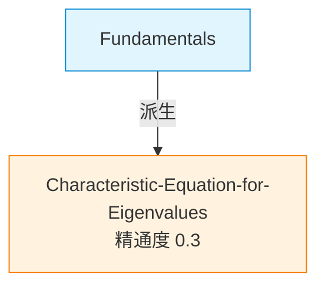

# 特征值与特征向量

> [!info]+ 原白板说明（扁平架构 · round-11）
> 这是学习主题"**特征值与特征向量**"的原白板。本文档即白板本身（不是白板目录的索引）。
>
> - **节点 md** 都在 vault 根的 `节点/` 文件夹（扁平池，一 vault 一学科零重名）
> - **subject** 字段读 vault 级 `.canvas-config.yaml`（不在每个 md frontmatter 重复）
> - 左栏文件树默认**折叠节点文件夹**，你主要从这份白板 md 入口管理
> - Cmd+Click `[[wikilink]]` 仍可跳转到节点 md（节点级 AI 对话继续工作）
>
> ## 你在这白板里能做什么
> - 选中任意文本 → `Cmd+Shift+D` 让 AI 派生新节点（Story 1.17），**自动建双向 wikilink**
> - 选中文本 → `Cmd+Shift+A` 加 Tips/错误/提问/关键点 callout + 3 态理解度 checkbox
> - 按 `Cmd+G` 打开 Graph View 看本白板所有 wikilink 拓扑
> - 按 `Cmd+E` 切 Reading View 看渲染后 callout

## Concepts

<!--
本 section 由三处维护：
  1. /configure-whiteboard Skill（Story 1.19）— 种子笔记 append 时写 "seed note (mastery: 0.30)"
  2. /ai-linked-doc Skill（Story 1.17）— AI 派生新节点时 append "extracted, weak (0.30)"
  3. 你手动 — 直接写 `- [[xxx]]` 都会被 Graph View 识别
wikilink 目标都指向 vault 根的 节点/ 文件夹下 md。
-->

- [[节点/Fundamentals]] — seed note (mastery: 0.30)
- [[节点/Characteristic-Equation-for-Eigenvalues]] — extracted, weak (0.30)
- [[节点/Eigenvalues-are-special-vectors-that-sat]] — extends, weak (0.30)

---

## 🔗 当前白板的概念关系（v2.4 简化版 · 只 1 个清晰视图）

> [!warning]+ 反幻觉硬约束
> 只列**当前白板**派生的节点（用 frontmatter `source_board` 字段精准过滤），不显示整 vault 的杂节点。**节点少时就少**，绝不凑数。

### 唯一视图：DataviewJS 简洁列表（限定当前白板）

```dataviewjs
const here = dv.current().file.link;
const nodes = dv.pages('"节点"')
  .where(p => p.source_board?.path === here.path);

if (nodes.length === 0) {
  dv.paragraph("> 🌱 当前白板暂无派生节点。用 `Cmd+Shift+D` 在源笔记选中文本派生第一个节点。");
} else {
  dv.header(4, `📊 当前白板共 ${nodes.length} 个节点（按精通度升序）`);
  const sorted = nodes.sort(p => p.mastery_score ?? 0, 'asc');
  dv.list(sorted.map(p => {
    const mastery = p.mastery_score ?? '—';
    const source = p["derived-from"]?.path
      ? `← 派生自 [[${p["derived-from"].path}|${p["derived-from"].fileName()}]]`
      : '← 手动加入';
    return `[[${p.file.path}|${p.file.name}]] · 精通度 **${mastery}** · ${source}`;
  }));
}
```

> 这个块**自动从 frontmatter `source_board` 字段精准过滤**只显示当前白板派生的节点。每次你 `Cmd+Shift+D` 派生新节点（Skill 自动写 `source_board: [[原白板/特征值与特征向量]]`）→ 该块自动多 1 行。

### 🥇 方案 1: Mermaid 自动箭头图（DataviewJS 从真实双链生成）

```dataviewjs
const here = dv.current().file.link;
const nodes = dv.pages('"节点"')
  .where(p => p.source_board?.path === here.path);

if (nodes.length === 0) {
  dv.paragraph("> 🌱 当前白板暂无派生节点，用 `Cmd+Shift+D` 派生第一个");
} else {
  let chart = "graph TD\n";
  const declared = new Set();

  // 1. 节点声明（节点池 + 源笔记）
  nodes.forEach(n => {
    const id = n.file.name.replace(/[^a-zA-Z0-9_]/g, "_");
    if (!declared.has(id)) {
      const mastery = n.mastery_score ?? '—';
      chart += `  ${id}["${n.file.name}<br/>精通度 ${mastery}"]\n`;
      chart += `  style ${id} fill:#fff3e0,stroke:#f57c00\n`;
      declared.add(id);
    }
    // 也声明 derived-from 的源笔记（如 Fundamentals）
    if (n["derived-from"]) {
      const srcName = n["derived-from"].fileName ? n["derived-from"].fileName() : n["derived-from"].path.split('/').pop().replace('.md','');
      const srcId = srcName.replace(/[^a-zA-Z0-9_]/g, "_");
      if (!declared.has(srcId)) {
        chart += `  ${srcId}["${srcName}<br/>(源笔记)"]\n`;
        chart += `  style ${srcId} fill:#e1f5ff,stroke:#0288d1\n`;
        declared.add(srcId);
      }
    }
  });

  // 2. 派生关系箭头（基于真实 derived-from 字段）
  nodes.forEach(n => {
    if (n["derived-from"]) {
      const srcName = n["derived-from"].fileName ? n["derived-from"].fileName() : n["derived-from"].path.split('/').pop().replace('.md','');
      const src = srcName.replace(/[^a-zA-Z0-9_]/g, "_");
      const dst = n.file.name.replace(/[^a-zA-Z0-9_]/g, "_");
      chart += `  ${src} -->|派生| ${dst}\n`;
    }
  });

  // 3. 节点间真实 wikilink 箭头（限定当前白板内）
  nodes.forEach(n => {
    (n.file.outlinks || []).forEach(link => {
      const target = nodes.find(p => p.file.path === link.path);
      if (target && target.file.name !== n.file.name) {
        const src = n.file.name.replace(/[^a-zA-Z0-9_]/g, "_");
        const dst = target.file.name.replace(/[^a-zA-Z0-9_]/g, "_");
        chart += `  ${src} -.->|wikilink| ${dst}\n`;
      }
    });
  });

  dv.paragraph("```mermaid\n" + chart + "```");
}
```

> ✅ **方案 1 工作原理**：
> - 自动从 frontmatter `source_board` 过滤当前白板的节点
> - 从 `derived-from` 字段画**实线箭头**（AI 派生关系）
> - 从节点正文 `[[wikilink]]` 画**虚线箭头**（手写关联）
> - 每次 `Cmd+Shift+D` 派生新节点 → mermaid 图自动多 1 节点 + 1 箭头
> - **零编造**：只画真实存在的关系
>
> ⚠️ 如果 mermaid 没渲染（dv.paragraph 在某些 obsidian 版本不重新解析 mermaid 块）→ 告诉我，我换 `await import('mermaid')` CDN 版本。

#### 静态备份（如方案 1 渲染失败时用）



### Graph View（零插件，看全 vault 拓扑）

按 `Cmd+G` → Filters 输 `path:节点/` 或 `path:原白板/特征值与特征向量` → 看到的每条线 = 一条真实 wikilink。

<!-- v2.7 (2026-04-30): 删除 ## Theorems & Proofs + ## Common Errors 段
     理由：Story 1.18 spec 未规划这 2 段聚合（gap）；定理段无任何 Story 规划；
     错误段虽有 Story 2-4/2-5/5-5 处理 frontmatter errors[] 但未聚合到白板。
     现状是死代码占位，删除反映现实。未来 Dashboard v2 想加再加。 -->

## Recent Activity

- 2026-04-30T10:56:16Z: Whiteboard created
- 2026-04-30T11:34:43Z: Extracted [[节点/Characteristic-Equation-for-Eigenvalues]] via /ai-linked-doc from [[Fundamentals]]
- 2026-05-01T06:11:34Z: Seed note Fundamentals.md (formerly wiki/canvases/math140/Fundamentals.md) imported via /configure-whiteboard rollback — confirms historical derived-from relation
- 2026-05-01T07:13:41.057Z: Seed note Fundamentals.md imported
- 2026-05-01T02:30:00Z: Cleanup — removed stuck Eigenvalues-are-special-vectors node + restored Fundamentals body (V3-1 retest prep)
- 2026-05-01T09:52:38.449Z: Extracted [[节点/Eigenvalues-are-special-vectors-that-sat]] via /ai-linked-doc from [[Fundamentals]]（关系: extends, status: ai_pending）
- 2026-05-01T10:49:41.427Z: Extracted [[节点/An-eigenvalue-of-a-linear-transformation]] via canvas:ai-linked-doc from [[Fundamentals]]（关系: extends）
- 2026-05-01T11:06:47.757Z: Extracted [[节点/Eigenvalues-are-special-vectors-that-sat]] via canvas:ai-linked-doc from [[Fundamentals]]（关系: extends）
