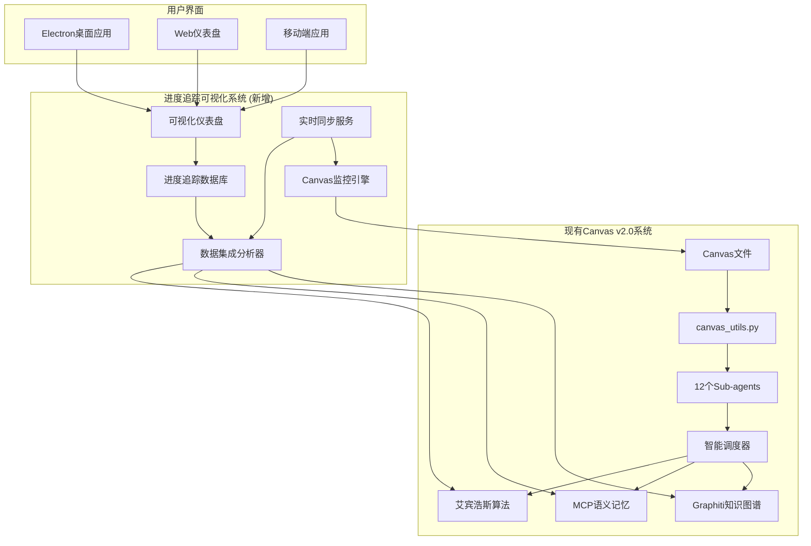
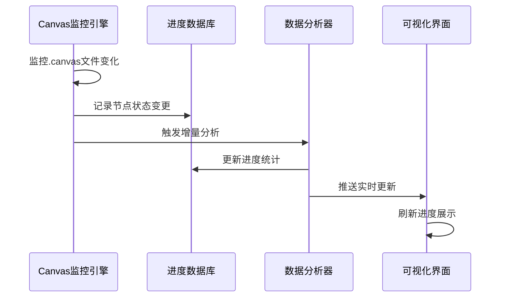
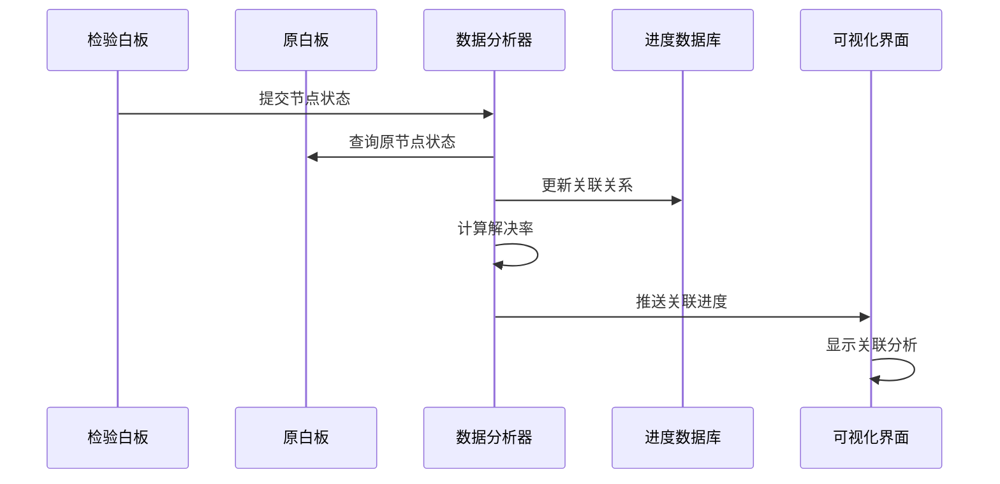
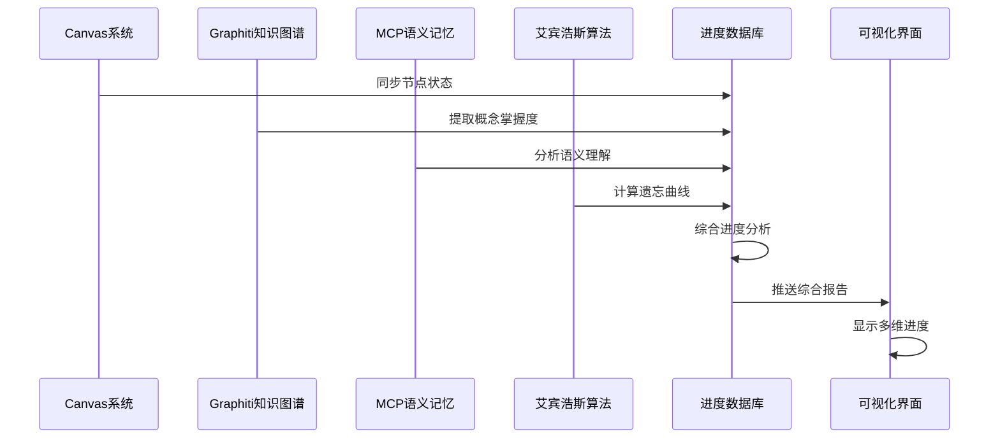
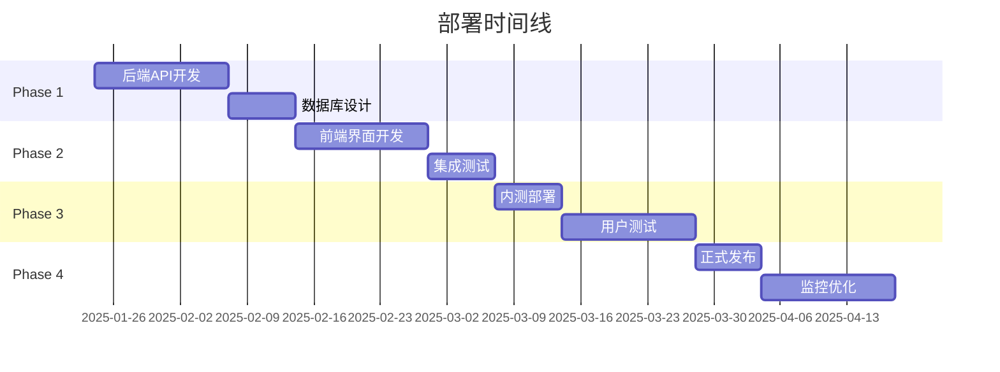

# Canvas学习进度可视化追踪系统 - 棕地架构设计

## 概要

### 项目背景
Canvas学习系统v2.0已成熟，包含完整的4层架构、12个专业Agent、智能调度器和Graphiti知识图谱。现需要在现有成熟系统基础上，设计专门的Canvas学习进度可视化追踪系统，为用户提供实时学习进展监控和历史数据分析能力。

### 核心问题
现有Canvas系统缺少学习进展的可视化监控和长期数据分析能力，用户无法直观了解：
- 原白板节点状态变化趋势
- 检验白板与原白板的关联进度
- 学习效率和遗忘曲线的影响
- 多个Canvas间的学习进展对比

### 解决方案概述
基于现有Canvas v2.0架构，构建轻量级可视化追踪系统，通过文件监控、数据集成和实时同步，提供全面的学习进展监控和历史数据分析功能。

### 架构原则
- **非侵入式**: 不修改现有Canvas代码，通过扩展接口集成
- **数据一致性**: 确保进度数据与Canvas状态实时同步
- **性能优先**: 监控系统不影响主系统性能
- **可扩展性**: 支持多用户、多Canvas、多设备
- **向后兼容**: 支持从现有v1.0/v2.0系统无缝升级

---

## 现有系统分析

### 现有Canvas v2.0架构
根据`canvas-v2-upgrade-prd.md`分析，现有系统已具备：

#### 核心组件
- **4层架构**: JSONOperator → BusinessLogic → Orchestrator → KnowledgeGraphLayer
- **12个专业Agent**: 完整的学习生态系统
- **Graphiti知识图谱**: Neo4j，8.2/10信任分数
- **MCP语义记忆**: ChromaDB，8.6/10信任分数
- **艾宾浩斯算法**: 智能复习调度
- **智能调度器**: Epic 8.10已完成

#### 成熟度评估
```
技术组件成熟度: ✅ 完全实现 (100%)
- Canvas JSON操作: 3000+行生产代码
- Agent调度系统: Epic 8.10完成
- Graphiti集成: Epic 8.7完成
- MCP集成: Epic 8.8完成
- 艾宾浩斯算法: Epic 8.6完成
- 智能规划: Epic 8.9完成
```

### 现有数据接口
- **Canvas文件**: `笔记库/*/*.canvas`
- **Graphiti API**: 通过mcp__graphiti-memory__系列工具
- **MCP API**: 语义记忆服务接口
- **Canvas Utils**: `canvas_utils.py`提供完整操作API

---

## 系统架构设计

### 整体架构


### 核心组件设计

#### 1. Canvas监控引擎 (Canvas Monitor Engine)
```typescript
interface CanvasMonitorEngine {
  // 文件监控
  watchCanvasFiles(basePath: string): void;

  // 变更检测
  detectCanvasChanges(filePath: string): CanvasChange[];

  // 增量同步
  syncCanvasChanges(canvasId: string, changes: CanvasChange[]): Promise<void>;

  // 事件发布
  publishCanvasEvent(event: CanvasEvent): void;
}
```

#### 2. 数据集成分析器 (Data Integration Analyzer)
```typescript
interface DataIntegrationAnalyzer {
  // Canvas状态分析
  analyzeCanvasState(canvasId: string): Promise<CanvasStateSnapshot>;

  // Graphiti记忆提取
  extractGraphitiMemories(conceptIds: string[]): Promise<MemoryData[]>;

  // MCP语义分析
  analyzeMCSemantics(content: string): Promise<SemanticData>;

  // 艾宾浩斯计算
  calculateEbbinghausProgress(userId: string): Promise<ForgettingCurveData>;

  // 进度关联分析
  analyzeProgressCorrelations(canvasId: string): Promise<ProgressCorrelation[]>;
}
```

#### 3. 进度追踪数据库 (Progress Tracking Database)
```sql
-- Canvas节点状态表
CREATE TABLE canvas_node_states (
    id UUID PRIMARY KEY,
    canvas_id VARCHAR(255) NOT NULL,
    node_id VARCHAR(255) NOT NULL,
    node_type VARCHAR(50) NOT NULL, -- red, purple, green, blue, yellow
    content TEXT,
    position_x FLOAT,
    position_y FLOAT,
    timestamp TIMESTAMP WITH TIME ZONE DEFAULT NOW(),
    user_id VARCHAR(255),
    INDEX idx_canvas_node (canvas_id, node_id),
    INDEX idx_timestamp (timestamp)
);

-- 学习进度表
CREATE TABLE learning_progress (
    id UUID PRIMARY KEY,
    canvas_id VARCHAR(255) NOT NULL,
    user_id VARCHAR(255) NOT NULL,
    date DATE NOT NULL,
    red_count INTEGER DEFAULT 0,
    purple_count INTEGER DEFAULT 0,
    green_count INTEGER DEFAULT 0,
    blue_count INTEGER DEFAULT 0,
    yellow_count INTEGER DEFAULT 0,
    total_nodes INTEGER DEFAULT 0,
    completion_rate FLOAT DEFAULT 0.0,
    review_boards_count INTEGER DEFAULT 0,
    original_nodes_resolved INTEGER DEFAULT 0,
    new_nodes_created INTEGER DEFAULT 0,
    INDEX idx_canvas_user_date (canvas_id, user_id, date)
);

-- 检验白板关联表
CREATE TABLE review_board_relations (
    id UUID PRIMARY KEY,
    original_canvas_id VARCHAR(255) NOT NULL,
    review_canvas_id VARCHAR(255) NOT NULL,
    original_nodes JSONB NOT NULL, -- 原白板节点ID列表
    resolved_nodes JSONB DEFAULT '[]', -- 已解决节点ID列表
    created_at TIMESTAMP WITH TIME ZONE DEFAULT NOW(),
    last_updated TIMESTAMP WITH TIME ZONE DEFAULT NOW(),
    INDEX idx_original_canvas (original_canvas_id),
    INDEX idx_review_canvas (review_canvas_id)
);

-- Agent调用记录表
CREATE TABLE agent_call_records (
    id UUID PRIMARY KEY,
    canvas_id VARCHAR(255) NOT NULL,
    user_id VARCHAR(255) NOT NULL,
    agent_type VARCHAR(100) NOT NULL,
    input_data JSONB,
    output_data JSONB,
    response_quality INTEGER, -- 1-5评分
    timestamp TIMESTAMP WITH TIME ZONE DEFAULT NOW(),
    execution_time_ms INTEGER,
    success BOOLEAN DEFAULT true,
    INDEX idx_canvas_agent (canvas_id, agent_type),
    INDEX idx_user_timestamp (user_id, timestamp)
);

-- 艾宾浩斯复习记录表
CREATE TABLE ebbinghaus_review_records (
    id UUID PRIMARY KEY,
    user_id VARCHAR(255) NOT NULL,
    canvas_id VARCHAR(255) NOT NULL,
    concept_id VARCHAR(255) NOT NULL,
    review_interval INTEGER NOT NULL, -- 复习间隔(小时)
    ease_factor FLOAT DEFAULT 2.5, -- 难度因子
    review_count INTEGER DEFAULT 0,
    last_review TIMESTAMP WITH TIME ZONE DEFAULT NOW(),
    next_review TIMESTAMP WITH TIME ZONE DEFAULT NOW(),
    retention_probability FLOAT,
    INDEX idx_user_concept (user_id, concept_id),
    INDEX idx_next_review (next_review)
);
```

### 集成策略

#### 1. 与现有Canvas系统的集成点
```python
# 扩展canvas_utils.py，添加进度追踪钩子
class CanvasJSONOperatorWithTracking(CanvasJSONOperator):
    def __init__(self, base_path: str, progress_tracker: ProgressTracker = None):
        super().__init__(base_path)
        self.progress_tracker = progress_tracker

    def update_node_color(self, canvas_path: str, node_id: str, new_color: str):
        # 原有逻辑
        old_color = self.get_node_color(canvas_path, node_id)
        result = super().update_node_color(canvas_path, node_id, new_color)

        # 进度追踪
        if self.progress_tracker:
            self.progress_tracker.record_node_color_change(
                canvas_path, node_id, old_color, new_color
            )

        return result
```

#### 2. 与Graphiti知识图谱的集成
```typescript
interface GraphitiProgressIntegration {
  // 学习概念追踪
  trackConceptProgress(userId: string, conceptId: string, masteryLevel: number): Promise<void>;

  // 知识图谱演化分析
  analyzeKnowledgeGraphEvolution(userId: string, timeRange: TimeRange): Promise<GraphEvolutionData>;

  // 概念关联强度计算
  calculateConceptAssociationStrength(conceptId1: string, conceptId2: string): Promise<number>;
}
```

#### 3. 与MCP语义记忆的集成
```typescript
interface MCPProgressIntegration {
  // 语义相似度追踪
  trackSemanticSimilarity(content1: string, content2: string): Promise<number>;

  // 理解深度量化
  quantifyUnderstandingDepth(userId: string, topic: string): Promise<UnderstandingDepth>;

  // 记忆压缩效果分析
  analyzeMemoryCompressionEfficiency(userId: string): Promise<CompressionMetrics>;
}
```

---

## 技术栈设计

### 后端技术栈
```yaml
运行时:
  - Node.js 18+ (主服务)
  - Python 3.9+ (AI集成)

数据库:
  - PostgreSQL 14+ (主数据库)
  - Redis 6+ (缓存和实时数据)
  - Neo4j 4.4+ (Graphiti知识图谱，已有)

文件监控:
  - chokidar (跨平台文件监控)
  - Cron (定时任务)

消息队列:
  - Bull Queue (Redis基础任务队列)
  - Socket.IO (实时通信)

AI集成:
  - 现有Graphiti API
  - 现有MCP API
  - 现有艾宾浩斯算法
```

### 前端技术栈
```yaml
桌面应用:
  - Electron 25+
  - React 18+
  - TypeScript 5+
  - Ant Design 5+ (UI组件)
  - ECharts 5+ (数据可视化)
  - Socket.IO Client (实时通信)

Web仪表盘:
  - Next.js 13+ (可选)
  - React 18+
  - TypeScript 5+
  - Tailwind CSS
  - Recharts (数据可视化)

移动端:
  - React Native (可选)
  - Expo
```

### 开发工具链
```yaml
代码质量:
  - ESLint + Prettier
  - Husky (Git钩子)
  - Jest + Testing Library
  - Storybook (组件开发)

构建部署:
  - Webpack 5
  - Docker + Docker Compose
  - GitHub Actions
  - PM2 (进程管理)

监控日志:
  - 现有Loguru系统
  - Prometheus + Grafana (可选)
  - Sentry (错误追踪)
```

---

## 数据流设计

### 1. Canvas状态监控流程


### 2. 检验白板关联分析流程


### 3. 多源数据集成流程


---

## API设计

### 1. Canvas进度API
```typescript
// Canvas进度查询
interface CanvasProgressAPI {
  // 获取Canvas当前状态
  getCanvasState(canvasId: string): Promise<CanvasState>;

  // 获取历史进度趋势
  getProgressHistory(canvasId: string, timeRange: TimeRange): Promise<ProgressHistoryItem[]>;

  // 获取节点变更记录
  getNodeChangeHistory(canvasId: string, nodeId: string): Promise<NodeChangeRecord[]>;

  // 获取颜色分布统计
  getColorDistribution(canvasId: string, date?: Date): Promise<ColorDistribution>;
}

// 类型定义
interface CanvasState {
  canvasId: string;
  totalNodes: number;
  redNodes: number;
  purpleNodes: number;
  greenNodes: number;
  blueNodes: number;
  yellowNodes: number;
  completionRate: number;
  lastUpdated: Date;
}

interface ProgressHistoryItem {
  date: Date;
  redCount: number;
  purpleCount: number;
  greenCount: number;
  completionRate: number;
  reviewBoardsCount: number;
  originalNodesResolved: number;
  newNodesCreated: number;
}
```

### 2. 检验白板关联API
```typescript
interface ReviewBoardRelationAPI {
  // 获取检验白板列表
  getReviewBoards(originalCanvasId: string): Promise<ReviewBoardInfo[]>;

  // 获取关联详情
  getRelationDetails(relationId: string): Promise<ReviewBoardRelation>;

  // 获取解决进度
  getResolutionProgress(reviewCanvasId: string): Promise<ResolutionProgress>;

  // 计算关联效果
  calculateRelationEffectiveness(originalCanvasId: string): Promise<RelationEffectiveness>;
}

interface ReviewBoardInfo {
  reviewCanvasId: string;
  originalNodesCount: number;
  resolvedNodesCount: number;
  resolutionRate: number;
  createdAt: Date;
  lastUpdated: Date;
}
```

### 3. 多维度分析API
```typescript
interface MultiDimensionAnalysisAPI {
  // 获取学习效率分析
  getLearningEfficiency(userId: string, timeRange: TimeRange): Promise<LearningEfficiencyReport>;

  // 获取遗忘曲线影响
  getForgettingCurveImpact(userId: string, conceptIds: string[]): Promise<ForgettingCurveImpact>;

  // 获取Agent使用统计
  getAgentUsageStats(userId: string, timeRange: TimeRange): Promise<AgentUsageStats>;

  // 获取知识图谱演化
  getKnowledgeGraphEvolution(userId: string): Promise<KnowledgeGraphEvolution>;
}
```

### 4. 实时监控API
```typescript
interface RealTimeMonitoringAPI {
  // Canvas实时状态WebSocket
  subscribeCanvasUpdates(canvasId: string): WebSocket;

  // 进度实时推送
  subscribeProgressUpdates(userId: string): WebSocket;

  // Agent调用实时监控
  subscribeAgentMonitoring(userId: string): WebSocket;
}

// WebSocket消息类型
interface CanvasUpdateMessage {
  type: 'canvas_update';
  canvasId: string;
  changes: CanvasChange[];
  timestamp: Date;
}

interface ProgressUpdateMessage {
  type: 'progress_update';
  userId: string;
  canvasId: string;
  oldState: CanvasState;
  newState: CanvasState;
  timestamp: Date;
}
```

---

## 安全性设计

### 1. 数据安全
```typescript
// 数据加密
interface DataEncryption {
  // 敏感数据加密存储
  encryptSensitiveData(data: any): Promise<string>;

  // 传输加密
  encryptTransmission(data: any): Promise<string>;

  // 访问控制
  checkDataAccess(userId: string, resourceId: string): Promise<boolean>;
}

// 隐私保护
interface PrivacyProtection {
  // 用户数据脱敏
  anonymizeUserData(userId: string, data: any): any;

  // 学习数据导出
  exportLearningData(userId: string, format: 'json' | 'csv'): Promise<Blob>;

  // 数据删除
  deleteUserData(userId: string): Promise<void>;
}
```

### 2. API安全
```typescript
// API认证
interface APIAuthentication {
  // JWT Token验证
  verifyJWTToken(token: string): Promise<UserInfo>;

  // API限流
  rateLimiting(userId: string, endpoint: string): Promise<boolean>;

  // 权限控制
  checkAPIPermission(userId: string, action: string, resource: string): Promise<boolean>;
}
```

### 3. 文件系统安全
```typescript
// 文件访问控制
interface FileSystemSecurity {
  // 路径验证
  validateFilePath(filePath: string): boolean;

  // 文件权限检查
  checkFilePermission(userId: string, filePath: string): Promise<boolean>;

  // 安全文件监控
  safeFileWatch(basePath: string): FileWatcher;
}
```

---

## 性能优化策略

### 1. 数据库优化
```sql
-- 分区表设计
CREATE TABLE learning_progress (
    id UUID,
    canvas_id VARCHAR(255),
    user_id VARCHAR(255),
    date DATE,
    -- 其他字段...
) PARTITION BY RANGE (date);

-- 创建月度分区
CREATE TABLE learning_progress_2025_01 PARTITION OF learning_progress
FOR VALUES FROM ('2025-01-01') TO ('2025-02-01');

-- 复合索引优化
CREATE INDEX idx_canvas_user_date_nodes
ON learning_progress(canvas_id, user_id, date, total_nodes);

CREATE INDEX idx_agent_performance
ON agent_call_records(agent_type, response_quality, timestamp);

-- 物化视图
CREATE MATERIALIZED VIEW daily_canvas_summary AS
SELECT
    date,
    canvas_id,
    user_id,
    SUM(red_count + purple_count + green_count) as total_nodes,
    SUM(green_count)::float / SUM(red_count + purple_count + green_count) as completion_rate,
    COUNT(DISTINCT canvas_id) as active_canvases
FROM learning_progress
GROUP BY date, canvas_id, user_id;

-- 定期刷新物化视图
CREATE OR REPLACE FUNCTION refresh_daily_summary()
RETURNS void AS $$
BEGIN
    REFRESH MATERIALIZED VIEW daily_canvas_summary;
END;
$$ LANGUAGE plpgsql;
```

### 2. 缓存策略
```typescript
interface CacheStrategy {
  // Redis缓存配置
  redisConfig: {
    canvasState: { ttl: 300 }, // 5分钟
    userProgress: { ttl: 1800 }, // 30分钟
    agentStats: { ttl: 3600 }, // 1小时
    analysisResults: { ttl: 7200 } // 2小时
  };

  // 缓存键设计
  cacheKeys: {
    canvasState: (canvasId: string) => `canvas:${canvasId}:state`;
    userProgress: (userId: string, date: Date) => `user:${userId}:progress:${date.toISOString().split('T')[0]}`;
    agentStats: (userId: string, agentType: string) => `user:${userId}:agent:${agentType}`;
  };

  // 缓存失效策略
  invalidateCache: {
    onCanvasChange: (canvasId: string) => [`canvas:${canvasId}:*`];
    onUserProgress: (userId: string) => [`user:${userId}:progress:*`];
  };
}
```

### 3. 文件监控优化
```typescript
interface FileMonitoringOptimization {
  // 智能防抖
  debounceConfig: {
    canvasChanges: 500, // 500ms防抖
    batchSync: 2000, // 2秒批量同步
  };

  // 增量监控
  incrementalSync: {
    checksumValidation: true, // 校验和验证
    changeDetection: 'size+mtime', // 变更检测策略
  };

  // 资源限制
  resourceLimits: {
    maxWatchers: 100, // 最大监控文件数
    maxEventsPerSecond: 50, // 每秒最大事件数
  };
}
```

### 4. 前端性能优化
```typescript
interface FrontendOptimization {
  // 虚拟滚动
  virtualScrolling: {
    enabled: true,
    itemHeight: 60,
    bufferSize: 10,
  };

  // 图表优化
  chartOptimization: {
    dataSampling: true, // 大数据采样
    lazyLoading: true, // 懒加载
    animationThrottling: true, // 动画节流
  };

  // 状态管理优化
  stateOptimization: {
    memoization: true, // 记忆化
    selectiveUpdates: true, // 选择性更新
    batchUpdates: true, // 批量更新
  };
}
```

---

## 部署架构

### 1. 本地开发环境
```yaml
# docker-compose.dev.yml
version: '3.8'
services:
  progress-tracker-dev:
    build:
      context: .
      dockerfile: Dockerfile.dev
    ports:
      - "3001:3001"
    environment:
      - NODE_ENV=development
      - DB_HOST=localhost
      - REDIS_HOST=localhost
    volumes:
      - .:/app
      - /app/node_modules
    depends_on:
      - postgres-dev
      - redis-dev

  postgres-dev:
    image: postgres:14
    environment:
      POSTGRES_DB: canvas_progress_dev
      POSTGRES_USER: dev_user
      POSTGRES_PASSWORD: dev_password
    ports:
      - "5433:5432"
    volumes:
      - postgres_dev_data:/var/lib/postgresql/data

  redis-dev:
    image: redis:6-alpine
    ports:
      - "6380:6379"
    volumes:
      - redis_dev_data:/data

volumes:
  postgres_dev_data:
  redis_dev_data:
```

### 2. 生产环境部署
```yaml
# docker-compose.prod.yml
version: '3.8'
services:
  progress-tracker:
    image: canvas-progress-tracker:latest
    restart: always
    environment:
      - NODE_ENV=production
      - DB_HOST=postgres-prod
      - REDIS_HOST=redis-prod
    depends_on:
      - postgres-prod
      - redis-prod
    deploy:
      replicas: 2
      resources:
        limits:
          cpus: '1.0'
          memory: 1G

  postgres-prod:
    image: postgres:14
    restart: always
    environment:
      POSTGRES_DB: canvas_progress
      POSTGRES_USER: ${DB_USER}
      POSTGRES_PASSWORD: ${DB_PASSWORD}
    volumes:
      - postgres_prod_data:/var/lib/postgresql/data
      - ./backups:/backups
    deploy:
      resources:
        limits:
          cpus: '2.0'
          memory: 2G

  redis-prod:
    image: redis:6-alpine
    restart: always
    volumes:
      - redis_prod_data:/data
    deploy:
      resources:
        limits:
          cpus: '0.5'
          memory: 512M

volumes:
  postgres_prod_data:
  redis_prod_data:
```

### 3. 监控配置
```yaml
# prometheus.yml
global:
  scrape_interval: 15s

scrape_configs:
  - job_name: 'canvas-progress-tracker'
    static_configs:
      - targets: ['progress-tracker:3001']
    metrics_path: '/metrics'

  - job_name: 'postgres'
    static_configs:
      - targets: ['postgres-prod:5432']

  - job_name: 'redis'
    static_configs:
      - targets: ['redis-prod:6379']
```

---

## 迁移策略

### 1. 数据迁移
```typescript
interface DataMigrationStrategy {
  // 现有Canvas数据迁移
  migrateCanvasData: {
    source: '现有Canvas文件',
    target: '进度数据库',
    strategy: '增量同步',
    validation: '数据一致性检查'
  };

  // Graphiti数据集成
  integrateGraphitiData: {
    source: 'Graphiti Neo4j',
    target: '进度数据库',
    method: 'API调用',
    frequency: '实时同步'
  };

  // 用户配置迁移
  migrateUserSettings: {
    source: '现有配置文件',
    target: '新配置系统',
    compatibility: '向后兼容',
    rollback: '支持回滚'
  };
}
```

### 2. 渐进式部署


### 3. 向后兼容性
```typescript
interface BackwardCompatibility {
  // API版本控制
  apiVersioning: {
    current: 'v1',
    supported: ['v1'],
    deprecated: [],
    migrationPath: 'v1 -> v2'
  };

  // 数据格式兼容
  dataFormatCompatibility: {
    canvasFormat: '支持现有.canvas格式',
    databaseSchema: '支持增量迁移',
    configurationFormat: '向后兼容'
  };

  // 功能兼容
  featureCompatibility: {
    existingFeatures: '完全兼容',
    newFeatures: '可选启用',
    breakingChanges: '无破坏性变更'
  };
}
```

---

## 开发计划

### Phase 1: 核心基础设施 (2周)
```yaml
Week 1:
  - 数据库设计和创建
  - 基础API框架搭建
  - Canvas文件监控引擎开发
  - 数据模型定义

Week 2:
  - Canvas状态同步机制
  - 基础数据收集功能
  - 单元测试编写
  - API文档生成
```

### Phase 2: 数据集成和分析 (2周)
```yaml
Week 3:
  - Graphiti数据集成
  - MCP语义记忆集成
  - 艾宾浩斯算法集成
  - 多维度数据分析器

Week 4:
  - 检验白板关联分析
  - 进度统计算法优化
  - 实时数据同步
  - 集成测试
```

### Phase 3: 前端可视化界面 (2周)
```yaml
Week 5:
  - Electron应用框架搭建
  - 基础UI组件开发
  - Canvas状态可视化
  - 进度图表组件

Week 6:
  - 实时监控界面
  - 多维度分析展示
  - 用户交互优化
  - 前端测试
```

### Phase 4: 集成测试和优化 (1周)
```yaml
Week 7:
  - 端到端测试
  - 性能优化
  - 安全性测试
  - 用户体验优化
  - 部署准备
```

### 资源需求
```yaml
开发人员:
  - 后端开发: 1人
  - 前端开发: 1人
  - 数据库工程师: 0.5人
  - 测试工程师: 0.5人

预计工作量:
  - 总开发时间: 7周
  - 总工作量: 28人日
  - 测试时间: 1周
  - 部署上线: 3天
```

---

## 成功指标

### 技术指标
- **数据同步延迟**: < 5秒
- **API响应时间**: < 200ms (95th percentile)
- **系统可用性**: > 99.5%
- **数据库查询性能**: < 100ms (复杂查询)
- **文件监控准确性**: > 99.9%

### 用户体验指标
- **界面加载时间**: < 2秒
- **实时更新延迟**: < 3秒
- **用户操作响应**: < 500ms
- **移动端适配率**: 100%

### 业务指标
- **数据准确性**: > 99.5%
- **用户满意度**: > 4.5/5
- **功能覆盖率**: 100% (需求功能)
- **系统稳定性**: 连续运行 > 30天无故障

---

## 风险分析与缓解措施

### 技术风险
```yaml
风险1: Canvas文件格式变更
  影响: 高
  概率: 中
  缓解措施:
    - 版本兼容性设计
    - 自动格式检测
    - 渐进式升级支持

风险2: 性能瓶颈
  影响: 中
  概率: 中
  缓解措施:
    - 数据库索引优化
    - 缓存策略设计
    - 异步处理机制

风险3: 数据同步冲突
  影响: 高
  概率: 低
  缓解措施:
    - 冲突检测机制
    - 自动解决策略
    - 手动干预接口
```

### 业务风险
```yaml
风险1: 用户接受度低
  影响: 高
  概率: 低
  缓解措施:
    - 用户体验调研
    - 渐进式功能发布
    - 用户反馈收集

风险2: 与现有系统集成困难
  影响: 中
  概率: 中
  缓解措施:
    - 非侵入式设计
    - 充分的API设计
    - 完整的测试覆盖
```

---

## 总结

本棕地架构设计为Canvas学习系统v2.0添加了专门的学习进度可视化追踪能力，通过非侵入式的集成方式，在保持现有系统稳定性的基础上，提供了：

1. **实时Canvas状态监控** - 文件级别的变更检测和同步
2. **多维度数据分析** - 整合Graphiti、MCP、艾宾浩斯等多源数据
3. **检验白板关联追踪** - 深度分析学习效果和知识掌握情况
4. **可视化仪表盘** - 直观的进度展示和历史趋势分析
5. **跨平台支持** - Electron桌面应用和Web端访问

该架构充分利用了现有Canvas v2.0系统的成熟组件，通过扩展接口实现了功能增强，确保了系统的稳定性和可维护性。通过分阶段的开发计划和完善的测试策略，可以确保系统的顺利交付和长期稳定运行。

这个可视化追踪系统将为Canvas学习用户提供强大的学习分析工具，帮助他们更好地了解自己的学习进展，优化学习策略，提高学习效率。
