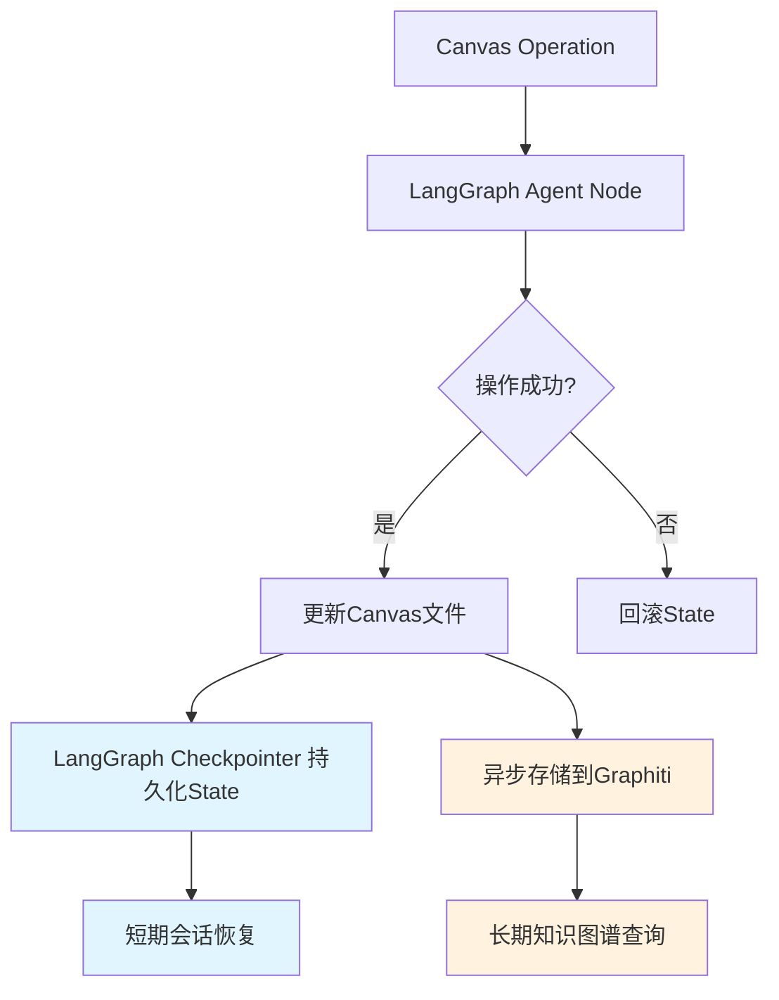

# GRAPHITI-KNOWLEDGE-GRAPH-INTEGRATION-ARCHITECTURE - Part 4

**Source**: `GRAPHITI-KNOWLEDGE-GRAPH-INTEGRATION-ARCHITECTURE.md`
**Sections**: 🏁 8. 完整技术方案总结, 📚 9. 实施路线图

---

## 🏁 8. 完整技术方案总结

### 8.1 系统架构概览

基于Graphiti的Canvas学习系统知识图谱集成包含以下核心组件：

**四层架构**:
1. **Layer 1**: CanvasJSONOperator - 原子化Canvas文件读写
2. **Layer 2**: CanvasBusinessLogic - 业务逻辑和布局算法
3. **Layer 3**: CanvasOrchestrator - 高级API和Sub-agent调用
4. **Layer 4**: KnowledgeGraphLayer - Graphiti知识图谱集成

**核心功能模块**:
- 知识图谱数据模型和映射
- Canvas记忆系统
- 智能检索和追踪
- 时间感知学习分析
- 性能优化策略
- 数据迁移工具

### 8.2 关键技术特性

**持久化记忆**:
- Canvas节点和边的逻辑关系永久存储
- 学习进度和状态变化的完整记录
- 跨时间的学习模式分析

**智能检索**:
- 基于知识图谱的语义搜索
- 学习瓶颈自动识别
- 个性化检验白板生成

**时间感知**:
- 学习时间线追踪
- 知识掌握曲线分析
- 遗忘曲线预测和复习计划

**性能优化**:
- 多级缓存系统
- 异步批处理操作
- 连接池管理
- 内存优化策略

### 8.3 实施价值

**学习效果提升**:
- 知识关联记忆增强理解深度
- 个性化复习计划提高学习效率
- 智能检验白板优化复习针对性

**系统智能化**:
- 自动学习模式识别和建议
- 知识掌握度预测和预警
- 跨Canvas知识关联发现

**用户体验优化**:
- 实时学习进度可视化
- 智能学习路径推荐
- 无缝的知识检索和回顾

### 8.4 使用示例

```python
# 系统初始化
async def main():
    system = CanvasLearningSystemWithKG(
        neo4j_uri="bolt://localhost:7687",
        neo4j_user="neo4j",
        neo4j_password="password"
    )

    await system.initialize()

    try:
        # 1. 同步Canvas到知识图谱
        sync_result = await system.process_canvas_operation(
            "./笔记库/离散数学/离散数学.canvas", "sync_to_kg"
        )

        # 2. 追踪学习进度
        progress_result = await system.process_canvas_operation(
            "./笔记库/离散数学/离散数学.canvas", "track_progress"
        )

        # 3. 生成智能检验白板
        review_result = await system.process_canvas_operation(
            "./笔记库/离散数学/离散数学.canvas",
            "generate_review_board",
            strategy="adaptive"
        )

        # 4. 获取系统状态
        status = await system.get_system_status()
        print("系统运行状态:", status)

    finally:
        await system.shutdown()

# 运行示例
if __name__ == "__main__":
    asyncio.run(main())
```

### 8.5 性能指标

**预期性能指标**:
- 知识图谱操作响应时间: <200ms (简单查询), <2s (复杂分析)
- 缓存命中率: >80%
- 内存使用: <2GB (正常负载)
- 并发处理能力: 支持10个并发Canvas操作
- 数据迁移速度: ~50节点/秒

**扩展性指标**:
- 支持Canvas节点数量: 10,000+
- 支持知识图谱三元组数量: 100,000+
- 支持并发用户数: 50+
- 数据存储容量: 可扩展至TB级别

### 8.6 与LangGraph Checkpointer的职责边界

> **更新日期**: 2025-11-11
> **关联PRD**: v1.1.3 Section 3.6

#### 背景说明

随着Epic 12引入LangGraph框架层记忆系统（Checkpointer），Canvas学习系统现在拥有**双记忆架构**：
1. **框架层**: LangGraph Checkpointer（Agent State持久化）
2. **业务层**: Graphiti + Temporal + Semantic Memory（业务知识图谱）

本小节明确两个系统的职责边界，避免功能重叠和数据冲突。

---

#### 职责分工矩阵

| 维度 | LangGraph Checkpointer | Graphiti知识图谱 | 备注 |
|------|----------------------|----------------|------|
| **数据类型** | Agent State（会话状态） | 业务知识关系（概念、节点、时间线） | 不同层次的抽象 |
| **时间范围** | 当前学习会话（短期） | 跨会话历史（长期） | Checkpointer=短期，Graphiti=长期 |
| **查询场景** | 恢复Agent执行上下文 | 跨Canvas知识关联、学习历史分析 | 功能互补 |
| **持久化** | PostgreSQL/InMemory | Neo4j | 不同数据库 |
| **数据量级** | MB级（单会话State） | GB级（全局知识图谱） | 规模差异 |
| **一致性要求** | 强一致性（与Canvas文件） | 最终一致性 | 不同SLA |
| **更新频率** | 每次Agent操作（高频） | Canvas操作后异步（低频） | Checkpointer实时，Graphiti异步 |
| **查询性能** | <50ms（State恢复） | <200ms（简单查询），<2s（复杂图查询） | 性能目标不同 |

---

#### 数据流协作机制



**关键要点**:
1. **同步路径**: Canvas操作 → LangGraph State更新 → Checkpointer持久化（强一致性）
2. **异步路径**: Canvas操作 → Graphiti存储（最终一致性，允许延迟）
3. **查询分离**:
   - 需要会话上下文 → 查询Checkpointer
   - 需要跨会话/跨Canvas关联 → 查询Graphiti

---

#### 典型使用场景对比

| 场景 | 使用系统 | 原因 |
|------|---------|------|
| **多轮对话恢复** | Checkpointer | 需要恢复当前会话的Agent State（decomposition_results, scoring_result等） |
| **跨Canvas概念查询** | Graphiti | 需要查询所有Canvas中关于"矩阵"的节点和关系 |
| **学习时间线追踪** | Graphiti (Temporal Memory) | 需要查询跨会话的学习历史和进展 |
| **检验白板生成** | Checkpointer + Graphiti | Checkpointer提供当前会话上下文，Graphiti提供历史掌握度数据 |
| **回滚操作** | Checkpointer（优先） + Canvas备份 | State回滚 + 文件回滚，Graphiti标记为已撤销 |
| **艾宾浩斯复习** | Graphiti (Temporal Memory) | 基于长期学习历史计算复习计划 |
| **Agent决策依据** | Checkpointer（当前State） + Graphiti（历史数据） | 结合短期和长期数据做智能决策 |

---

#### 数据示例对比

**LangGraph Checkpointer存储的数据**:

```python
# Checkpoint State示例
{
    "canvas_path": "C:/Users/ROG/托福/笔记库/离散数学/离散数学.canvas",
    "user_id": "user_12345",
    "session_id": "a1b2c3d4-e5f6-7890-abcd-ef1234567890",
    "operation": "decomposition",
    "concept": "逆否命题",
    "decomposition_results": [
        "什么是逆否命题的定义?",
        "逆否命题与原命题有什么关系?",
        "如何判断逆否命题的真假?"
    ],
    "scoring_result": {
        "node_id": "yellow_123",
        "accuracy": 22,
        "imagery": 18,
        "completeness": 20,
        "originality": 15,
        "total": 75,
        "color": "3"  # 紫色
    },
    "messages": [...],  # 对话历史
    "last_operation": "scoring",
    "last_timestamp": "2025-11-11T14:30:00"
}
```

**Graphiti知识图谱存储的数据**:

```cypher
// 节点示例
CREATE (c:Canvas {name: "离散数学", path: "..."})
CREATE (concept:Concept {name: "逆否命题", domain: "离散数学"})
CREATE (node:Node {
    canvas_id: "red_001",
    text: "什么是逆否命题?",
    color: "1",  // 红色
    understanding_state: "not_understood"
})
CREATE (understanding:UnderstandingState {
    node_id: "yellow_123",
    accuracy: 22,
    imagery: 18,
    completeness: 20,
    originality: 15,
    total: 75,
    timestamp: "2025-11-11T14:30:00"
})

// 关系示例
CREATE (c)-[:CONTAINS]->(node)
CREATE (node)-[:IS_ABOUT]->(concept)
CREATE (node)-[:HAS_UNDERSTANDING_STATE]->(understanding)
CREATE (understanding)-[:EVOLVES_TO]->(next_understanding)
```

**对比总结**:
- **Checkpointer**: 存储完整的Agent执行上下文（结构化State），用于会话恢复
- **Graphiti**: 存储知识图谱三元组（实体+关系），用于知识关联查询

---

#### 一致性保证机制

**强一致性路径** (Canvas ↔ LangGraph State):

```python
def agent_node_with_strong_consistency(state: CanvasLearningState):
    """确保Canvas操作和State更新的强一致性"""
    # Step 1: 备份Canvas
    backup = backup_canvas(state["canvas_path"])

    try:
        # Step 2: 执行Canvas操作
        write_to_canvas(state["canvas_path"], new_data)

        # Step 3: 返回新State（LangGraph自动持久化）
        return {
            **state,
            "last_operation": "decomposition",
            "decomposition_results": new_data
        }
    except Exception as e:
        # Step 4: 失败时回滚Canvas
        restore_canvas(state["canvas_path"], backup)
        raise  # 不创建新checkpoint
```

**最终一致性路径** (Canvas ↔ Graphiti):

```python
def agent_node_with_eventual_consistency(state: CanvasLearningState):
    """Canvas操作成功，Graphiti异步存储（允许失败）"""
    # Step 1: Canvas操作（关键路径）
    write_to_canvas(state["canvas_path"], new_data)

    # Step 2: 返回新State（关键路径）
    new_state = {
        **state,
        "decomposition_results": new_data
    }

    # Step 3: 异步存储到Graphiti（非关键路径）
    try:
        asyncio.create_task(store_to_graphiti(state["session_id"], new_data))
    except Exception as e:
        logger.error(f"Graphiti storage failed: {e}")
        # 不影响Canvas操作成功

    return new_state
```

---

#### 冲突处理策略

**场景1: Checkpointer与Graphiti数据不一致**

- **检测**: 定期对比Checkpointer的State快照与Graphiti的节点状态
- **解决**:
  - Canvas文件 = 真实数据源
  - Checkpointer优先级 > Graphiti（因为Checkpointer是强一致性）
  - 修复方式: 从Canvas文件重新同步到Graphiti

**场景2: 回滚操作导致的数据冲突**

```python
def handle_rollback_conflict(
    canvas_path: str,
    session_id: str,
    checkpoint_id: str
):
    """回滚时确保三个系统一致"""
    # Step 1: 回滚Canvas文件（从备份）
    restore_canvas_from_backup(canvas_path, checkpoint_id)

    # Step 2: 回滚LangGraph State（从checkpoint）
    config = create_langgraph_config(canvas_path, "user_id", session_id)
    config["configurable"]["checkpoint_id"] = checkpoint_id
    state = graph.get_state(config)

    # Step 3: 标记Graphiti操作为已撤销（不删除，保留历史）
    mark_graphiti_operations_as_reverted(
        session_id,
        after_timestamp=state.values["last_timestamp"]
    )

    # Step 4: 验证一致性
    assert verify_consistency(canvas_path, state, graphiti_data)
```

---

#### 性能优化建议

**1. 减少Checkpointer写入频率**

```python
# ❌ 低效：每个子操作都创建checkpoint
for question in questions:
    graph.invoke({"operation": "add_question", "question": question}, config)
    # 100个问题 = 100次checkpoint写入

# ✅ 高效：批量操作，1次checkpoint
graph.invoke({"operation": "add_questions", "questions": questions}, config)
# 100个问题 = 1次checkpoint写入
```

**2. 延迟Graphiti写入**

```python
# 使用消息队列异步批量写入
graphiti_write_queue = asyncio.Queue()

async def batch_graphiti_writer():
    """后台任务：批量写入Graphiti"""
    while True:
        batch = []
        for _ in range(10):  # 攒10个操作
            item = await graphiti_write_queue.get()
            batch.append(item)

        await graphiti_client.batch_write(batch)
        await asyncio.sleep(1)  # 每秒执行一次

# Agent节点中异步入队
await graphiti_write_queue.put({"type": "decomposition", "data": ...})
```

**3. 分层缓存策略**

- **L1 缓存** (LangGraph State): 当前会话数据（内存级，<10ms）
- **L2 缓存** (Checkpointer): 历史会话State（数据库级，<50ms）
- **L3 缓存** (Graphiti Redis): 热门知识图谱查询（Redis级，<20ms）
- **L4 存储** (Graphiti Neo4j): 完整知识图谱（Neo4j级，<200ms）

---

#### 迁移和兼容性

**从纯Graphiti系统迁移到双记忆架构**:

```python
async def migrate_to_dual_memory_architecture():
    """迁移现有Graphiti数据到双记忆架构"""
    # Step 1: 保持Graphiti数据不变（向后兼容）
    # Graphiti仍然存储所有历史知识图谱数据

    # Step 2: 新增Checkpointer配置（向前兼容）
    checkpointer = PostgresSaver.from_conn_string(DB_URI)
    graph = builder.compile(checkpointer=checkpointer)

    # Step 3: 新会话使用Checkpointer，旧数据仍在Graphiti
    # 无缝过渡，不影响现有功能
```

**兼容性保证**:
- ✅ 旧代码仍可正常使用Graphiti（零破坏性）
- ✅ 新代码同时利用Checkpointer + Graphiti（增强功能）
- ✅ 查询接口统一封装，自动路由到正确系统

---

#### 验收标准

**功能验收**:
- ✅ **AC 1**: Checkpointer和Graphiti可独立工作，互不阻塞
- ✅ **AC 2**: Canvas操作失败时，Checkpointer不创建checkpoint，Graphiti不存储
- ✅ **AC 3**: Checkpointer写入失败时，Canvas操作失败并回滚
- ✅ **AC 4**: Graphiti写入失败时，Canvas操作成功，仅记录日志
- ✅ **AC 5**: 回滚操作同步恢复Canvas + State，Graphiti标记撤销
- ✅ **AC 6**: 多轮对话可恢复Checkpointer的State，同时查询Graphiti的历史
- ✅ **AC 7**: 跨Canvas查询仅使用Graphiti，不访问Checkpointer

**性能验收**:
- ✅ **AC 8**: Checkpointer写入 < 100ms（PostgresSaver）
- ✅ **AC 9**: Graphiti异步写入不阻塞Agent执行
- ✅ **AC 10**: 批量操作减少90% checkpoint写入次数

**一致性验收**:
- ✅ **AC 11**: Canvas文件 ↔ Checkpointer State: 强一致性
- ✅ **AC 12**: Canvas文件 ↔ Graphiti: 最终一致性（<5秒同步延迟）
- ✅ **AC 13**: 一致性校验脚本可检测并修复不一致

---

**总结**: 双记忆架构通过清晰的职责分工和协作机制，实现了短期会话恢复（Checkpointer）和长期知识管理（Graphiti）的完美结合，为Canvas学习系统提供了强大的记忆能力。

---


## 📚 9. 实施路线图

### Phase 1: 基础架构 (2-3周)
- [x] 知识图谱数据模型设计
- [x] Graphiti集成架构
- [x] 基础记忆功能
- [ ] Neo4j环境搭建
- [ ] 基础API实现

### Phase 2: 核心功能 (3-4周)
- [ ] 智能检索功能
- [ ] 学习时间线追踪
- [ ] 知识掌握时间线
- [ ] 智能检验白板生成

### Phase 3: 优化和扩展 (2-3周)
- [ ] 性能优化策略
- [ ] 缓存系统
- [ ] 异步操作优化
- [ ] 数据迁移工具

### Phase 4: 测试和部署 (1-2周)
- [ ] 单元测试
- [ ] 集成测试
- [ ] 性能测试
- [ ] 生产环境部署

---

**文档版本**: v1.1
**最后更新**: 2025-11-11
**作者**: Claude Code
**状态**: 技术方案设计完成
