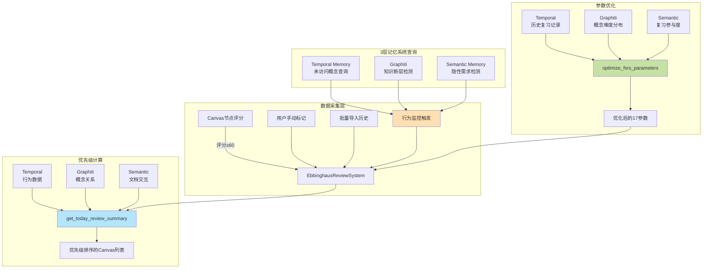

# LANGGRAPH-MEMORY-INTEGRATION-DESIGN - Part 2

**Source**: `LANGGRAPH-MEMORY-INTEGRATION-DESIGN.md`
**Sections**: 🔄 八、艾宾浩斯复习系统3层记忆集成 (v1.1.6新增)

---

## 🔄 八、艾宾浩斯复习系统3层记忆集成 (v1.1.6新增)

### 8.1 集成背景

**问题描述**:
- 艾宾浩斯复习系统原设计仅依赖Canvas评分（≥60分）作为唯一数据源
- Py-FSRS使用默认17参数（相当于模拟数据，非个性化）
- 缺少主动发现需要复习概念的机制（完全被动等待评分触发）

**解决方案**:
通过整合3层记忆系统（Temporal + Graphiti + Semantic），实现100%真实数据驱动的艾宾浩斯复习系统。

---

### 8.2 3层记忆系统数据提供

#### 8.2.1 Temporal Memory提供的数据

**职责**: 学习行为数据源

**提供数据**:
1. **长期未访问的已掌握概念** (触发点4 - 条件1)
   ```python
   query_temporal_learning_behavior(
       filter_type="inactive_mastered",
       days_threshold=7,
       min_mastery=0.6
   )
   # 返回: [{"concept": "逆否命题", "last_access_days": 10, "mastery": 0.85, ...}]
   ```

2. **历史复习记录** (FSRS参数优化)
   ```python
   query_temporal_learning_behavior(
       filter_type="all_reviews",
       min_samples=100,
       fields=["review_time", "rating", "interval", "stability", "difficulty"]
   )
   # 返回: [{"interval": 7, "rating": 3, "retention": 0.9, ...}, ...]
   ```

3. **最近行为数据** (优先级计算)
   ```python
   query_temporal_learning_behavior(
       filter_type="recent_behavior",
       canvas_file="笔记库/离散数学.canvas",
       concept_ids=["node123", "node456"],
       metrics=["review_frequency", "avg_interval", "accuracy_trend"]
   )
   # 返回: {"review_frequency_normalized": 0.3, "interval_deviation": 0.5, ...}
   ```

**数据schema (Neo4j - Temporal Memory)**:
```cypher
// 学习事件节点
CREATE (e:LearningEvent {
    event_id: randomUUID(),
    session_id: $session_id,
    canvas_file: $canvas_file,
    node_id: $node_id,
    concept: $concept,
    operation_type: $operation_type, // 'scoring', 'review', 'view', 'doc_interaction'
    timestamp: datetime(),
    score: $score,              // 如果operation_type='scoring'
    rating: $rating,            // 如果operation_type='review' (1-4)
    duration: $duration,        // 如果operation_type='view' (秒)
    metadata: $metadata         // JSON对象
})

// 索引
CREATE INDEX learning_event_timestamp IF NOT EXISTS FOR (e:LearningEvent) ON (e.timestamp);
CREATE INDEX learning_event_concept IF NOT EXISTS FOR (e:LearningEvent) ON (e.concept, e.timestamp);
```

---

#### 8.2.2 Graphiti提供的数据

**职责**: 概念关系网络数据源

**提供数据**:
1. **知识断层检测** (触发点4 - 条件2)
   ```python
   query_graphiti_concept_network(
       analysis_type="prerequisite_gap",
       min_prerequisite_mastery=0.8,
       gap_days_threshold=14
   )
   # 返回: [{"concept": "行列式", "prerequisite_mastery": 0.9, "days_not_learned": 20, ...}]
   ```

2. **概念难度分布** (FSRS参数优化)
   ```python
   query_graphiti_concept_network(
       analysis_type="learning_difficulty_distribution",
       concepts=["逆否命题", "德摩根定律", ...]
   )
   # 返回: {"逆否命题": {"difficulty": 0.6}, "德摩根定律": {"difficulty": 0.7}, ...}
   ```

3. **概念关系数据** (优先级计算)
   ```python
   query_graphiti_concept_network(
       analysis_type="related_concepts",
       canvas_file="笔记库/离散数学.canvas",
       concept_ids=["node123", "node456"]
   )
   # 返回: {"prerequisite_completeness": 0.8, "related_difficulty_normalized": 0.5, ...}
   ```

**Cypher查询示例** (Neo4j):
```cypher
// 查询知识断层: 前置概念已掌握但后续概念未学习
MATCH (pre:Concept)-[:PREREQUISITE_OF]->(post:Concept)
WHERE pre.mastery >= 0.8
  AND post.mastery < 0.3
  AND duration.inDays(post.last_learned, datetime()).days > 14
RETURN post.concept, pre.concept AS prerequisite, pre.mastery, post.last_learned
```

---

#### 8.2.3 Semantic Memory提供的数据

**职责**: 文档交互数据源

**提供数据**:
1. **隐性需求检测** (触发点4 - 条件3)
   ```python
   query_semantic_document_interactions(
       pattern="related_doc_frequent_but_concept_inactive",
       related_access_threshold=5,
       concept_inactive_days=7
   )
   # 返回: [{"concept": "特征向量", "related_doc_accesses": 8, "concept_inactive_days": 10, ...}]
   ```

2. **复习参与度相关性** (FSRS参数优化)
   ```python
   query_semantic_document_interactions(
       pattern="review_engagement_correlation",
       concepts=["逆否命题", "德摩根定律", ...]
   )
   # 返回: {"逆否命题": {"engagement": 0.7}, "德摩根定律": {"engagement": 0.5}, ...}
   ```

3. **访问指标** (优先级计算)
   ```python
   query_semantic_document_interactions(
       pattern="access_metrics",
       canvas_file="笔记库/离散数学.canvas",
       concept_ids=["node123", "node456"]
   )
   # 返回: {"recent_access_frequency": 0.3, "dwell_time_normalized": 0.4, ...}
   ```

**数据schema (LanceDB + CUDA Metadata)**:
```python
# LanceDB Document Metadata (Pydantic Schema)
{
    "document_path": "Canvas/Math53/逆否命题-口语化解释-20250115.md",
    "concept": "逆否命题",
    "canvas_file": "Canvas/Math53/离散数学.canvas",
    "node_id": "node123",
    "access_count": 12,
    "last_accessed": "2025-11-10T14:30:00Z",
    "avg_dwell_time": 180,  # 秒
    "related_docs": ["德摩根定律-对比表.md", "命题逻辑-四层次答案.md"]
}
# 768维向量嵌入 (sentence-transformers/all-MiniLM-L6-v2 + CUDA加速)
```

---

### 8.3 艾宾浩斯系统数据流向



**数据流说明**:
1. **触发点1-3**: Canvas评分、手动标记、批量导入 → 直接调用EbbinghausReviewSystem
2. **触发点4**: 每日凌晨2:00定时任务 → 查询3层记忆系统 → 批量添加到EbbinghausReviewSystem
3. **参数优化**: 累积100次复习后 → 从3层记忆提取数据 → 优化FSRS 17参数
4. **优先级计算**: 每日显示复习面板时 → 从3层记忆聚合数据 → 多维度优先级排序

---

### 8.4 LangGraph集成点

#### 8.4.1 行为监控后台任务

**LangGraph实现**: 使用LangGraph的周期性任务节点

```python
from langgraph.graph import StateGraph
from datetime import datetime, time

class EbbinghausMonitoringState(TypedDict):
    last_check_time: datetime
    triggered_concepts: List[Dict]

def behavior_monitoring_node(state: EbbinghausMonitoringState):
    """
    每日凌晨2:00执行的行为监控节点
    """
    # 查询3层记忆系统
    temporal_concepts = query_temporal_learning_behavior(
        filter_type="inactive_mastered",
        days_threshold=7,
        min_mastery=0.6
    )

    graphiti_concepts = query_graphiti_concept_network(
        analysis_type="prerequisite_gap",
        min_prerequisite_mastery=0.8,
        gap_days_threshold=14
    )

    semantic_concepts = query_semantic_document_interactions(
        pattern="related_doc_frequent_but_concept_inactive",
        related_access_threshold=5,
        concept_inactive_days=7
    )

    # 合并并去重
    all_concepts = merge_and_deduplicate(
        temporal_concepts, graphiti_concepts, semantic_concepts
    )

    # 批量添加到艾宾浩斯系统
    review_system = EbbinghausReviewSystem()
    for concept in all_concepts:
        review_system.add_concept_for_review(
            canvas_file=concept['canvas_file'],
            node_id=concept['node_id'],
            concept=concept['concept'],
            initial_mastery=concept.get('mastery', 0.6),
            trigger_source="behavior_monitoring"
        )

    return {
        "last_check_time": datetime.now(),
        "triggered_concepts": all_concepts
    }

# LangGraph StateGraph配置
monitoring_graph = StateGraph(EbbinghausMonitoringState)
monitoring_graph.add_node("behavior_monitoring", behavior_monitoring_node)
monitoring_graph.add_edge(START, "behavior_monitoring")
monitoring_graph.add_edge("behavior_monitoring", END)

# 定时调度 (使用APScheduler)
from apscheduler.schedulers.background import BackgroundScheduler

scheduler = BackgroundScheduler()
scheduler.add_job(
    func=lambda: monitoring_graph.compile().invoke({"last_check_time": None}),
    trigger="cron",
    hour=2,  # 凌晨2点
    minute=0
)
scheduler.start()
```

#### 8.4.2 评分后行为记录

**集成点**: scoring-agent节点执行后

```python
@tool
def score_and_track(
    canvas_file: str,
    node_id: str,
    concept: str,
    score: int,
    config: RunnableConfig
) -> str:
    """
    评分并记录到Temporal Memory（集成到scoring-agent）
    """
    # Step 1: 更新Canvas节点颜色
    write_to_canvas(canvas_file, {"id": node_id, "color": get_color_by_score(score)}, config)

    # Step 2: 记录行为到Temporal Memory
    track_learning_behavior(
        session_id=config.configurable.get("session_id"),
        canvas_file=canvas_file,
        node_id=node_id,
        concept=concept,
        operation_type="scoring",
        behavior_data={"score": score},
        config=config
    )

    # Step 3: 如果评分≥60，添加到艾宾浩斯系统
    if score >= 60:
        review_system = EbbinghausReviewSystem()
        review_system.add_concept_for_review(
            canvas_file=canvas_file,
            node_id=node_id,
            concept=concept,
            initial_mastery=score / 100.0,
            trigger_source="scoring"
        )

    return f"✅ 评分完成: {score}分, 已记录行为数据"
```

---

### 8.5 一致性保证机制

#### 8.5.1 3层记忆写入失败处理

**问题**: 行为记录写入失败时，艾宾浩斯系统可能缺少数据

**解决方案**: 最终一致性 + 重试队列

```python
class MemoryWriteQueue:
    """3层记忆系统写入队列（最终一致性保证）"""

    def __init__(self):
        self.redis_client = redis.Redis(...)
        self.retry_max = 3

    def enqueue_temporal_write(self, event_data: Dict):
        """
        将Temporal Memory写入任务加入队列
        """
        task = {
            "type": "temporal_write",
            "data": event_data,
            "retry_count": 0,
            "created_at": datetime.now().isoformat()
        }
        self.redis_client.lpush("memory_write_queue", json.dumps(task))

    async def process_queue(self):
        """
        后台worker处理写入队列
        """
        while True:
            task_json = self.redis_client.brpop("memory_write_queue", timeout=5)
            if not task_json:
                continue

            task = json.loads(task_json[1])

            try:
                if task["type"] == "temporal_write":
                    temporal_manager.store_learning_event(task["data"])
                elif task["type"] == "graphiti_write":
                    mcp__graphiti_memory__add_episode(content=task["data"])
                # 写入成功，不重新入队
            except Exception as e:
                # 写入失败，重试
                task["retry_count"] += 1
                if task["retry_count"] < self.retry_max:
                    self.redis_client.lpush("memory_write_queue", json.dumps(task))
                else:
                    # 超过重试次数，记录到错误日志
                    logger.error(f"Memory write failed after {self.retry_max} retries: {task}")
```

#### 8.5.2 艾宾浩斯系统数据修复

**问题**: 如果某些评分事件未成功触发艾宾浩斯系统，导致复习列表不完整

**解决方案**: 定期一致性扫描

```python
def sync_ebbinghaus_from_canvas():
    """
    从Canvas文件扫描所有≥60分节点，确保都在艾宾浩斯系统中
    """
    # Step 1: 扫描所有Canvas文件，找到绿色+紫色节点
    canvas_files = glob.glob("笔记库/**/*.canvas", recursive=True)
    concepts_in_canvas = []

    for canvas_file in canvas_files:
        canvas_data = read_canvas(canvas_file)
        for node in canvas_data.get("nodes", []):
            if node.get("color") in ["2", "3"]:  # 绿色或紫色
                concepts_in_canvas.append({
                    "canvas_file": canvas_file,
                    "node_id": node["id"],
                    "concept": extract_concept_from_node(node)
                })

    # Step 2: 查询艾宾浩斯系统现有概念
    review_system = EbbinghausReviewSystem()
    concepts_in_ebbinghaus = review_system.list_all_concepts()

    # Step 3: 找出缺失的概念
    missing_concepts = [
        c for c in concepts_in_canvas
        if f"{c['canvas_file']}_{c['node_id']}" not in concepts_in_ebbinghaus
    ]

    # Step 4: 批量添加缺失概念
    for concept in missing_concepts:
        review_system.add_concept_for_review(
            canvas_file=concept['canvas_file'],
            node_id=concept['node_id'],
            concept=concept['concept'],
            initial_mastery=0.7,  # 默认掌握度
            trigger_source="consistency_sync"
        )

    logger.info(f"✅ 一致性扫描完成: 修复了{len(missing_concepts)}个缺失概念")

# 定期执行（每周日凌晨3点）
scheduler.add_job(
    func=sync_ebbinghaus_from_canvas,
    trigger="cron",
    day_of_week="sun",
    hour=3,
    minute=0
)
```

---

### 8.6 性能优化

#### 8.6.1 批量查询优化

**问题**: 优先级计算时需要为每个Canvas查询3层记忆系统，可能很慢

**优化方案**: 批量查询 + 缓存

```python
class MemoryBatchQuery:
    """3层记忆系统批量查询优化"""

    def __init__(self):
        self.cache = TTLCache(maxsize=1000, ttl=300)  # 5分钟缓存

    def batch_query_for_review_summary(self, canvas_files: List[str]) -> Dict:
        """
        批量查询多个Canvas的3层记忆数据
        """
        # Step 1: 检查缓存
        cached_results = {}
        uncached_files = []
        for canvas_file in canvas_files:
            cache_key = f"review_summary:{canvas_file}"
            if cache_key in self.cache:
                cached_results[canvas_file] = self.cache[cache_key]
            else:
                uncached_files.append(canvas_file)

        if not uncached_files:
            return cached_results

        # Step 2: 批量查询Temporal Memory（单次查询）
        temporal_data = query_temporal_learning_behavior(
            filter_type="batch_recent_behavior",
            canvas_files=uncached_files,
            metrics=["review_frequency", "avg_interval", "accuracy_trend"]
        )

        # Step 3: 批量查询Graphiti（单次Cypher查询）
        graphiti_data = query_graphiti_concept_network_batch(
            canvas_files=uncached_files,
            analysis=["prerequisite_mastery", "related_difficulty"]
        )

        # Step 4: 批量查询Semantic Memory（单次向量搜索）
        semantic_data = query_semantic_document_interactions_batch(
            canvas_files=uncached_files,
            metrics=["access_frequency", "dwell_time"]
        )

        # Step 5: 合并结果并缓存
        for canvas_file in uncached_files:
            result = {
                "temporal": temporal_data.get(canvas_file, {}),
                "graphiti": graphiti_data.get(canvas_file, {}),
                "semantic": semantic_data.get(canvas_file, {})
            }
            cache_key = f"review_summary:{canvas_file}"
            self.cache[cache_key] = result
            cached_results[canvas_file] = result

        return cached_results
```

#### 8.6.2 异步并发查询

**使用LangGraph的并发节点**:

```python
from langgraph.graph import StateGraph

class MemoryQueryState(TypedDict):
    canvas_files: List[str]
    temporal_results: Dict
    graphiti_results: Dict
    semantic_results: Dict

async def query_temporal_parallel(state: MemoryQueryState):
    """并发查询Temporal Memory"""
    results = await query_temporal_learning_behavior_async(
        filter_type="batch_recent_behavior",
        canvas_files=state["canvas_files"]
    )
    return {"temporal_results": results}

async def query_graphiti_parallel(state: MemoryQueryState):
    """并发查询Graphiti"""
    results = await query_graphiti_concept_network_async_batch(
        canvas_files=state["canvas_files"]
    )
    return {"graphiti_results": results}

async def query_semantic_parallel(state: MemoryQueryState):
    """并发查询Semantic Memory"""
    results = await query_semantic_document_interactions_async_batch(
        canvas_files=state["canvas_files"]
    )
    return {"semantic_results": results}

# 构建并发查询图
memory_query_graph = StateGraph(MemoryQueryState)
memory_query_graph.add_node("temporal", query_temporal_parallel)
memory_query_graph.add_node("graphiti", query_graphiti_parallel)
memory_query_graph.add_node("semantic", query_semantic_parallel)

# 并发执行3个查询
memory_query_graph.add_edge(START, "temporal")
memory_query_graph.add_edge(START, "graphiti")
memory_query_graph.add_edge(START, "semantic")
memory_query_graph.add_edge("temporal", END)
memory_query_graph.add_edge("graphiti", END)
memory_query_graph.add_edge("semantic", END)

# 使用
compiled = memory_query_graph.compile()
result = await compiled.ainvoke({"canvas_files": ["离散数学.canvas", "线性代数.canvas"]})
# result包含所有3层记忆的查询结果
```

---

### 8.7 监控和告警

#### 8.7.1 关键指标监控

```python
# Prometheus指标定义
from prometheus_client import Counter, Histogram, Gauge

# 行为监控触发统计
behavior_monitoring_triggered = Counter(
    'ebbinghaus_behavior_monitoring_triggered_total',
    'Total behavior monitoring triggers',
    ['source']  # temporal/graphiti/semantic
)

# 3层记忆查询延迟
memory_query_latency = Histogram(
    'memory_query_duration_seconds',
    'Memory query latency',
    ['memory_type']  # temporal/graphiti/semantic
)

# FSRS参数优化频率
fsrs_optimization_count = Counter(
    'fsrs_parameter_optimization_total',
    'Total FSRS parameter optimizations'
)

# 当前复习队列大小
review_queue_size = Gauge(
    'ebbinghaus_review_queue_size',
    'Current review queue size'
)
```

#### 8.7.2 告警规则

```yaml
# AlertManager告警规则
groups:
  - name: ebbinghaus_system
    rules:
      - alert: MemoryQuerySlow
        expr: memory_query_duration_seconds{quantile="0.95"} > 1.0
        for: 5m
        labels:
          severity: warning
        annotations:
          summary: "3层记忆系统查询变慢"
          description: "{{ $labels.memory_type }} 查询P95延迟 > 1秒"

      - alert: BehaviorMonitoringFailed
        expr: rate(behavior_monitoring_triggered_total[1h]) == 0
        for: 25h  # 超过1天未触发
        labels:
          severity: critical
        annotations:
          summary: "行为监控未执行"
          description: "过去25小时内未触发行为监控，可能系统故障"

      - alert: ReviewQueueTooLarge
        expr: review_queue_size > 500
        for: 1h
        labels:
          severity: warning
        annotations:
          summary: "复习队列过大"
          description: "当前复习队列: {{ $value }} 个概念"
```

---

### 8.8 测试策略

#### 8.8.1 集成测试

```python
@pytest.mark.integration
async def test_ebbinghaus_3layer_memory_integration():
    """
    测试艾宾浩斯系统与3层记忆系统的完整集成
    """
    # Setup: 创建测试数据
    canvas_file = "test_data/测试-离散数学.canvas"
    concept = "测试-逆否命题"

    # Step 1: 模拟评分触发
    await score_and_track(
        canvas_file=canvas_file,
        node_id="test_node_123",
        concept=concept,
        score=85,
        config=test_config
    )

    # Step 2: 验证Temporal Memory已记录
    temporal_events = query_temporal_learning_behavior(
        filter_type="all_reviews",
        min_samples=1
    )
    assert any(e["concept"] == concept for e in temporal_events)

    # Step 3: 验证艾宾浩斯系统已添加
    review_system = EbbinghausReviewSystem()
    concepts = review_system.list_all_concepts()
    assert f"{canvas_file}_test_node_123" in concepts

    # Step 4: 模拟7天后行为监控触发
    await simulate_time_advance(days=7)
    await behavior_monitoring_node({})

    # Step 5: 验证触发了复习推送
    review_summary = get_today_review_summary()
    assert any(c["canvas_file"] == canvas_file for c in review_summary)
```

#### 8.8.2 性能测试

```python
@pytest.mark.performance
async def test_memory_query_performance():
    """
    测试3层记忆系统查询性能
    """
    canvas_files = [f"test_data/canvas_{i}.canvas" for i in range(50)]

    # 测试批量查询性能
    start_time = time.time()
    batch_query = MemoryBatchQuery()
    results = batch_query.batch_query_for_review_summary(canvas_files)
    duration = time.time() - start_time

    # 性能要求: 50个Canvas批量查询 < 2秒
    assert duration < 2.0
    assert len(results) == 50
```

---
