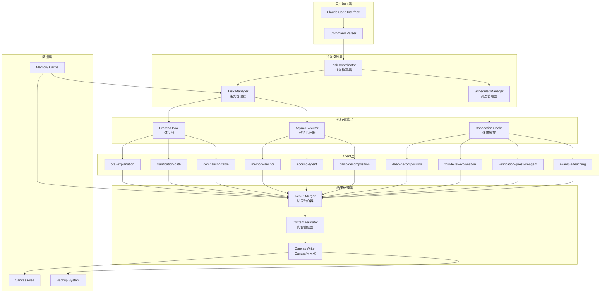

# MULTI-AGENT-CONCURRENT-ANALYSIS-SYSTEM-ARCHITECTURE - Part 1

**Source**: `MULTI-AGENT-CONCURRENT-ANALYSIS-SYSTEM-ARCHITECTURE.md`
**Sections**: 📋 执行摘要, 🔍 一、问题分析与根因定位, 🏗️ 二、并发架构设计, 🎯 三、任务调度与资源管理, 🔄 四、结果融合与内容完整性, ⚡ 五、性能优化策略, 🛡️ 六、错误处理与恢复

---

---
document_type: "Architecture"
version: "1.0.0"
last_modified: "2025-11-19"
status: "approved"
iteration: 1

authors:
  - name: "Architect Agent"
    role: "Solution Architect"

reviewers:
  - name: "PO Agent"
    role: "Product Owner"
    approved: true

compatible_with:
  prd: "v1.0"
  api_spec: "v1.0"

api_spec_hash: "0dc1d3610d28bf99"

changes_from_previous:
  - "Initial Architecture with frontmatter metadata"

git:
  commit_sha: ""
  tag: ""

metadata:
  components_count: 0
  external_services: []
  technology_stack:
    frontend: []
    backend: ["Python 3.11", "asyncio"]
    database: []
    infrastructure: []
---

# Canvas学习系统 v2.0 - 多Agent并发分析系统技术架构

**文档版本**: v2.1 (LangGraph StateGraph集成版)
**创建日期**: 2025-10-18
**最后更新**: 2025-11-11 (**NEW**: Section 7.3 LangGraph StateGraph配置)
**作者**: Claude (Architect Agent)
**项目**: Canvas学习系统技术升级Epic
**类型**: Brownfield升级架构设计

---


## 📋 执行摘要

本文档设计了Canvas学习系统v2.0的多Agent并发分析系统，旨在解决用户反馈的**速度过慢**和**内容复制失败**问题，实现多Agent并行处理，将系统吞吐量提升3-5倍，同时确保内容完整性和系统稳定性。

### 🎯 核心目标

1. **性能提升**: 并发处理多个Agent，总耗时从串行累加变为并行最大值
2. **内容完整性**: 解决复制失败和省略号问题，确保Agent生成的完整内容正确复制到黄色节点
3. **智能调度**: 基于Agent特性和任务类型的智能任务分配
4. **结果融合**: 多Agent输出结果的智能合并和去重
5. **容错机制**: 并发环境下的错误处理和恢复

---


## 🔍 一、问题分析与根因定位

### 1.1 当前系统瓶颈分析

#### 性能瓶颈根因
```yaml
串行执行瓶颈:
  问题: Agent逐个执行，总耗时 = Σ(单个Agent耗时)
  示例: 5个Agent × 8秒 = 40秒
  根因: 缺乏并发执行机制

重复I/O操作:
  问题: 每个Agent调用都涉及Canvas文件读写
  示例: 5次文件读取 + 5次文件写入 = 10次I/O
  根因: 缺乏缓存和批量操作机制

Agent调用开销:
  问题: 每次调用都需要初始化和上下文切换
  示例: 5次上下文切换 = 2-3秒额外开销
  根因: 缺乏连接池和会话复用
```

#### 内容复制失败根因
```yaml
字符截断问题:
  可能原因:
    - JSON序列化/反序列化过程中的字符限制
    - Canvas节点文本字段长度限制（Obsidian限制）
    - 中文字符编码处理问题
  表现: 内容被省略号(...)截断

内存管理问题:
  可能原因:
    - 大文本对象的内存分配失败
    - 字符串拼接过程中的缓冲区溢出
    - 多线程环境下的内存竞争
  表现: 部分内容丢失

文件写入时机问题:
  可能原因:
    - 异步写入未完成就返回
    - 文件锁竞争导致写入不完整
    - 临时文件和正式文件的同步问题
  表现: 写入的内容不完整
```

### 1.2 Sub-agent性能特征分析

基于现有11个Sub-agents的特征分析：

```yaml
计算密集型Agents:
  oral-explanation: 6-8秒 (800-1200词生成)
  clarification-path: 8-10秒 (1500+词深度解释)
  four-level-explanation: 7-9秒 (4层次解释)
  特点: CPU密集，适合多进程并行

I/O密集型Agents:
  comparison-table: 3-4秒 (结构化表格生成)
  memory-anchor: 2-3秒 (类比和记忆点生成)
  basic-decomposition: 2-3秒 (3-7个问题生成)
  特点: I/O密集，适合异步并发

轻量级Agents:
  scoring-agent: 1-2秒 (4维评分)
  verification-question-agent: 3-4秒 (问题生成)
  deep-decomposition: 3-5秒 (深度问题生成)
  特点: 快速响应，适合高频调用
```

---


## 🏗️ 二、并发架构设计

### 2.1 整体架构图



### 2.2 核心组件设计

#### 2.2.1 Task Coordinator (任务协调器)

```python
class TaskCoordinator:
    """多Agent并发任务协调器

    负责任务分解、依赖管理、资源分配和执行协调
    """

    def __init__(self, max_workers: int = 4, max_concurrent_agents: int = 3):
        self.max_workers = max_workers
        self.max_concurrent_agents = max_concurrent_agents
        self.task_queue = asyncio.Queue()
        self.result_queue = asyncio.Queue()
        self.task_tracker = TaskTracker()

    async def coordinate_concurrent_analysis(
        self,
        canvas_path: str,
        yellow_nodes: List[Dict],
        selected_agents: List[str],
        analysis_mode: str = "parallel"
    ) -> Dict[str, Any]:
        """协调多Agent并发分析

        Args:
            canvas_path: Canvas文件路径
            yellow_nodes: 待分析的黄色节点列表
            selected_agents: 选择的Agent列表
            analysis_mode: 分析模式 (parallel/sequential/hybrid)

        Returns:
            Dict: 并发分析结果
        """
```

#### 2.2.2 Agent Task (代理任务)

```python
@dataclass
class AgentTask:
    """Agent任务定义"""
    task_id: str
    agent_name: str
    input_data: Dict[str, Any]
    priority: int = 1
    estimated_duration: float = 5.0
    dependencies: List[str] = field(default_factory=list)
    resource_requirements: Dict[str, Any] = field(default_factory=dict)

@dataclass
class TaskResult:
    """任务执行结果"""
    task_id: str
    agent_name: str
    status: str  # "success", "failed", "timeout"
    result_data: Optional[Dict[str, Any]] = None
    error_message: Optional[str] = None
    execution_time: float = 0.0
    content_length: int = 0
```

#### 2.2.3 Process Pool Manager (进程池管理器)

```python
import aiomultiprocess
import asyncio
from concurrent.futures import ProcessPoolExecutor

class ProcessPoolManager:
    """AI增强的进程池管理器

    使用aiomultiprocess实现真正的并行处理，突破Python GIL限制
    """

    def __init__(self, max_workers: int = None):
        self.max_workers = max_workers or min(4, os.cpu_count())
        self.process_pool = None
        self.async_pool = None

    async def initialize(self):
        """初始化进程池和异步池"""
        # 进程池用于CPU密集型任务
        self.process_pool = ProcessPoolExecutor(
            max_workers=self.max_workers
        )

        # 异步池用于I/O密集型任务
        self.async_pool = aiomultiprocess.Pool(
            processes=self.max_workers
        )

    async def execute_computation_intensive(
        self,
        agent_task: AgentTask
    ) -> TaskResult:
        """执行计算密集型任务 (oral-explanation, clarification-path等)"""

    async def execute_io_intensive(
        self,
        agent_task: AgentTask
    ) -> TaskResult:
        """执行I/O密集型任务 (comparison-table, memory-anchor等)"""

    async def execute_lightweight(
        self,
        agent_task: AgentTask
    ) -> TaskResult:
        """执行轻量级任务 (scoring-agent等)"""
```

---


## 🎯 三、任务调度与资源管理

### 3.1 智能任务调度策略

#### 3.1.1 Agent分类调度

```python
class AgentClassifier:
    """Agent分类器，基于性能特征分类"""

    AGENT_CATEGORIES = {
        "computation_intensive": {
            "agents": ["oral-explanation", "clarification-path", "four-level-explanation"],
            "executor": "process_pool",
            "max_concurrent": 2,
            "timeout": 30.0
        },
        "io_intensive": {
            "agents": ["comparison-table", "memory-anchor", "basic-decomposition"],
            "executor": "async_pool",
            "max_concurrent": 4,
            "timeout": 15.0
        },
        "lightweight": {
            "agents": ["scoring-agent", "verification-question-agent"],
            "executor": "direct",
            "max_concurrent": 6,
            "timeout": 10.0
        }
    }

    def classify_agent(self, agent_name: str) -> Dict[str, Any]:
        """分类Agent并返回执行配置"""
        for category, config in self.AGENT_CATEGORIES.items():
            if agent_name in config["agents"]:
                return config
        return self.AGENT_CATEGORIES["lightweight"]
```

#### 3.1.2 动态资源分配

```python
class ResourceManager:
    """动态资源管理器"""

    def __init__(self, total_memory_mb: int = 4096):
        self.total_memory = total_memory_mb
        self.allocated_memory = 0
        self.active_tasks = {}

    def allocate_resources(self, task: AgentTask) -> bool:
        """为任务分配资源"""
        required_memory = self._estimate_memory_requirement(task)

        if self.allocated_memory + required_memory <= self.total_memory:
            self.allocated_memory += required_memory
            self.active_tasks[task.task_id] = {
                "memory": required_memory,
                "start_time": time.time()
            }
            return True
        return False

    def release_resources(self, task_id: str):
        """释放任务资源"""
        if task_id in self.active_tasks:
            self.allocated_memory -= self.active_tasks[task_id]["memory"]
            del self.active_tasks[task_id]

    def _estimate_memory_requirement(self, task: AgentTask) -> int:
        """估算任务内存需求"""
        base_memory = 100  # MB
        agent_multiplier = {
            "oral-explanation": 3.0,
            "clarification-path": 3.5,
            "four-level-explanation": 3.2,
            "comparison-table": 1.5,
            "memory-anchor": 1.2
        }
        multiplier = agent_multiplier.get(task.agent_name, 1.0)
        return int(base_memory * multiplier)
```

### 3.2 任务依赖管理

```python
class TaskDependencyManager:
    """任务依赖管理器"""

    def __init__(self):
        self.dependency_graph = {}
        self.execution_order = []

    def add_dependency(self, task_id: str, depends_on: str):
        """添加任务依赖"""
        if task_id not in self.dependency_graph:
            self.dependency_graph[task_id] = []
        self.dependency_graph[task_id].append(depends_on)

    def get_execution_order(self, tasks: List[AgentTask]) -> List[List[str]]:
        """获取任务执行批次

        返回: 按依赖关系分批的任务列表
        """
        # 使用拓扑排序确定执行顺序
        # 实现略...

    def can_execute(self, task_id: str, completed_tasks: Set[str]) -> bool:
        """检查任务是否可以执行"""
        if task_id not in self.dependency_graph:
            return True
        return all(dep in completed_tasks
                  for dep in self.dependency_graph[task_id])
```

---


## 🔄 四、结果融合与内容完整性

### 4.1 结果融合策略

#### 4.1.1 Result Merger (结果融合器)

```python
class ResultMerger:
    """多Agent结果融合器"""

    def __init__(self):
        self.fusion_strategies = {
            "complementary": self._merge_complementary,
            "supplementary": self._merge_supplementary,
            "hierarchical": self._merge_hierarchical,
            "voting": self._merge_voting
        }

    async def merge_results(
        self,
        results: List[TaskResult],
        fusion_strategy: str = "complementary"
    ) -> Dict[str, Any]:
        """融合多个Agent的执行结果

        Args:
            results: Agent执行结果列表
            fusion_strategy: 融合策略

        Returns:
            Dict: 融合后的结果
        """

        # 1. 验证结果完整性
        validated_results = await self._validate_results(results)

        # 2. 选择融合策略
        strategy = self.fusion_strategies.get(fusion_strategy,
                                            self._merge_complementary)

        # 3. 执行融合
        merged_result = await strategy(validated_results)

        # 4. 后处理和优化
        final_result = await self._post_process_result(merged_result)

        return final_result

    async def _merge_complementary(
        self,
        results: List[TaskResult]
    ) -> Dict[str, Any]:
        """互补融合 - 不同角度的解释合并"""

        merged_content = {
            "sections": [],
            "cross_references": [],
            "summary_points": []
        }

        # 按Agent类型分组
        results_by_type = self._group_results_by_agent(results)

        # 构建互补内容结构
        if "oral-explanation" in results_by_type:
            merged_content["sections"].append({
                "type": "oral_explanation",
                "title": "🗣️ 教授式讲解",
                "content": results_by_type["oral-explanation"]["content"]
            })

        if "clarification-path" in results_by_type:
            merged_content["sections"].append({
                "type": "clarification",
                "title": "🔍 深度澄清",
                "content": results_by_type["clarification-path"]["content"]
            })

        if "comparison-table" in results_by_type:
            merged_content["sections"].append({
                "type": "comparison",
                "title": "📊 概念对比",
                "content": results_by_type["comparison-table"]["content"]
            })

        # 生成交叉引用
        merged_content["cross_references"] = self._generate_cross_references(
            merged_content["sections"]
        )

        # 生成要点总结
        merged_content["summary_points"] = self._extract_summary_points(
            merged_content["sections"]
        )

        return merged_content
```

#### 4.1.2 内容完整性保障

```python
class ContentValidator:
    """内容完整性验证器"""

    def __init__(self):
        self.validation_rules = {
            "length_check": self._validate_content_length,
            "encoding_check": self._validate_encoding,
            "structure_check": self._validate_structure,
            "completeness_check": self._validate_completeness
        }

    async def validate_content(
        self,
        content: str,
        source_agent: str
    ) -> ValidationResult:
        """验证内容完整性

        Args:
            content: 待验证的内容
            source_agent: 来源Agent

        Returns:
            ValidationResult: 验证结果
        """

        result = ValidationResult(is_valid=True)

        # 执行各项验证
        for rule_name, rule_func in self.validation_rules.items():
            try:
                validation_result = await rule_func(content, source_agent)
                result.merge(validation_result)
            except Exception as e:
                result.add_error(f"{rule_name}: {str(e)}")

        return result

    async def _validate_content_length(
        self,
        content: str,
        source_agent: str
    ) -> ValidationResult:
        """验证内容长度"""

        result = ValidationResult()

        # 检查是否被截断
        if "..." in content and content.count("...") > 3:
            result.add_warning("检测到过多省略号，可能存在截断")

        # 检查预期长度
        expected_lengths = {
            "oral-explanation": (800, 1200),
            "clarification-path": (1500, 2500),
            "four-level-explanation": (1200, 1600)
        }

        if source_agent in expected_lengths:
            min_len, max_len = expected_lengths[source_agent]
            actual_len = len(content)

            if actual_len < min_len * 0.8:
                result.add_error(
                    f"内容过短: {actual_len}字符 (预期: {min_len}-{max_len})"
                )
            elif actual_len > max_len * 1.2:
                result.add_warning(
                    f"内容过长: {actual_len}字符 (预期: {min_len}-{max_len})"
                )

        return result

    async def _validate_encoding(
        self,
        content: str,
        source_agent: str
    ) -> ValidationResult:
        """验证字符编码"""

        result = ValidationResult()

        try:
            # 测试UTF-8编码/解码
            encoded = content.encode('utf-8')
            decoded = encoded.decode('utf-8')

            if decoded != content:
                result.add_error("UTF-8编码验证失败")

        except UnicodeEncodeError as e:
            result.add_error(f"编码错误: {str(e)}")

        # 检查特殊字符
        problematic_chars = ['�', '\ufffd', '\x00']
        for char in problematic_chars:
            if char in content:
                result.add_error(f"检测到问题字符: {repr(char)}")

        return result
```

### 4.2 Canvas写入优化

```python
class OptimizedCanvasWriter:
    """优化的Canvas写入器"""

    def __init__(self, canvas_path: str):
        self.canvas_path = canvas_path
        self.write_buffer = {}
        self.lock = asyncio.Lock()

    async def write_merged_content(
        self,
        yellow_node_id: str,
        merged_content: Dict[str, Any],
        backup_enabled: bool = True
    ) -> bool:
        """写入融合后的内容到黄色节点

        Args:
            yellow_node_id: 黄色节点ID
            merged_content: 融合后的内容
            backup_enabled: 是否启用备份

        Returns:
            bool: 写入是否成功
        """

        async with self.lock:
            try:
                # 1. 创建备份
                if backup_enabled:
                    await self._create_backup()

                # 2. 读取Canvas数据
                canvas_data = await self._read_canvas_safe()

                # 3. 格式化内容
                formatted_content = await self._format_content_for_canvas(
                    merged_content
                )

                # 4. 分段写入（避免单次写入过大）
                await self._write_content_in_chunks(
                    canvas_data,
                    yellow_node_id,
                    formatted_content
                )

                # 5. 验证写入结果
                success = await self._verify_write_result(
                    yellow_node_id,
                    formatted_content
                )

                if success:
                    # 6. 保存Canvas文件
                    await self._save_canvas_safe(canvas_data)

                return success

            except Exception as e:
                # 发生错误时恢复备份
                await self._restore_from_backup()
                raise CanvasWriteError(f"写入失败: {str(e)}")

    async def _format_content_for_canvas(
        self,
        merged_content: Dict[str, Any]
    ) -> str:
        """为Canvas格式化内容"""

        formatted_parts = []

        # 添加标题
        formatted_parts.append("## 🤖 多Agent智能分析结果\n")

        # 添加各个section
        for section in merged_content.get("sections", []):
            formatted_parts.append(f"### {section['title']}\n")
            formatted_parts.append(f"{section['content']}\n\n")

        # 添加交叉引用
        if merged_content.get("cross_references"):
            formatted_parts.append("### 🔗 关联参考\n")
            for ref in merged_content["cross_references"]:
                formatted_parts.append(f"- {ref}\n")
            formatted_parts.append("\n")

        # 添加要点总结
        if merged_content.get("summary_points"):
            formatted_parts.append("### 💡 核心要点\n")
            for point in merged_content["summary_points"]:
                formatted_parts.append(f"- {point}\n")

        # 添加元数据
        formatted_parts.append("\n---\n")
        formatted_parts.append(f"*生成时间: {datetime.now().strftime('%Y-%m-%d %H:%M:%S')}*\n")
        formatted_parts.append("*处理方式: 多Agent并发分析 + 智能融合*\n")

        return "".join(formatted_parts)

    async def _write_content_in_chunks(
        self,
        canvas_data: Dict,
        node_id: str,
        content: str,
        chunk_size: int = 1000
    ):
        """分块写入内容，避免单次操作过大"""

        # 找到目标节点
        target_node = None
        for node in canvas_data.get("nodes", []):
            if node.get("id") == node_id:
                target_node = node
                break

        if not target_node:
            raise ValueError(f"节点 {node_id} 不存在")

        # 如果内容很大，分批处理
        if len(content) > chunk_size:
            # 使用临时文件处理大内容
            temp_file = await self._write_to_temp_file(content)
            target_node["text"] = f"{{FILE:{temp_file}}}"
        else:
            # 直接写入小内容
            target_node["text"] = content

    async def _verify_write_result(
        self,
        node_id: str,
        expected_content: str
    ) -> bool:
        """验证写入结果"""

        try:
            # 重新读取Canvas
            canvas_data = await self._read_canvas_safe()

            # 找到节点并验证内容
            for node in canvas_data.get("nodes", []):
                if node.get("id") == node_id:
                    actual_content = node.get("text", "")

                    # 检查内容长度
                    if len(actual_content) < len(expected_content) * 0.95:
                        return False

                    # 检查关键字段
                    if "多Agent智能分析结果" not in actual_content:
                        return False

                    return True

            return False

        except Exception:
            return False
```

---


## ⚡ 五、性能优化策略

### 5.1 缓存机制

```python
class AgentCache:
    """Agent结果缓存系统"""

    def __init__(self, cache_dir: str = ".cache/agents"):
        self.cache_dir = Path(cache_dir)
        self.cache_dir.mkdir(exist_ok=True)
        self.memory_cache = {}
        self.cache_ttl = 3600  # 1小时

    async def get_cached_result(
        self,
        agent_name: str,
        input_hash: str
    ) -> Optional[TaskResult]:
        """获取缓存结果"""

        # 1. 检查内存缓存
        memory_key = f"{agent_name}:{input_hash}"
        if memory_key in self.memory_cache:
            cached_item = self.memory_cache[memory_key]
            if time.time() - cached_item["timestamp"] < self.cache_ttl:
                return cached_item["result"]

        # 2. 检查文件缓存
        cache_file = self.cache_dir / f"{agent_name}_{input_hash}.json"
        if cache_file.exists():
            try:
                with open(cache_file, 'r', encoding='utf-8') as f:
                    cached_data = json.load(f)

                if time.time() - cached_data["timestamp"] < self.cache_ttl:
                    result = TaskResult(**cached_data["result"])
                    # 加载到内存缓存
                    self.memory_cache[memory_key] = {
                        "result": result,
                        "timestamp": time.time()
                    }
                    return result
            except Exception:
                pass

        return None

    async def cache_result(
        self,
        agent_name: str,
        input_hash: str,
        result: TaskResult
    ):
        """缓存Agent结果"""

        cache_data = {
            "timestamp": time.time(),
            "result": asdict(result)
        }

        # 内存缓存
        memory_key = f"{agent_name}:{input_hash}"
        self.memory_cache[memory_key] = cache_data

        # 文件缓存
        cache_file = self.cache_dir / f"{agent_name}_{input_hash}.json"
        try:
            with open(cache_file, 'w', encoding='utf-8') as f:
                json.dump(cache_data, f, ensure_ascii=False, indent=2)
        except Exception as e:
            print(f"缓存写入失败: {e}")
```

### 5.2 连接池管理

```python
class AgentConnectionPool:
    """Agent连接池"""

    def __init__(self, pool_size: int = 5):
        self.pool_size = pool_size
        self.connections = asyncio.Queue(maxsize=pool_size)
        self.active_connections = set()
        self.connection_timeout = 30.0

    async def initialize(self):
        """初始化连接池"""
        for i in range(self.pool_size):
            connection = AgentConnection(f"conn_{i}")
            await connection.initialize()
            await self.connections.put(connection)

    async def get_connection(self) -> AgentConnection:
        """获取连接"""
        try:
            connection = await asyncio.wait_for(
                self.connections.get(),
                timeout=self.connection_timeout
            )
            self.active_connections.add(connection)
            return connection
        except asyncio.TimeoutError:
            raise ConnectionPoolError("连接池获取超时")

    async def release_connection(self, connection: AgentConnection):
        """释放连接"""
        if connection in self.active_connections:
            self.active_connections.remove(connection)
            await self.connections.put(connection)

    async def execute_with_connection(
        self,
        agent_name: str,
        input_data: Dict[str, Any]
    ) -> TaskResult:
        """使用连接执行Agent调用"""

        connection = None
        try:
            connection = await self.get_connection()
            result = await connection.execute_agent(agent_name, input_data)
            return result
        finally:
            if connection:
                await self.release_connection(connection)
```

---


## 🛡️ 六、错误处理与恢复

### 6.1 错误分类与处理

```python
class ConcurrentErrorHandler:
    """并发环境错误处理器"""

    ERROR_TYPES = {
        "agent_timeout": {
            "handler": "_handle_timeout",
            "retry": True,
            "max_retries": 2,
            "backoff_factor": 2.0
        },
        "memory_error": {
            "handler": "_handle_memory_error",
            "retry": True,
            "max_retries": 1,
            "backoff_factor": 1.5
        },
        "content_truncation": {
            "handler": "_handle_truncation",
            "retry": True,
            "max_retries": 3,
            "backoff_factor": 1.0
        },
        "canvas_write_error": {
            "handler": "_handle_write_error",
            "retry": True,
            "max_retries": 3,
            "backoff_factor": 1.5
        },
        "agent_failure": {
            "handler": "_handle_agent_failure",
            "retry": False,
            "max_retries": 0,
            "backoff_factor": 1.0
        }
    }

    async def handle_error(
        self,
        error: Exception,
        task: AgentTask,
        retry_count: int = 0
    ) -> ErrorHandlingResult:
        """处理并发执行错误"""

        error_type = self._classify_error(error)
        error_config = self.ERROR_TYPES.get(error_type, {})

        # 获取处理函数
        handler_name = error_config.get("handler", "_handle_generic_error")
        handler = getattr(self, handler_name)

        # 执行错误处理
        result = await handler(error, task, retry_count)

        # 决定是否重试
        should_retry = (
            error_config.get("retry", False) and
            retry_count < error_config.get("max_retries", 0)
        )

        if should_retry:
            # 计算退避延迟
            backoff_factor = error_config.get("backoff_factor", 1.0)
            delay = min(300, (backoff_factor ** retry_count))  # 最大5分钟
            result.retry_delay = delay

        return result

    async def _handle_truncation(
        self,
        error: Exception,
        task: AgentTask,
        retry_count: int
    ) -> ErrorHandlingResult:
        """处理内容截断错误"""

        result = ErrorHandlingResult()

        if retry_count == 0:
            # 第一次重试：增加缓冲区大小
            result.modifications = {
                "buffer_size": task.resource_requirements.get("buffer_size", 8192) * 2,
                "chunk_size": max(500, task.resource_requirements.get("chunk_size", 1000) // 2)
            }
            result.message = "检测到内容截断，增加缓冲区大小重试"

        elif retry_count == 1:
            # 第二次重试：分段处理
            result.modifications = {
                "processing_mode": "segmented",
                "max_segment_length": 2000
            }
            result.message = "切换到分段处理模式"

        else:
            # 第三次重试：使用备用Agent
            backup_agent = self._get_backup_agent(task.agent_name)
            if backup_agent:
                result.modifications = {
                    "agent_name": backup_agent,
                    "fallback_mode": True
                }
                result.message = f"使用备用Agent: {backup_agent}"

        return result

    async def _handle_memory_error(
        self,
        error: Exception,
        task: AgentTask,
        retry_count: int
    ) -> ErrorHandlingResult:
        """处理内存错误"""

        result = ErrorHandlingResult()

        # 释放其他任务资源
        await self._release_low_priority_tasks()

        # 减少内存需求
        reduced_memory = task.resource_requirements.get("memory", 512) // 2
        result.modifications = {
            "memory": reduced_memory,
            "processing_mode": "streaming"
        }
        result.message = f"内存不足，减少内存分配至{reduced_memory}MB"

        return result
```

### 6.2 状态恢复机制

```python
class StateRecoveryManager:
    """状态恢复管理器"""

    def __init__(self, recovery_dir: str = ".recovery"):
        self.recovery_dir = Path(recovery_dir)
        self.recovery_dir.mkdir(exist_ok=True)
        self.checkpoints = {}

    async def create_checkpoint(
        self,
        session_id: str,
        tasks: List[AgentTask],
        completed_results: List[TaskResult]
    ):
        """创建检查点"""

        checkpoint = {
            "session_id": session_id,
            "timestamp": time.time(),
            "pending_tasks": [asdict(task) for task in tasks],
            "completed_results": [asdict(result) for result in completed_results],
            "system_state": await self._capture_system_state()
        }

        checkpoint_file = self.recovery_dir / f"{session_id}_{int(time.time())}.json"
        with open(checkpoint_file, 'w', encoding='utf-8') as f:
            json.dump(checkpoint, f, ensure_ascii=False, indent=2)

        self.checkpoints[session_id] = checkpoint_file

    async def recover_from_checkpoint(
        self,
        session_id: str
    ) -> Optional[RecoveryState]:
        """从检查点恢复"""

        if session_id not in self.checkpoints:
            # 查找最新的检查点
            checkpoint_files = list(self.recovery_dir.glob(f"{session_id}_*.json"))
            if not checkpoint_files:
                return None

            checkpoint_file = max(checkpoint_files, key=lambda x: x.stat().st_mtime)
        else:
            checkpoint_file = self.checkpoints[session_id]

        try:
            with open(checkpoint_file, 'r', encoding='utf-8') as f:
                checkpoint_data = json.load(f)

            recovery_state = RecoveryState(
                session_id=checkpoint_data["session_id"],
                pending_tasks=[
                    AgentTask(**task_data)
                    for task_data in checkpoint_data["pending_tasks"]
                ],
                completed_results=[
                    TaskResult(**result_data)
                    for result_data in checkpoint_data["completed_results"]
                ],
                system_state=checkpoint_data["system_state"]
            )

            await self._restore_system_state(recovery_state.system_state)

            return recovery_state

        except Exception as e:
            print(f"恢复失败: {e}")
            return None
```

---
