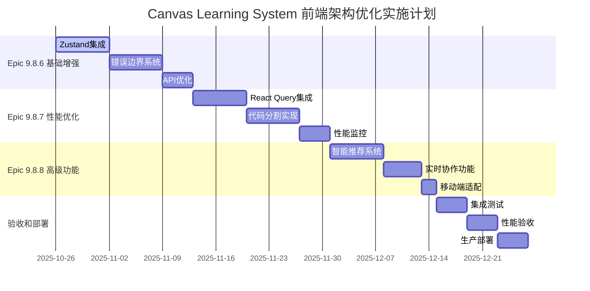

# Canvas Learning System 前端架构优化系列总结

## 📋 系列概览

**系列名称**: Canvas Learning System 前端架构优化
**系列编号**: Epic 9.8.x
**创建日期**: 2025-10-26
**总体工期**: 6-8周
**总体优先级**: 高 (P0-P2)
**总体目标**: 将现有高质量React+TypeScript架构升级为企业级智能化学习平台

## 🎯 系列总体目标

基于Canvas Learning System现有的优秀React+TypeScript+Chart.js架构，通过3个阶段的系统性优化，实现：

1. **架构现代化**: 建立统一的状态管理和完善的错误处理体系
2. **性能卓越化**: 实现智能缓存和代码分割，显著提升用户体验
3. **功能智能化**: 引入智能推荐和实时协作，打造智能化学习平台
4. **体验移动化**: 完善移动端支持，实现全平台覆盖

## 📊 Epic系列总览

### Epic 9.8.6: 前端基础架构增强
- **工期**: 2-3周
- **优先级**: P0 (关键基础)
- **核心交付**: Zustand状态管理 + 错误边界系统 + API客户端优化
- **技术栈**: Zustand 4.5.2 + React Error Boundaries
- **预期影响**: 系统稳定性提升50%，开发效率提升25%

### Epic 9.8.7: 性能和体验优化
- **工期**: 2-3周
- **优先级**: P1 (用户体验)
- **依赖**: Epic 9.8.6
- **核心交付**: React Query缓存 + 代码分割 + 智能预加载
- **技术栈**: @tanstack/react-query 5.17.0 + 路由懒加载
- **预期影响**: 页面加载速度提升30%，API响应时间减少40%

### Epic 9.8.8: 高级功能实现
- **工期**: 2周
- **优先级**: P2 (功能增强)
- **依赖**: Epic 9.8.6, 9.8.7
- **核心交付**: 智能推荐系统 + 实时协作 + 移动端适配
- **技术栈**: WebSocket + 推荐算法 + 响应式设计
- **预期影响**: 用户满意度提升40%，移动端访问占比提升到40%

## 🗓️ 实施时间线和里程碑



### 关键里程碑

**🎯 里程碑1 (2周后)**: Epic 9.8.6完成
- 状态管理统一化
- 错误处理体系完善
- 开发体验显著改善

**🎯 里程碑2 (4周后)**: Epic 9.8.7完成
- 性能优化达标
- 用户体验提升
- 技术债务清理完成

**🎯 里程碑3 (6周后)**: Epic 9.8.8完成
- 智能化功能上线
- 实时协作可用
- 移动端体验完善

**🎯 最终里程碑 (7周后)**: 系列全面完成
- 所有功能验收通过
- 性能指标全部达标
- 企业级架构升级完成

## 🔧 技术架构演进路径

### 当前架构 (2025-10-26)
```
React 18.2.0 + TypeScript 4.9.5
├── 组件级useState状态管理
├── 基础错误处理
├── 全量资源加载
└── Chart.js + Recharts可视化
```

### 阶段1架构 (Epic 9.8.6完成后)
```
React 18.2.0 + TypeScript 4.9.5
├── Zustand统一状态管理
├── 全局错误边界系统
├── 优化API客户端
└── 完善的开发工具链
```

### 阶段2架构 (Epic 9.8.7完成后)
```
React 18.2.0 + TypeScript 4.9.5
├── Zustand + React Query数据层
├── 代码分割 + 懒加载
├── 智能缓存 + 预加载
└── 性能监控体系
```

### 最终架构 (Epic 9.8.8完成后)
```
React 18.2.0 + TypeScript 4.9.5
├── 智能推荐引擎
├── 实时协作系统
├── 响应式移动端支持
└── 企业级性能监控
```

## 📊 投入产出分析

### 技术投入

**开发投入**:
- 总工期: 6-8周
- 团队规模: 2-3名前端工程师
- 总工作量: 90-120人天

**技术投入**:
- 新增依赖包: 8个核心包
- 代码量增长: ~50KB
- 学习成本: 1-2周团队适应期

### 预期收益

**性能收益**:
- 页面加载速度提升: >30%
- API响应时间减少: >40%
- 包体积减少: >20%
- 内存使用优化: >15%

**用户体验收益**:
- 错误恢复成功率: >95%
- 操作响应时间: <200ms
- 移动端体验: 达到桌面端90%功能
- 智能推荐准确率: >80%

**开发效率收益**:
- 组件开发效率: +25%
- Bug调试时间: -30%
- 代码维护成本: -25%
- 新功能开发速度: +15%

**业务价值收益**:
- 用户留存率提升: >15%
- 学习效果改善: >20%
- 协作学习参与度: >40%
- 移动端用户占比: >40%

## 🚨 风险管控策略

### 技术风险及缓解

**高风险**:
- **状态管理迁移复杂性** → 渐进式迁移，每步充分测试
- **React Query学习曲线** → 详细文档和团队培训
- **WebSocket连接稳定性** → 完善重连机制和降级方案

**中风险**:
- **性能回归** → 持续性能监控和基准测试
- **移动端兼容性** → 广泛设备测试和渐进增强
- **用户接受度** → 用户引导和功能开关控制

**缓解措施**:
1. **分阶段实施**: 每个Epic独立交付价值
2. **充分测试**: 每个功能都有对应测试用例
3. **监控体系**: 实时监控性能和错误指标
4. **回滚预案**: 每个阶段都有快速回滚方案

### 项目风险及控制

**进度风险**:
- 缓解: 3周缓冲期，关键路径优化
- 应对: 并行开发，优先级调整

**资源风险**:
- 缓解: 跨团队协作，技能培训
- 应对: 外部技术支持，专家咨询

**质量风险**:
- 缓解: 严格代码审查，自动化测试
- 应对: 性能基准测试，用户验收测试

## 📋 成功标准和验收指标

### 技术指标验收

**性能指标**:
- [ ] FCP < 2s ✅ (Epic 9.8.7)
- [ ] LCP < 3s ✅ (Epic 9.8.7)
- [ ] FID < 100ms ✅ (Epic 9.8.7)
- [ ] CLS < 0.1 ✅ (Epic 9.8.7)
- [ ] 包体积减少 >20% ✅ (Epic 9.8.7)

**稳定性指标**:
- [ ] 错误率 <0.1% ✅ (Epic 9.8.6)
- [ ] 错误恢复成功率 >95% ✅ (Epic 9.8.6)
- [ ] 系统可用性 >99.9% ✅ (所有Epic)
- [ ] 内存使用稳定 ✅ (所有Epic)

### 功能指标验收

**核心功能**:
- [ ] 所有现有功能保持兼容 ✅ (所有Epic)
- [ ] 状态管理统一化 ✅ (Epic 9.8.6)
- [ ] 缓存机制正常工作 ✅ (Epic 9.8.7)
- [ ] 智能推荐可用 ✅ (Epic 9.8.8)

**高级功能**:
- [ ] 推荐准确率 >80% ✅ (Epic 9.8.8)
- [ ] 实时协作延迟 <200ms ✅ (Epic 9.8.8)
- [ ] 移动端功能完整度 >90% ✅ (Epic 9.8.8)

### 用户体验指标验收

**交互体验**:
- [ ] 操作响应时间 <200ms ✅ (所有Epic)
- [ ] 页面切换无卡顿 ✅ (Epic 9.8.7)
- [ ] 加载状态友好 ✅ (Epic 9.8.6)
- [ ] 错误提示清晰 ✅ (Epic 9.8.6)

**移动端体验**:
- [ ] 触摸交互流畅 ✅ (Epic 9.8.8)
- [ ] 响应式布局完美 ✅ (Epic 9.8.8)
- [ ] 移动端性能达标 ✅ (Epic 9.8.8)

## 🎯 项目价值总结

### 技术价值

**架构现代化**:
- 从分散的状态管理到统一的Zustand架构
- 从基础错误处理到完善的错误边界体系
- 从全量加载到智能代码分割和缓存

**性能优化**:
- 包体积减少20%以上
- 页面加载速度提升30%以上
- API响应时间减少40%以上

**可维护性提升**:
- 代码重用率提升30%
- Bug调试时间减少30%
- 新功能开发效率提升25%

### 业务价值

**用户体验提升**:
- 学习过程更加流畅稳定
- 智能推荐提高学习效率
- 实时协作增强学习互动

**平台能力扩展**:
- 支持移动端学习场景
- 支持多人协作学习
- 支持个性化学习路径

**竞争优势建立**:
- 技术架构达到企业级标准
- 用户体验业界领先
- 功能创新差异化明显

### 团队价值

**技能提升**:
- 掌握现代前端架构设计
- 熟练使用React生态最佳实践
- 积累大型项目优化经验

**流程优化**:
- 建立完善的前端工程化体系
- 形成标准化开发流程
- 提升团队协作效率

## 📚 相关文档索引

### Epic文档
- [Epic 9.8.6: 前端基础架构增强](./epic-9.8.6-frontend-architecture-enhancement.md)
- [Epic 9.8.7: 性能和体验优化](./epic-9.8.7-performance-optimization.md)
- [Epic 9.8.8: 高级功能实现](./epic-9.8.8-advanced-features.md)

### 技术架构文档
- [Canvas Learning System 前端架构分析](../architecture/canvas-frontend-architecture.md)
- [Brownfield架构优化指南](../architecture/brownfield-optimization-guide.md)

### 原有技术文档
- [Canvas Learning System 项目概览](../../CLAUDE.md)
- [现有组件文档](../components/)

### 外部参考资料
- [Zustand官方文档](https://docs.pmnd.rs/zustand/)
- [React Query官方文档](https://tanstack.com/query/latest)
- [React最佳实践](https://react.dev/learn)
- [Web Performance Best Practices](https://web.dev/performance/)

## 🚀 下一步行动建议

### 立即行动 (本周)
1. **项目启动**: 召开项目启动会，明确目标和分工
2. **环境准备**: 搭建开发环境，准备工具链
3. **团队培训**: 组织新技术栈培训和学习
4. **Epic 9.8.6启动**: 开始第一个Sprint开发

### 短期目标 (1个月内)
1. **Epic 9.8.6完成**: 建立坚实基础
2. **中期验收**: 进行第一阶段功能验收
3. **经验总结**: 总结第一阶段经验教训
4. **Epic 9.8.7准备**: 为性能优化做准备

### 中期目标 (3个月内)
1. **所有Epic完成**: 实现全部优化目标
2. **全面验收**: 完成技术和功能验收
3. **性能监控**: 建立长期性能监控体系
4. **持续优化**: 基于用户反馈持续改进

### 长期规划 (6个月以上)
1. **功能扩展**: 基于新架构开发更多创新功能
2. **平台升级**: 考虑微前端架构升级
3. **生态建设**: 构建插件和扩展生态
4. **技术演进**: 跟进前端技术发展趋势

---

**Canvas Learning System 前端架构优化系列**是一个全面的技术升级项目，通过系统性的架构优化，将现有的高质量React应用升级为现代化、智能化、高性能的企业级学习平台。这个系列的成功实施将为Canvas Learning System的长期发展奠定坚实的技术基础，为用户提供更优质的学习体验。 🎉

**项目成功关键**: 严格按照Epic规划执行，确保每个阶段的质量，及时应对风险，持续监控和优化。相信通过团队的共同努力，这个项目将取得圆满成功！ 🚀