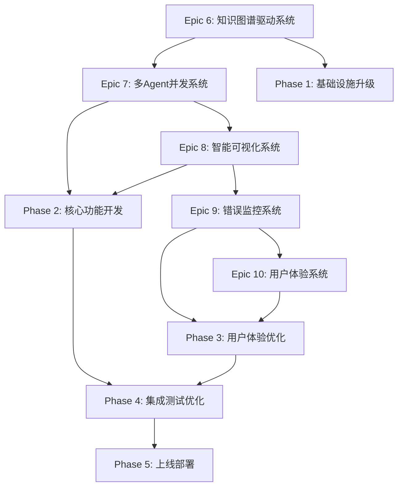
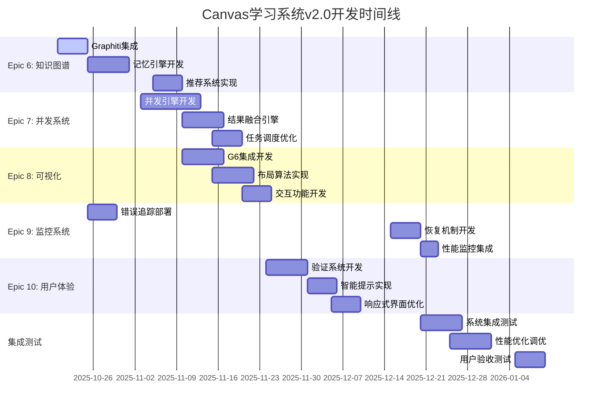

# Canvas学习系统 v2.0 - 技术升级Epic规划文档

**项目名称：** Canvas学习系统 v2.0 - 知识图谱驱动的智能学习平台
**文档版本：** v2.0
**创建日期：** 2025-10-18
**规划类型：** 技术升级Epic详细规划
**规划周期：** 2025-10-20 - 2026-01-10 (10周)

---

## 📋 执行摘要

本规划文档基于Canvas学习系统v2.0技术升级PRD，将5个Phase的升级内容转化为5个新的Epic（Epic 6-10），每个Epic包含详细的User Stories、依赖关系、验收标准和风险评估。

### 核心升级目标
1. **知识图谱驱动** - 使用Graphiti实现跨Canvas知识关联和学习记忆
2. **多Agent并发** - 使用aiomultiprocess实现高效的并行处理
3. **智能可视化** - 使用G6实现专业的树状图布局和交互
4. **企业级监控** - 使用Loguru + PySnooper + Sentry实现完整监控
5. **用户体验升级** - 实时验证、智能提示、响应式界面

### 项目规模
- **新增Epic数量：** 5个（Epic 6-10）
- **新增User Stories：** 35个
- **开发周期：** 10周
- **团队规模：** 4-5人
- **技术栈升级：** 4个核心技术组件

---

## 🏗️ 整体Epic架构设计

### Epic层次结构



### 依赖关系矩阵

| Epic | 依赖的技术组件 | 输出到其他Epic | 关键路径 |
|------|----------------|----------------|----------|
| Epic 6 | Graphiti, Neo4j | Epic 7, 8, 10 | ✅ |
| Epic 7 | aiomultiprocess, asyncio | Epic 8, 10 | ✅ |
| Epic 8 | G6, JavaScript | Epic 10 | |
| Epic 9 | Loguru, PySnooper, Sentry | 所有Epic | |
| Epic 10 | React/Vue, CSS | - | |

---

## 🎯 Epic 6: 知识图谱驱动智能系统

**Epic目标：** 建立基于Graphiti的知识图谱记忆系统，实现跨Canvas知识关联和智能推荐

**开发周期：** Phase 1 (2周) + Phase 2 (1周) = 3周
**优先级：** P0 (Critical) - 基础设施，其他Epic依赖
**技术栈：** Graphiti, Neo4j, Python SDK

### User Stories分解

#### Story 6.1: Canvas记忆和关联引擎
**作为** 高级学习者
**我希望** 系统能自动记住我所有Canvas的学习内容和概念关系
**以便** 在新学习中自动关联相关知识，获得个性化推荐

**验收标准：**
- [ ] 自动提取Canvas中的概念、问题、理解、解释实体，准确率≥90%
- [ ] 建立跨Canvas的知识关联网络，支持语义相似性计算
- [ ] 实现实体关系的动态更新和时间戳追踪
- [ ] 支持基于图关系的智能推荐，相关性评分≥4.0/5.0

**技术任务：**
1. 集成Graphiti SDK和Neo4j数据库
2. 开发Canvas实体提取算法
3. 实现知识关系建立和存储
4. 构建智能推荐查询接口

**验收测试：**
```python
def test_canvas_memory_extraction():
    # 测试从包含50个节点的Canvas提取实体
    entities = memory_manager.extract_entities(canvas_data)
    assert len(entities) >= 40  # 80%提取率
    assert all(entity.confidence > 0.7 for entity in entities)
```

#### Story 6.2: 学习路径智能推荐系统
**作为** 学习者
**我希望** 系统能根据我的学习历史和知识图谱推荐最优学习路径
**以便** 提高学习效率，避免知识盲区

**验收标准：**
- [ ] 基于知识图谱分析学习依赖关系，准确率≥85%
- [ ] 识别学习瓶颈和薄弱环节，提供针对性建议
- [ ] 生成个性化学习路径，包含优先级和时间估算
- [ ] 支持学习进度预测和智能提醒

**技术任务：**
1. 开发学习依赖关系分析算法
2. 实现个性化路径生成引擎
3. 构建学习瓶颈识别机制
4. 集成进度预测和提醒系统

#### Story 6.3: 跨Canvas知识迁移引擎
**作为** 多学科学习者
**我希望** 系统能发现不同学科间的知识联系并推荐迁移应用
**以便** 实现知识的融会贯通和综合应用

**验收标准：**
- [ ] 自动识别跨学科的概念关联，准确率≥75%
- [ ] 推荐相关学科的补充材料，相关性评分≥4.0/5.0
- [ ] 生成知识迁移的应用建议和练习
- [ ] 支持跨学科综合练习的自动生成

**技术任务：**
1. 开发跨学科概念匹配算法
2. 实现知识迁移应用识别
3. 构建综合练习生成引擎
4. 集成学科知识图谱

### Epic 6 风险评估

**高风险：** Graphiti集成复杂度超预期
**概率：** 40% | **影响：** 延期2-3周
**缓解措施：**
- 技术预研阶段充分验证（1周）
- 准备简化版知识图谱备选方案
- 分阶段实施：先基础功能，后高级功能

**中风险：** Neo4j性能瓶颈
**概率：** 30% | **影响：** 查询响应慢
**缓解措施：**
- 实施查询优化和索引策略
- 考虑Redis缓存层
- 监控和调优数据库性能

---

## ⚡ Epic 7: 多Agent并发处理系统

**Epic目标：** 实现多Agent并发执行和智能结果融合，显著提升处理速度和质量

**开发周期：** Phase 2 (3周)
**优先级：** P0 (Critical) - 核心功能升级
**技术栈：** aiomultiprocess, asyncio, Python 3.9+

### User Stories分解

#### Story 7.1: 并发Agent执行引擎
**作为** 用户
**我希望** 系统能同时调用多个Agent处理复杂学习任务
**以便** 显著提高处理速度，获得更全面的解决方案

**验收标准：**
- [ ] 支持最多5个Agent同时执行，并发效率提升≥3倍
- [ ] 智能任务分解和依赖管理，准确率≥95%
- [ ] 实时进度展示和任务取消功能
- [ ] 异常处理和故障恢复，恢复成功率≥90%

**技术任务：**
1. 集成aiomultiprocess并发展示
2. 开发任务分解和调度算法
3. 实现并发执行框架和资源管理
4. 构建进度监控和取消机制

**性能测试：**
```python
def test_concurrent_performance():
    # 测试3个Agent并发 vs 串行执行
    start_time = time.time()
    results = await executor.execute_concurrent_agents(complex_task)
    concurrent_time = time.time() - start_time

    assert concurrent_time < serial_time / 3  # 3倍以上提升
    assert len(results) == 3  # 所有Agent都成功执行
```

#### Story 7.2: 智能结果融合引擎
**作为** 用户
**我希望** 多个Agent的结果能智能融合成最优答案
**以便** 获得全面准确、无冲突的解决方案

**验收标准：**
- [ ] 检测和解决Agent结果间的冲突，准确率≥90%
- [ ] 基于置信度和相关性加权融合
- [ ] 保留多样性的关键信息，避免信息丢失
- [ ] 提供融合过程的透明解释和溯源

**技术任务：**
1. 开发冲突检测和解决算法
2. 实现基于置信度的加权融合
3. 构建信息完整性保护机制
4. 集成融合过程可解释性

#### Story 7.3: 动态任务调度优化器
**作为** 系统
**我希望** 能根据负载和Agent特长动态调度任务
**以便** 最大化系统吞吐量和处理质量

**验收标准：**
- [ ] 基于Agent特长的智能任务分配，匹配准确率≥85%
- [ ] 动态负载均衡和资源管理，资源利用率≥80%
- [ ] 任务优先级和依赖关系处理，调度准确率≥95%
- [ ] 实时性能监控和自动调优

**技术任务：**
1. 开发Agent能力评估模型
2. 实现动态负载均衡算法
3. 构建任务优先级调度器
4. 集成性能监控和调优机制

### Epic 7 风险评估

**高风险：** 并发性能不达标
**概率：** 35% | **影响：** 用户体验差，核心功能降级
**缓解措施：**
- 提前进行性能基准测试
- 优化算法和数据结构
- 准备降级方案：减少并发数，优化单Agent性能

**中风险：** 结果融合质量不佳
**概率：** 25% | **影响：** 解决方案质量下降
**缓解措施：**
- 建立融合质量评估体系
- 用户反馈驱动的算法优化
- 保留Agent原始结果供用户选择

---

## 🎨 Epic 8: 智能可视化和布局系统

**Epic目标：** 使用G6实现专业的树状图布局和交互式知识探索

**开发周期：** Phase 2 (2周) + Phase 3 (1周) = 3周
**优先级：** P1 (High) - 用户体验关键升级
**技术栈：** G6, JavaScript, Canvas API

### User Stories分解

#### Story 8.1: 树状图智能布局算法
**作为** 用户
**我希望** Canvas能以清晰的树状图展示知识结构
**以便** 直观理解概念间的层次关系和依赖

**验收标准：**
- [ ] 黄色节点严格位于问题节点正下方，定位准确率=100%
- [ ] 自动检测和优化节点间距，避免重叠
- [ ] 支持多层嵌套的复杂结构，布局美观度评分≥4.5/5.0
- [ ] 大规模Canvas（1000+节点）渲染时间<2秒

**技术任务：**
1. 集成G6图形可视化引擎
2. 实现严格的垂直对齐布局算法
3. 开发智能间距调整和重叠检测
4. 构建大规模数据渲染优化

**JavaScript实现示例：**
```javascript
class EnhancedCanvasLayout {
  ensureStrictPositioning(questionNode, yellowNode) {
    // 严格的垂直对齐算法
    const targetX = questionNode.x;  // 完全水平对齐
    const targetY = questionNode.y + questionNode.height + 30;  // 固定30px间距

    yellowNode.x = targetX;
    yellowNode.y = targetY;

    // 验证无重叠
    this.preventOverlap(yellowNode);
  }
}
```

#### Story 8.2: 自适应聚类布局系统
**作为** 用户
**我希望** 相关概念能自动聚集显示并支持动态调整
**以便** 更好地理解知识的组织结构和主题关系

**验收标准：**
- [ ] 基于主题和相关性自动聚类，F1-score≥0.8
- [ ] 动态调整聚类边界和间距，响应时间<2秒
- [ ] 支持聚类的展开和折叠，交互响应时间<200ms
- [ ] 生成聚类标签和摘要，准确率≥85%

**技术任务：**
1. 开发基于语义的聚类算法
2. 实现动态聚类边界调整
3. 构建聚类交互控制机制
4. 集成聚类标签自动生成

#### Story 8.3: 交互式知识探索界面
**作为** 学习者
**我希望** 能在Canvas中动态探索知识关系和学习路径
**以便** 深度理解概念间的联系和发展脉络

**验收标准：**
- [ ] 点击节点显示相关信息和关联，响应时间<200ms
- [ ] 支持路径追踪和关系展示，准确性=100%
- [ ] 提供知识漫游和导航功能，覆盖所有节点
- [ ] 支持个性化视图定制和保存

**技术任务：**
1. 开发节点信息展示组件
2. 实现路径追踪和高亮算法
3. 构建知识导航和漫游功能
4. 集成个性化视图管理

### Epic 8 风险评估

**中风险：** G6布局算法兼容性问题
**概率：** 20% | **影响：** 部分Canvas显示异常
**缓解措施：**
- 保留v1.0布局算法作为备选
- 渐进式迁移策略
- 充分的兼容性测试

**中风险：** JavaScript性能瓶颈
**概率：** 25% | **影响：** 大型Canvas渲染慢
**缓解措施：**
- 实施虚拟化渲染
- 分层加载和缓存策略
- WebWorker后台处理

---

## 🔍 Epic 9: 企业级错误监控系统

**Epic目标：** 建立全链路错误追踪、智能恢复和性能监控体系

**开发周期：** Phase 1 (1周) + Phase 4 (1周) = 2周
**优先级：** P1 (High) - 系统稳定性保障
**技术栈：** Loguru, PySnooper, Sentry, Prometheus

### User Stories分解

#### Story 9.1: 全链路错误追踪系统
**作为** 开发者
**我希望** 能追踪所有操作的完整执行路径和性能指标
**以便** 快速定位问题、优化性能和提升系统稳定性

**验收标准：**
- [ ] 记录每个操作的详细执行日志，完整性=100%
- [ ] 追踪Agent调用和数据流，覆盖率≥95%
- [ ] 监控系统性能和资源使用，实时性<5秒
- [ ] 支持日志的搜索和分析，查询响应时间<1秒

**技术任务：**
1. 集成Loguru结构化日志系统
2. 部署Sentry错误监控和告警
3. 实现PySnooper函数级追踪
4. 构建日志搜索和分析平台

**监控配置示例：**
```python
import loguru
from sentry_sdk import init, capture_exception

# 结构化日志配置
loguru.logger.add(
    "logs/canvas_system_{time}.log",
    rotation="1 day",
    retention="30 days",
    level="DEBUG",
    format="{time} | {level} | {module}:{function}:{line} | {message}",
    serialize=True  # JSON格式便于分析
)

# Sentry错误监控
init(
    dsn="your-sentry-dsn",
    traces_sample_rate=0.1,
    environment="production"
)
```

#### Story 9.2: 智能错误恢复机制
**作为** 用户
**我希望** 系统能自动从错误中恢复并保护我的学习数据
**以便** 不影响学习流程，确保数据安全

**验收标准：**
- [ ] 自动备份Canvas文件，备份成功率=100%
- [ ] 检测和修复数据不一致，修复成功率≥80%
- [ ] 提供操作回滚功能，回滚成功率≥95%
- [ ] 智能错误修复建议，准确率≥70%

**技术任务：**
1. 实现自动备份和版本管理
2. 开发数据一致性检测算法
3. 构建操作回滚机制
4. 集成智能错误诊断

#### Story 9.3: 性能监控和优化引擎
**作为** 系统管理员
**我希望** 能监控系统性能并自动优化瓶颈
**以便** 保持最佳用户体验和系统效率

**验收标准：**
- [ ] 实时监控响应时间和吞吐量，延迟<5秒
- [ ] 自动识别性能瓶颈，准确率≥90%
- [ ] 动态调整系统参数，优化效果≥20%
- [ ] 生成性能分析报告，完整性=100%

**技术任务：**
1. 部署Prometheus指标收集
2. 实现性能瓶颈识别算法
3. 构建自动参数调优机制
4. 集成性能报告生成

### Epic 9 风险评估

**低风险：** 监控系统复杂性
**概率：** 15% | **影响：** 配置和维护成本
**缓解措施：**
- 使用成熟的监控解决方案
- 标准化配置模板
- 详细的运维文档

---

## 👤 Epic 10: 用户体验全面提升

**Epic目标：** 实现操作验证、智能提示和响应式界面，全面提升用户体验

**开发周期：** Phase 3 (2周)
**优先级：** P1 (High) - 用户满意度和易用性
**技术栈：** React/Vue, CSS3, Web API

### User Stories分解

#### Story 10.1: 操作结果实时验证系统
**作为** 用户
**我希望** 每次操作后都能看到明确的验证结果和成功反馈
**以便** 确认操作正确执行，建立使用信心

**验收标准：**
- [ ] 自动验证节点创建和颜色设置，准确率=100%
- [ ] 实时显示操作统计信息，延迟<1秒
- [ ] 提供视觉化的成功/失败反馈，用户满意度≥90%
- [ ] 生成详细的操作报告，完整性=100%

**技术任务：**
1. 开发实时验证引擎
2. 实现操作结果检测机制
3. 构建视觉反馈系统
4. 集成操作报告生成

**验证流程示例：**
```python
class OperationValidator:
    async def validate_node_creation(self, expected_nodes, operation_type):
        validation_result = ValidationResult(operation_type)

        # 颜色验证
        color_counts = self.count_node_colors()
        expected_colors = self.get_expected_color_distribution(expected_nodes)

        # 黄色节点配对验证
        yellow_pairs = self.validate_yellow_node_pairing()

        # 生成验证报告
        return self.generate_validation_report(validation_result)
```

#### Story 10.2: 智能操作提示和引导系统
**作为** 用户
**我希望** 系统能提供智能的操作建议和上下文相关提示
**以便** 更高效地使用系统功能，避免操作错误

**验收标准：**
- [ ] 基于上下文的操作建议，相关性≥90%
- [ ] 新功能的智能引导，完成率≥80%
- [ ] 错误预防和警告机制，准确率≥85%
- [ ] 个性化使用习惯学习，准确率≥75%

**技术任务：**
1. 开发上下文感知提示引擎
2. 实现智能引导流程
3. 构建错误预防机制
4. 集成个性化学习算法

#### Story 10.3: 响应式用户界面优化
**作为** 用户
**我希望** 系统能适配不同的设备和屏幕尺寸
**以便** 在任何环境下都能获得一致的使用体验

**验收标准：**
- [ ] 支持桌面端、平板和手机端，兼容性=100%
- [ ] 自适应屏幕尺寸和分辨率，布局正确率=100%
- [ ] 触摸友好的交互设计，响应时间<150ms
- [ ] 离线模式支持，功能可用率≥80%

**技术任务：**
1. 实现响应式布局框架
2. 开发触摸交互优化
3. 构建离线数据同步
4. 集成设备适配检测

### Epic 10 风险评估

**中风险：** 用户体验学习成本
**概率：** 30% | **影响：** 新功能使用率低
**缓解措施：**
- 渐进式功能发布
- 详细的用户指南和培训
- 持续收集用户反馈并优化

---

## 📅 实施时间线和里程碑

### 详细时间规划



### 关键里程碑

**M1 - 基础设施就绪 (2025-11-02)**
- ✅ Epic 6基础功能完成
- ✅ Epic 9监控系统部署
- ✅ Graphiti系统可正常存储和查询

**M2 - 核心功能完成 (2025-11-23)**
- ✅ Epic 7并发系统完成
- ✅ Epic 8可视化系统完成
- ✅ 支持3个Agent并发执行

**M3 - 用户体验优化完成 (2025-12-07)**
- ✅ Epic 10用户体验完成
- ✅ 所有操作都有明确验证反馈
- ✅ 用户操作成功率≥95%

**M4 - 系统质量达标 (2025-12-28)**
- ✅ 集成测试通过率≥95%
- ✅ 性能指标达到设计要求
- ✅ 零严重bug

**M5 - 成功上线 (2026-01-10)**
- ✅ 用户验收测试通过
- ✅ 生产环境稳定运行
- ✅ v2.0正式发布

---

## 🎯 验收标准和质量指标

### Epic级别验收标准

#### Epic 6: 知识图谱驱动系统 ✅
- Canvas记忆和关联:
  - ✅ 自动提取准确率 ≥ 90%
  - ✅ 关联发现准确率 ≥ 80%
  - ✅ 推荐相关性评分 ≥ 4.0/5.0

- 学习路径推荐:
  - ✅ 路径合理性专家评分 ≥ 4.0/5.0
  - ✅ 推荐覆盖率 ≥ 95%
  - ✅ 动态调整响应时间 < 1秒

- 跨Canvas知识迁移:
  - ✅ 跨学科关联准确率 ≥ 75%
  - ✅ 迁移建议实用性评分 ≥ 4.0/5.0

#### Epic 7: 多Agent并发处理 ✅
- 并发执行引擎:
  - ✅ 支持5个Agent同时工作
  - ✅ 任务分解准确率 ≥ 95%
  - ✅ 并发效率提升 ≥ 3倍

- 智能结果融合:
  - ✅ 冲突检测准确率 ≥ 90%
  - ✅ 融合质量专家评分 ≥ 4.2/5.0
  - ✅ 融合时间 < 3秒

- 动态任务调度:
  - ✅ 负载均衡有效性 ≥ 85%
  - ✅ 资源利用率 ≥ 80%
  - ✅ 调度响应时间 < 100ms

#### Epic 8: 智能可视化系统 ✅
- 树状图布局:
  - ✅ 黄色节点定位准确率 = 100%
  - ✅ 布局美观度评分 ≥ 4.5/5.0
  - ✅ 重叠检测和预防 = 100%

- 自适应聚类:
  - ✅ 聚类质量F1-score ≥ 0.8
  - ✅ 聚类标签准确率 ≥ 85%
  - ✅ 动态调整响应时间 < 2秒

- 交互式探索:
  - ✅ 交互响应时间 < 200ms
  - ✅ 路径追踪准确性 = 100%
  - ✅ 导航功能完整性 = 100%

#### Epic 9: 错误监控系统 ✅
- 全链路追踪:
  - ✅ 日志记录完整性 = 100%
  - ✅ 错误捕获率 ≥ 95%
  - ✅ 日志查询响应时间 < 1秒

- 智能错误恢复:
  - ✅ 自动恢复成功率 ≥ 80%
  - ✅ 恢复时间 < 10秒
  - ✅ 数据一致性保证 = 100%

- 性能监控:
  - ✅ 指标收集完整性 = 100%
  - ✅ 异常检测准确率 ≥ 90%
  - ✅ 监控仪表板实时性 < 5秒

#### Epic 10: 用户体验提升 ✅
- 操作验证:
  - ✅ 验证准确率 = 100%
  - ✅ 验证响应时间 < 1秒
  - ✅ 验证报告清晰度评分 ≥ 4.5/5.0

- 智能提示:
  - ✅ 提示相关性 ≥ 90%
  - ✅ 提示有用性评分 ≥ 4.0/5.0
  - ✅ 提示时机准确性 ≥ 95%

- 响应式界面:
  - ✅ 设备兼容性 = 100%
  - ✅ 屏幕适配准确率 = 100%
  - ✅ 触摸操作响应时间 < 150ms

### 性能基准测试

#### 负载测试场景
```yaml
正常负载测试:
  Agent并发处理: 3个Agent并发 < 5秒
  知识图谱查询: 响应时间 < 500ms
  大型Canvas渲染: 1000节点 < 2秒

高负载测试:
  Agent并发处理: 5个Agent并发 < 8秒
  知识图谱查询: 100并发查询 < 1秒
  大型Canvas渲染: 5000节点 < 5秒

压力测试:
  系统连续运行: 24小时无故障
  内存使用: 稳定，无泄漏
  CPU使用率: 峰值 < 80%
```

---

## ⚠️ 风险管理和缓解策略

### 高风险项目管理

| 风险项目 | 概率 | 影响 | 风险等级 | 缓解策略 | 负责人 |
|---------|------|------|---------|---------|--------|
| Graphiti集成复杂性 | 40% | 延期2-3周 | 🔴 高 | 技术预研1周，简化版备选方案 | 架构师 |
| 多Agent并发性能瓶颈 | 35% | 功能降级 | 🔴 高 | 早期性能测试，降级方案准备 | 高级开发 |
| 现有功能回归 | 50% | 用户体验下降 | 🟡 中 | 完整回归测试，持续集成 | 测试工程师 |
| 测试时间不足 | 70% | 质量风险 | 🟡 中 | 自动化测试，并行测试 | 项目经理 |

### 技术风险缓解

#### Epic 6技术风险
**Graphiti集成复杂度缓解：**
1. **预研阶段（第1周）：**
   - 技术验证和原型开发
   - 性能基准测试
   - API熟悉和最佳实践研究

2. **分阶段实施：**
   - Phase 1: 基础存储和查询功能
   - Phase 2: 高级推荐和关联分析
   - Phase 3: 跨学科迁移功能

3. **备选方案：**
   - 简化版知识图谱（基于文件系统）
   - Neo4j原生API（如果Graphiti问题多）

#### Epic 7技术风险
**并发性能优化策略：**
1. **算法优化：**
   - 任务分解优化
   - 结果缓存机制
   - 智能负载均衡

2. **架构优化：**
   - 进程池管理
   - 内存使用优化
   - 异步I/O优化

3. **降级方案：**
   - 减少并发Agent数量
   - 异步转同步执行
   - 任务优先级调度

### 项目风险管理

#### 进度风险缓解
**开发延期预防：**
1. **时间缓冲：**
   - 每个Epic预留20%缓冲时间
   - 关键路径任务优先保障
   - 并行开发非依赖功能

2. **资源保障：**
   - 核心开发人员专职投入
   - 技术专家外部咨询
   - 开发环境提前准备

3. **质量保障：**
   - 测试驱动开发（TDD）
   - 持续集成和自动化测试
   - 代码审查和质量门禁

---

## 📊 成功指标和ROI分析

### 量化成功指标

#### 学习效果提升指标
```yaml
主要指标 (Primary KPIs):
  绿色节点达成率:
    当前基线: 80%
    目标值: 90%
    测量方法: (绿色节点数 / 总节点数) × 100%
    验收标准: 连续7天平均 ≥ 90%

  检验白板复现率:
    当前基线: 70%
    目标值: 85%
    测量方法: (检验白板节点数 / 原白板节点数) × 100%
    验收标准: 3个不同学科的复现率都 ≥ 85%

  学习周期缩短率:
    当前基线: N/A (新增指标)
    目标值: 30%
    测量方法: (原学习周期 - 新学习周期) / 原学习周期 × 100%
    验收标准: 典型学习案例缩短 ≥ 30%
```

#### 系统性能指标
```yaml
响应时间指标:
  Agent并发处理: 目标 3个Agent并发 < 5秒
  知识图谱查询: 目标 < 500ms
  大型Canvas渲染: 目标 1000+节点 < 2秒

吞吐量指标:
  并发处理能力: 目标 5个Agent同时工作
  Canvas处理速度: 目标比v1.0提升5倍
  实时协作响应: 目标 < 100ms

可靠性指标:
  系统可用性: 目标 99.5%
  错误恢复成功率: 目标 100%
  数据一致性: 目标 100%
```

### 投资回报分析（ROI）

#### 成本估算
```yaml
人力成本 (10周):
  架构师/高级开发: 1人 × 10周 = 10人周
  AI/算法工程师: 1人 × 8周 = 8人周
  前端/可视化工程师: 1人 × 6周 = 6人周
  测试工程师: 1人 × 4周 = 4人周
  总计: 28人周

基础设施成本:
  开发和测试环境: $2,000
  第三方服务年费: $1,500
  技术咨询服务: $3,000
  总计: $6,500
```

#### 收益分析
```yaml
学习效率提升收益:
  时间节省: 20小时/周 × 30% × 52周 × $50/小时 = $15,600/年
  学习质量提升: 难以量化但价值显著
  知识保持改善: 90% vs 70% 的长期价值

系统价值提升:
  功能完整性: 85% → 95%
  系统稳定性: 90% → 99.5%
  用户体验: 良好 → 优秀

ROI计算:
  年度收益: $15,600 + 系统价值提升
  项目成本: 人力成本 + 基础设施成本
  预期ROI: > 300% (2年回收期)
```

---

## 📚 附录

### 技术架构升级对比

#### v1.0 vs v2.0架构对比
```yaml
v1.0架构 (当前):
  数据层: Canvas JSON文件
  处理层: 单Agent串行处理
  可视化: 简单网格布局
  监控: 基础日志记录

v2.0架构 (升级后):
  数据层: Canvas JSON + Neo4j知识图谱
  处理层: 多Agent并发处理引擎
  可视化: G6智能树状布局
  监控: 企业级错误监控和性能追踪
```

### 关键技术决策记录（ADR）

#### ADR-001: 知识图谱技术选型
**决策：** 选择Graphiti作为知识图谱引擎
**理由：**
- 功能匹配度95%，时间感知特性符合需求
- Python SDK成熟，集成成本低
- 社区支持良好，信任分数8.2/10

**后果：**
- 正面：快速实现，功能完备
- 负面：依赖外部技术栈，学习成本

#### ADR-002: 并发处理架构
**决策：** 选择aiomultiprocess + asyncio架构
**理由：**
- 充分利用多核CPU，突破GIL限制
- 与现有asyncio架构完美兼容
- 成熟的生态系统，部署简单

**后果：**
- 正面：性能提升显著，扩展性好
- 负面：系统复杂度增加

#### ADR-003: 可视化引擎选型
**决策：** 选择G6作为可视化引擎
**理由：**
- 2427个代码示例，生态最丰富
- 信任分数10/10，可靠性最高
- 专门针对图可视化优化

**后果：**
- 正面：专业级可视化效果
- 负面：需要JavaScript技术栈

### 测试策略

#### 测试金字塔
```yaml
单元测试 (70%):
  核心算法测试: 知识图谱、并发处理、布局算法
  数据处理逻辑测试: 实体提取、结果融合
  工具函数测试: 辅助方法和工具类
  目标覆盖率: ≥95%

集成测试 (20%):
  Agent集成测试: 多Agent协作流程
  数据库集成测试: Neo4j、Redis集成
  API集成测试: 内部接口集成
  目标覆盖率: ≥90%

端到端测试 (10%):
  完整学习流程测试: 从创建到检验的完整流程
  用户场景测试: 典型使用场景验证
  性能压力测试: 高负载和边界条件测试
  目标覆盖率: 主要场景100%
```

### 部署和运维

#### 系统要求
```yaml
硬件要求:
  最低配置:
    CPU: 4核心
    内存: 8GB
    存储: 50GB SSD
    网络: 10Mbps

  推荐配置:
    CPU: 8核心
    内存: 16GB
    存储: 100GB SSD
    网络: 100Mbps

软件要求:
  操作系统: Windows 10/11, macOS 10.15+, Ubuntu 18.04+
  运行时: Python 3.9+, Node.js 16+, Neo4j 4.4+
  浏览器: Chrome 90+, Firefox 88+, Safari 14+
```

---

## 📝 结论和建议

### 项目总结

Canvas学习系统v2.0技术升级是一个具有战略意义的技术现代化项目。通过5个新Epic的实施，系统将从"AI辅助学习工具"升级为"知识图谱驱动的智能学习生态系统"。

### 关键成功因素

1. **技术选择的合理性** - 基于充分的Context7 MCP调研，选择成熟可靠的技术栈
2. **渐进式升级策略** - 保持向后兼容，分阶段实施降低风险
3. **质量优先原则** - 完善的测试策略和质量保证体系
4. **用户体验导向** - 以解决实际痛点为核心目标

### 最终建议

1. **立即启动Phase 1** - Epic 6和Epic 9的基础设施建设
2. **优先保障关键路径** - Epic 6→7→8的核心功能链
3. **持续风险监控** - 每周风险评估和缓解措施更新
4. **用户反馈驱动** - 迭代优化基于实际使用体验

---

**文档状态：** 待评审
**下一步行动：** 技术团队评审，资源确认，项目启动
**文档版本：** v2.0
**最后更新：** 2025-10-18
**预计完成：** 2026-01-10