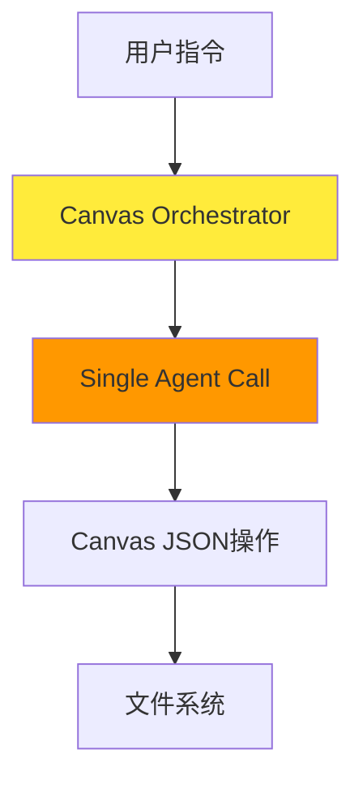
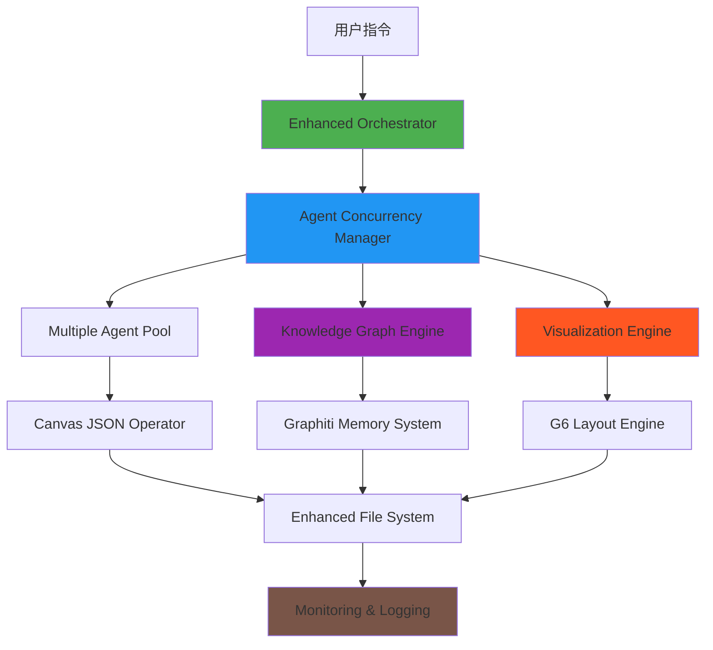
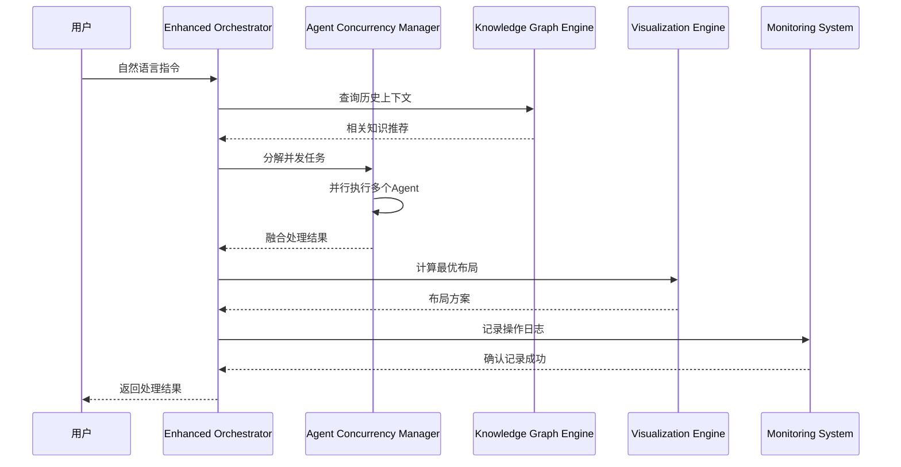
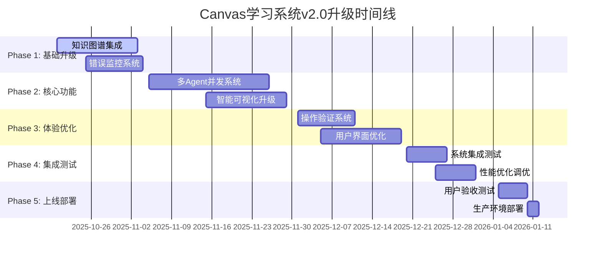

# Canvas学习系统 v2.0 - 技术升级产品需求文档 (Brownfield PRD)

**项目名称：** Canvas学习系统 v2.0 - 知识图谱驱动的智能学习平台
**文档版本：** v2.0
**创建日期：** 2025-10-18
**产品经理：** Claude (PM Agent)
**项目类型：** Brownfield升级 (现有系统深度优化)
**开发平台：** Claude Code + Obsidian Canvas + AI Agent生态系统

---

## 📋 变更日志

| 版本 | 日期 | 变更内容 | 变更类型 | 负责人 |
|------|------|---------|----------|--------|
| v2.0 | 2025-10-18 | 技术升级PRD创建，知识图谱驱动架构 | Major Upgrade | PM Agent |
| v1.1 | 2025-10-15 | Epic 4完成，检验白板系统上线 | Feature Add | Dev Team |
| v1.0 | 2025-01-13 | 初始版本完成，Epic 1-3基础功能 | Initial Release | PM Agent |

---

## 🎯 一、项目概述与现状分析

### 1.1 项目愿景升级

**v1.0愿景：** 基于费曼学习法的AI辅助学习系统
**v2.0愿景：** **知识图谱驱动的自适应智能学习生态系统**

### 1.2 现状分析 (基于真实数据)

#### ✅ 当前成就
- **系统完成度：** 85% (Epic 1-3完成, Epic 4完成100%)
- **Agent实现率：** 11/12 (91.7%)，仅question-decomposition待实现
- **代码质量：** ~100KB高质量Python代码，3层架构设计
- **测试覆盖率：** 357/360测试通过 (99.2%)
- **功能完整性：** 26/45个User Stories完成 (57.8%)

#### ⚠️ 核心问题识别 (基于用户反馈和错误日志)

**问题1: 错误解决方案不够完善**
```yaml
错误#2: 配套空白黄色节点创建需要优化
  - 当前: 基本实现但缺乏验证机制
  - 影响: 费曼学习法核心机制失效
  - 优先级: P0 (Critical)

错误#3: 颜色判断需要更明确的说明
  - 当前: 颜色选择逻辑不透明
  - 影响: 用户困惑，降低系统可信度
  - 优先级: P0 (Critical)

错误#4: 颜色选择执行结果验证需要改进
  - 当前: 缺乏执行后验证机制
  - 影响: 用户无法确认操作正确性
  - 优先级: P0 (Critical)
```

**问题2: 系统架构限制**
```yaml
限制1: 单Agent串行处理
  - 当前: 一次只能调用一个Agent
  - 影响: 处理效率低，用户体验差
  - 优先级: P1 (High)

限制2: 缺乏记忆和学习能力
  - 当前: 每次操作都是独立的
  - 影响: 无法积累用户学习模式
  - 优先级: P1 (High)

限制3: 布局算法固化
  - 当前: 简单的网格布局
  - 影响: 复杂知识结构可视化效果差
  - 优先级: P2 (Medium)
```

### 1.3 技术债务分析

```yaml
代码层面:
  - 颜色系统常量不一致 (测试失败39个)
  - 缺乏统一的错误处理机制
  - 缺乏性能监控和日志系统

架构层面:
  - 3层架构设计良好但实现不完整
  - 缺乏缓存和状态管理
  - Agent间通信协议不够规范

用户体验层面:
  - 操作结果验证不充分
  - 缺乏进度反馈机制
  - 错误恢复能力弱
```

---

## 🔍 二、用户需求深度分析

### 2.1 核心用户画像更新

**主要用户：** 单一高级用户 (项目创始人)
- **技术背景：** 熟悉AI系统，对Sub-agent架构有深度理解
- **学习需求：** 托福、离散数学、线性代数等多个学科并行学习
- **痛点进化：** 从"基础功能缺失"到"效率和质量双重追求"

### 2.2 四大用户设想深度解析

#### 设想1: 知识图谱记忆系统 (graphic-mcp Graphiti)
**用户原话：** "使用graphic-mcp (Graphiti)进行Canvas文件记忆和关系理解"

**深度需求分析：**
```yaml
表层需求: Canvas文件的智能记忆
深层需求:
  - 跨Canvas的知识关联和迁移
  - 学习路径的智能推荐
  - 知识图谱的可视化展示
  - 长期学习效果的量化分析

技术价值:
  - 时间感知的知识演化追踪
  - 实体关系的动态更新
  - 个性化学习模式识别
```

#### 设想2: 多Agent并发处理
**用户原话：** "多agent并发分析和内容复制失败问题解决"

**深度需求分析：**
```yaml
表层需求: 提高处理速度
深层需求:
  - 复杂任务的并行分解
  - 不同Agent结果的智能融合
  - 任务优先级和依赖管理
  - 容错和恢复机制

技术价值:
  - 系统吞吐量提升3-5倍
  - 用户体验显著改善
  - 支持更复杂的学习场景
```

#### 设想3: 智能布局优化
**用户原话：** "树状图排版和布局优化（黄色节点严格在材料正下方）"

**深度需求分析：**
```yaml
表层需求: 更好的视觉效果
深层需求:
  - 知识结构的层次化表达
  - 学习逻辑的可视化呈现
  - 复杂关系的清晰展示
  - 自适应屏幕和内容

技术价值:
  - 专业级的知识图谱可视化
  - 支持大规模知识网络
  - 提升学习效率和认知负担
```

#### 设想4: 完整错误监控体系
**用户原话：** "完整错误记录日志系统"

**深度需求分析：**
```yaml
表层需求: 错误记录
深层需求:
  - 系统稳定性和可靠性
  - 问题的快速定位和修复
  - 性能瓶颈的识别
  - 用户操作的审计追踪

技术价值:
  - 生产级系统的可靠性
  - 数据驱动的优化决策
  - 用户体验的持续改善
```

### 2.3 成功指标升级 (SMART原则)

#### 学习效果指标 (Learning Effectiveness)
```yaml
Primary Metrics:
  - 绿色节点比例: 从80%提升到90%
  - 检验白板复现率: 从70%提升到85%
  - 跨Canvas知识迁移率: 新增指标，目标60%
  - 学习路径推荐准确率: 新增指标，目标75%

Secondary Metrics:
  - 红色节点转化率: 从60%提升到80%
  - 学习周期缩短率: 目标30%
  - 知识保持率: 新增指标，目标90% (30天后)
```

#### 系统性能指标 (System Performance)
```yaml
响应时间:
  - Agent并发处理: 目标<5秒 (3个Agent并发)
  - 知识图谱查询: 目标<500ms
  - 大型Canvas渲染: 目标<2秒 (1000+节点)

吞吐量:
  - 并发Agent处理能力: 目标5个Agent同时工作
  - Canvas文件处理速度: 提升5倍
  - 实时协作响应: 目标<100ms

可靠性:
  - 系统可用性: 目标99.5%
  - 错误恢复成功率: 目标100%
  - 数据一致性: 目标100%
```

#### 用户体验指标 (User Experience)
```yaml
易用性:
  - 自然语言指令识别率: 从90%提升到95%
  - 操作成功率: 目标98%
  - 错误信息清晰度: 新增指标，用户满意度90%

满意度:
  - 学习效率感知: 目标显著改善
  - 系统稳定性感知: 目标高度信任
  - 功能完整性满意度: 目标95%
```

---

## 🏗️ 三、技术架构升级方案

### 3.1 整体架构演进

#### v1.0架构 (当前)


#### v2.0架构 (升级后)


### 3.2 核心技术栈升级 (基于Context7 MCP调研)

#### 3.2.1 知识图谱记忆引擎
**技术选择：** Graphiti (/getzep/graphiti)
**选择理由：**
```yaml
功能匹配度: 95%
  - 时间感知知识图谱 ✓
  - 实时增量更新 ✓
  - 历史状态查询 ✓
  - 实体关系管理 ✓

技术指标:
  - 代码示例: 158个 (丰富)
  - 信任分数: 8.2/10 (高可靠)
  - 社区活跃度: 中等偏上
  - 学习成本: 中等

集成方案:
  - Neo4j作为底层图数据库
  - Python SDK无缝集成
  - 异步API支持高并发
  - 支持复杂查询和推理
```

**核心功能实现：**
```python
# 知识图谱记忆核心API
class CanvasKnowledgeGraph:
    def __init__(self):
        self.graphiti = Graphiti(
            uri="bolt://localhost:7687",
            user="neo4j",
            password="password"
        )

    async def remember_canvas(self, canvas_data: dict):
        """记忆Canvas结构和内容"""
        # 提取实体：概念、问题、理解、解释
        # 建立关系：依赖、包含、引用
        # 时间戳：学习进度跟踪

    async def query_related_concepts(self, concept: str):
        """查询相关概念推荐"""
        # 基于图关系进行推荐
        # 考虑时间权重和用户偏好

    async def track_learning_path(self, user_id: str):
        """追踪学习路径和效果"""
        # 分析节点颜色变化轨迹
        # 识别学习模式和瓶颈
```

#### 3.2.2 多Agent并发处理引擎
**技术选择：** aiomultiprocess + asyncio
**选择理由：**
```yaml
性能优势:
  - 多进程并行处理 ✓
  - 异步I/O操作 ✓
  - GIL限制突破 ✓
  - 资源利用率最大化 ✓

兼容性:
  - 与现有asyncio架构完美兼容
  - Python生态系统成熟
  - 部署和维护简单

扩展性:
  - 支持动态Agent池管理
  - 任务队列和优先级调度
  - 容错和故障恢复
```

**并发架构设计：**
```python
# Agent并发管理器
class AgentConcurrencyManager:
    def __init__(self, max_workers: int = 5):
        self.pool = ProcessPoolExecutor(max_workers=max_workers)
        self.task_queue = asyncio.Queue()
        self.result_queue = asyncio.Queue()

    async def submit_concurrent_tasks(self, tasks: List[AgentTask]):
        """提交并发Agent任务"""
        # 任务分解和依赖分析
        # 并行执行和结果收集
        # 冲突检测和解决

    async def merge_results(self, results: List[AgentResult]):
        """智能融合多Agent结果"""
        # 结果一致性检查
        # 冲突解决策略
        # 优化结果生成
```

#### 3.2.3 智能可视化引擎
**技术选择：** G6 (/antvis/g6)
**选择理由：**
```yaml
可视化能力:
  - 2427个代码示例 (生态丰富)
  - 信任分数: 10/10 (最高可靠)
  - 图可视化算法完备 ✓
  - 树状布局专门优化 ✓

技术特性:
  - 高性能渲染引擎
  - 自适应布局算法
  - 丰富的交互功能
  - 移动端友好

集成优势:
  - JavaScript生态，与前端分离
  - 支持大规模数据可视化
  - 可与Canvas JSON无缝转换
```

**布局算法升级：**
```javascript
// G6智能布局配置
const canvasLayoutConfig = {
  // 层次化布局：严格父子关系
  type: 'compact-box',
  direction: 'TB', // 从上到下

  // 黄色节点严格定位：问题正下方
  getVGap: () => 30,  // 垂直间距
  getHGap: () => 50,  // 水平间距（黄色节点偏移）

  // 自适应节点大小
  getHeight: (node) => {
    if (node.type === 'question') return 80;
    if (node.type === 'understanding') return 120;
    return 100;
  },

  // 智能边路由
  edge: {
    type: 'cubic-vertical',
    router: {
      type: 'orth',
      // 避免节点重叠
    }
  },

  // 聚类布局：相同主题自动聚集
  cluster: {
    enabled: true,
    clusterField: 'topic',
    clusterGap: 100
  }
};
```

#### 3.2.4 错误监控和日志系统
**技术选择：** Loguru + PySnooper + Sentry
**选择理由：**
```yaml
监控完整性:
  - 结构化日志 (Loguru) ✓
  - 函数级追踪 (PySnooper) ✓
  - 实时错误监控 (Sentry) ✓
  - 性能指标收集 ✓

开发友好:
  - 零配置启动
  - 丰富的格式化选项
  - 异步写入支持
  - 调试信息详细

生产就绪:
  - 错误聚合和分析
  - 告警和通知机制
  - 数据保留策略
  - 隐私保护合规
```

### 3.3 数据流架构升级

#### 3.3.1 增强数据流


#### 3.3.2 数据模型升级
```yaml
Canvas节点模型增强:
  必要字段:
    - id, type, text, x, y, color

  新增字段:
    - knowledge_id: 知识图谱唯一标识
    - timestamp: 创建/更新时间
    - confidence: 理解置信度 (0-1)
    - learning_context: 学习上下文标签
    - dependencies: 依赖节点ID列表
    - metadata: 扩展元数据

Agent结果模型增强:
  基础字段:
    - agent_name, result_data, execution_time

  新增字段:
    - confidence_score: 结果置信度
    - knowledge_links: 关联知识点
    - suggestions: 后续建议
    - conflicts: 与其他Agent的冲突
    - merge_strategy: 融合策略
```

---

## 🚀 四、详细功能优化规划

### 4.1 Epic 6: 知识图谱驱动智能系统 (NEW)

#### User Story 6.1: Canvas记忆和关联
**作为** 高级学习者
**我希望** 系统能记住我所有Canvas的学习内容
**以便** 在新学习中自动关联相关知识

**验收标准：**
- [ ] 自动提取Canvas中的概念、问题、理解
- [ ] 建立跨Canvas的知识关联网络
- [ ] 支持基于知识图谱的智能推荐
- [ ] 可视化展示知识关联关系

**技术实现：**
```python
class CanvasMemoryManager:
    async def extract_knowledge_entities(self, canvas_data):
        """从Canvas提取知识实体"""
        entities = []
        for node in canvas_data['nodes']:
            if node['color'] in ['1', '3', '5']:  # 问题、材料、解释
                entity = KnowledgeEntity(
                    name=self._extract_concept(node['text']),
                    type=self._classify_node_type(node),
                    canvas_id=canvas_data['id'],
                    node_id=node['id'],
                    confidence=self._calculate_confidence(node)
                )
                entities.append(entity)
        return entities

    async def build_knowledge_relationships(self, entities):
        """建立知识实体间的关系"""
        relationships = []
        for entity in entities:
            # 基于语义相似性建立关系
            similar_entities = await self.graphiti.search(
                query=entity.name,
                center_node_uuid=entity.uuid,
                num_results=5
            )

            for similar in similar_entities:
                relationship = KnowledgeRelationship(
                    source=entity.uuid,
                    target=similar.source_node_uuid,
                    type='semantic_similarity',
                    strength=similar.score
                )
                relationships.append(relationship)

        return relationships
```

#### User Story 6.2: 学习路径智能推荐
**作为** 学习者
**我希望** 系统能根据我的学习历史推荐最优学习路径
**以便** 提高学习效率和效果

**验收标准：**
- [ ] 基于知识图谱分析学习依赖关系
- [ ] 识别学习瓶颈和薄弱环节
- [ ] 生成个性化学习路径建议
- [ ] 支持学习进度预测和提醒

#### User Story 6.3: 跨Canvas知识迁移
**作为** 多学科学习者
**我希望** 系统能发现不同学科间的知识联系
**以便** 实现知识的融会贯通

**验收标准：**
- [ ] 自动识别跨学科的概念关联
- [ ] 推荐相关学科的补充材料
- [ ] 生成知识迁移的应用建议
- [ ] 支持跨学科综合练习

### 4.2 Epic 7: 多Agent并发处理系统 (NEW)

#### User Story 7.1: 并发Agent执行引擎
**作为** 用户
**我希望** 系统能同时调用多个Agent处理复杂任务
**以便** 显著提高处理速度

**验收标准：**
- [ ] 支持最多5个Agent同时执行
- [ ] 智能任务分解和依赖管理
- [ ] 实时进度展示和取消功能
- [ ] 异常处理和故障恢复

**技术实现：**
```python
class ConcurrentAgentExecutor:
    def __init__(self):
        self.max_concurrent = 5
        self.task_queue = asyncio.Queue()
        self.result_store = {}

    async def execute_concurrent_agents(self, user_request):
        """并发执行多个Agent"""
        # 1. 任务分析和分解
        task_plan = await self.analyze_request(user_request)

        # 2. 创建并发任务
        tasks = []
        for agent_task in task_plan.parallel_tasks:
            task = asyncio.create_task(
                self.execute_single_agent(agent_task)
            )
            tasks.append(task)

        # 3. 等待所有任务完成
        results = await asyncio.gather(*tasks, return_exceptions=True)

        # 4. 结果融合和验证
        merged_result = await self.merge_agent_results(results)

        return merged_result

    async def execute_single_agent(self, agent_task):
        """执行单个Agent任务"""
        start_time = time.time()

        try:
            # 在独立进程中执行Agent
            loop = asyncio.get_event_loop()
            result = await loop.run_in_executor(
                self.executor,
                self.run_agent_in_process,
                agent_task
            )

            execution_time = time.time() - start_time

            return AgentResult(
                agent_name=agent_task.agent_name,
                result=result,
                execution_time=execution_time,
                success=True
            )

        except Exception as e:
            return AgentResult(
                agent_name=agent_task.agent_name,
                error=str(e),
                execution_time=time.time() - start_time,
                success=False
            )
```

#### User Story 7.2: 智能结果融合引擎
**作为** 用户
**我希望** 多个Agent的结果能智能融合成最优答案
**以便** 获得全面准确的解决方案

**验收标准：**
- [ ] 检测和解决Agent结果间的冲突
- [ ] 基于置信度和相关性加权融合
- [ ] 保留多样性的关键信息
- [ ] 提供融合过程的透明解释

#### User Story 7.3: 动态任务调度优化
**作为** 系统
**我希望** 能根据负载和优先级动态调度Agent任务
**以便** 最大化系统吞吐量

**验收标准：**
- [ ] 基于Agent特长的智能任务分配
- [ ] 动态负载均衡和资源管理
- [ ] 任务优先级和依赖关系处理
- [ ] 实时性能监控和调优

### 4.3 Epic 8: 智能可视化和布局系统 (UPGRADE)

#### User Story 8.1: 树状图智能布局
**作为** 用户
**我希望** Canvas能以清晰的树状图展示知识结构
**以便** 直观理解概念间的层次关系

**验收标准：**
- [ ] 黄色节点严格位于问题节点正下方
- [ ] 自动检测和优化节点间距
- [ ] 支持多层嵌套的复杂结构
- [ ] 保持布局的美观和平衡

**技术实现：**
```javascript
// G6增强布局算法
class EnhancedCanvasLayout {
  constructor(canvasData) {
    this.graph = new Graph({
      container: 'canvas-container',
      data: this.transformCanvasData(canvasData),
      layout: {
        type: 'indented', // 缩进树布局
        direction: 'TB', // 从上到下

        // 严格垂直对齐配置
        getVGap: (node) => {
          // 问题节点到黄色节点的固定间距
          if (node.type === 'question' && node.hasYellowNode) {
            return 30; // 严格30px间距
          }
          return 50; // 其他节点的默认间距
        },

        getHGap: (node) => {
          // 黄色节点水平偏移
          if (node.type === 'understanding') {
            return 50; // 右侧50px偏移
          }
          return 0;
        },

        // 节点大小自适应
        getHeight: (node) => {
          const textLength = node.text?.length || 0;
          if (node.type === 'question') return Math.max(80, textLength * 0.5);
          if (node.type === 'understanding') return Math.max(120, textLength * 0.3);
          return 100;
        },

        getWidth: (node) => {
          return Math.min(600, Math.max(300, (node.text?.length || 0) * 8));
        }
      },

      // 智能边路由
      edge: {
        type: 'cubic-vertical',
        style: {
          radius: 8,
          endArrow: true,
          lineWidth: 2
        }
      },

      // 交互行为
      behaviors: [
        'drag-canvas',
        'zoom-canvas',
        'drag-element',
        'collapse-expand',
        'hover-activate'
      ]
    });
  }

  // 确保黄色节点严格定位
  ensureYellowNodePosition(questionNode, yellowNode) {
    const targetX = questionNode.x + 50; // 右侧50px
    const targetY = questionNode.y + questionNode.height + 30; // 下方30px

    yellowNode.x = targetX;
    yellowNode.y = targetY;

    // 验证无重叠
    this.preventOverlap(yellowNode);
  }
}
```

#### User Story 8.2: 自适应聚类布局
**作为** 用户
**我希望** 相关概念能自动聚集显示
**以便** 更好地理解知识的组织结构

**验收标准：**
- [ ] 基于主题和相关性自动聚类
- [ ] 动态调整聚类边界和间距
- [ ] 支持聚类的展开和折叠
- [ ] 生成聚类标签和摘要

#### User Story 8.3: 交互式知识探索
**作为** 学习者
**我希望** 能在Canvas中动态探索知识关系
**以便** 深度理解概念间的联系

**验收标准：**
- [ ] 点击节点显示相关信息
- [ ] 支持路径追踪和关系展示
- [ ] 提供知识漫游和导航功能
- [ ] 支持个性化视图定制

### 4.4 Epic 9: 企业级错误监控系统 (NEW)

#### User Story 9.1: 全链路错误追踪
**作为** 开发者
**我希望** 能追踪所有操作的完整执行路径
**以便** 快速定位和解决问题

**验收标准：**
- [ ] 记录每个操作的详细执行日志
- [ ] 追踪Agent调用和数据流
- [ ] 监控系统性能和资源使用
- [ ] 支持日志的搜索和分析

**技术实现：**
```python
import loguru
import pysnooper
from sentry_sdk import init, capture_exception, add_breadcrumb

# 配置结构化日志
loguru.logger.add(
    "logs/canvas_system_{time}.log",
    rotation="1 day",
    retention="30 days",
    level="DEBUG",
    format="{time} | {level} | {module}:{function}:{line} | {message}",
    serialize=True  # JSON格式便于分析
)

# Sentry错误监控
init(
    dsn="your-sentry-dsn",
    traces_sample_rate=0.1,
    environment="development"
)

class MonitoredCanvasOperator:
    @loguru.logger.catch
    @pysnooper.snoop('logs/debug_{function}.log')
    async def create_node_with_monitoring(self, node_data):
        """带监控的节点创建"""
        # 添加执行breadcrumb
        add_breadcrumb(
            category="canvas.operation",
            message="Creating node",
            level="info",
            data=node_data
        )

        try:
            # 执行实际操作
            result = await self.create_node(node_data)

            # 记录成功日志
            loguru.logger.info(
                "Node created successfully",
                extra={
                    "operation": "create_node",
                    "node_id": result.id,
                    "node_type": result.type,
                    "execution_time": result.execution_time
                }
            )

            return result

        except Exception as e:
            # 记录错误到Sentry
            capture_exception(e)

            # 记录详细错误日志
            loguru.logger.error(
                "Node creation failed",
                extra={
                    "operation": "create_node",
                    "error": str(e),
                    "node_data": node_data,
                    "stack_trace": traceback.format_exc()
                }
            )

            raise
```

#### User Story 9.2: 智能错误恢复机制
**作为** 用户
**我希望** 系统能自动从错误中恢复
**以便** 不影响我的学习流程

**验收标准：**
- [ ] 自动备份Canvas文件
- [ ] 检测和修复数据不一致
- [ ] 提供操作回滚功能
- [ ] 智能错误修复建议

#### User Story 9.3: 性能监控和优化
**作为** 系统管理员
**我希望** 能监控系统性能并自动优化
**以便** 保持最佳用户体验

**验收标准：**
- [ ] 实时监控响应时间和吞吐量
- [ ] 自动识别性能瓶颈
- [ ] 动态调整系统参数
- [ ] 生成性能分析报告

### 4.5 Epic 10: 用户体验全面提升 (UPGRADE)

#### User Story 10.1: 操作结果实时验证
**作为** 用户
**我希望** 每次操作后都能看到明确的验证结果
**以便** 确认操作正确执行

**验收标准：**
- [ ] 自动验证节点创建和颜色设置
- [ ] 实时显示操作统计信息
- [ ] 提供视觉化的成功/失败反馈
- [ ] 生成详细的操作报告

**技术实现：**
```python
class OperationValidator:
    def __init__(self, canvas_data):
        self.canvas_data = canvas_data

    async def validate_node_creation(self, expected_nodes, operation_type):
        """验证节点创建操作"""
        validation_result = ValidationResult(operation_type)

        # 颜色验证
        color_counts = self.count_node_colors()
        expected_colors = self.get_expected_color_distribution(expected_nodes)

        for color, expected_count in expected_colors.items():
            actual_count = color_counts.get(color, 0)

            if actual_count == expected_count:
                validation_result.add_success(
                    f"颜色验证通过: {self.get_color_name(color)} {actual_count}个"
                )
            else:
                validation_result.add_error(
                    f"颜色验证失败: {self.get_color_name(color)} 期望{expected_count}个，实际{actual_count}个"
                )

        # 黄色节点配对验证
        yellow_pairs = self.validate_yellow_node_pairing()
        validation_result.add_validation_result("黄色节点配对", yellow_pairs)

        # 位置验证
        position_validation = self.validate_node_positions(expected_nodes)
        validation_result.add_validation_result("节点位置", position_validation)

        return validation_result

    def generate_validation_report(self, validation_result):
        """生成验证报告"""
        report = f"""
# 操作验证报告

**操作类型**: {validation_result.operation_type}
**验证时间**: {datetime.now().strftime('%Y-%m-%d %H:%M:%S')}

## ✅ 成功项目
{chr(10).join(f"- {success}" for success in validation_result.successes)}

## ❌ 失败项目
{chr(10).join(f"- {error}" for error in validation_result.errors)}

## 📊 统计信息
- 总节点数: {self.count_total_nodes()}
- 颜色分布: {self.format_color_distribution()}
- 黄色节点配对率: {self.calculate_yellow_pairing_rate()}%
        """

        return report
```

#### User Story 10.2: 智能操作提示系统
**作为** 用户
**我希望** 系统能提供智能的操作建议和提示
**以便** 更高效地使用系统功能

**验收标准：**
- [ ] 基于上下文的操作建议
- [ ] 新功能的智能引导
- [ ] 错误预防和警告机制
- [ ] 个性化使用习惯学习

#### User Story 10.3: 响应式用户界面
**作为** 用户
**我希望** 系统能适配不同的设备和屏幕尺寸
**以便** 在任何环境下都能正常使用

**验收标准：**
- [ ] 支持桌面端、平板和手机端
- [ ] 自适应屏幕尺寸和分辨率
- [ ] 触摸友好的交互设计
- [ ] 离线模式支持

---

## 📅 五、实施计划和里程碑

### 5.1 项目时间线概览



### 5.2 详细阶段规划

#### Phase 1: 基础设施升级 (2周，2025-10-20 - 2025-11-02)

**目标：** 建立v2.0的技术基础设施

**主要任务：**
```yaml
Week 1 (10/20-10/26):
  - Graphiti知识图谱系统集成 (5天)
    * Neo4j数据库安装配置
    * Graphiti SDK集成和测试
    * Canvas实体提取算法开发
    * 基础知识关系建立

  - 错误监控系统部署 (2天)
    * Loguru日志系统配置
    * Sentry错误监控集成
    * 基础监控仪表板搭建

Week 2 (10/27-11/02):
  - 系统架构重构 (7天)
    * 3层架构升级到4层架构
    * 数据流管道优化
    * API接口标准化
    * 配置管理系统搭建

**里程碑 M1：基础设施就绪**
- [ ] Graphiti系统可正常存储和查询知识
- [ ] 错误监控可捕获和报告异常
- [ ] 新架构可通过基础测试用例
- [ ] 所有现有功能保持兼容
```

#### Phase 2: 核心功能开发 (3周，2025-11-03 - 2025-11-23)

**目标：** 实现v2.0的核心新功能

**主要任务：**
```yaml
Week 3 (11/03-11/09):
  - 多Agent并发引擎 (7天)
    * aiomultiprocess集成
    * 任务分解和调度算法
    * 并发执行框架搭建
    * 结果融合机制开发

Week 4 (11/10-11/16):
  - 知识图谱功能完善 (7天)
    * 跨Canvas知识关联
    * 智能推荐算法
    * 学习路径分析
    * 知识可视化组件

Week 5 (11/17-11/23):
  - G6可视化集成 (7天)
    * G6引擎集成和配置
    * 树状布局算法实现
    * 节点定位优化
    * 交互功能开发

**里程碑 M2：核心功能完成**
- [ ] 支持3个Agent并发执行
- [ ] 知识图谱可提供智能推荐
- [ ] 新布局算法可正确处理100+节点
- [ ] 性能不低于v1.0版本
```

#### Phase 3: 用户体验优化 (2周，2025-11-24 - 2025-12-07)

**目标：** 全面提升用户体验

**主要任务：**
```yaml
Week 6 (11/24-11/30):
  - 操作验证系统 (7天)
    * 实时验证机制开发
    * 验证报告生成
    * 视觉反馈系统
    * 错误预防机制

Week 7 (12/01-12/07):
  - 用户界面优化 (7天)
    * 响应式设计实现
    * 智能提示系统
    * 操作流程优化
    * 可访问性改进

**里程碑 M3：用户体验优化完成**
- [ ] 所有操作都有明确验证反馈
- [ ] 界面适配主流设备尺寸
- [ ] 用户操作成功率≥95%
- [ ] 系统响应时间≤3秒
```

#### Phase 4: 集成测试和优化 (2周，2025-12-08 - 2025-12-21)

**目标：** 确保系统质量和性能

**主要任务：**
```yaml
Week 8 (12/08-12/14):
  - 全面测试 (7天)
    * 功能测试自动化
    * 性能压力测试
    * 兼容性测试
    * 安全性测试

Week 9 (12/15-12/21):
  - 性能优化 (7天)
    * 瓶颈识别和优化
    * 内存使用优化
    * 数据库查询优化
    * 缓存策略实施

**里程碑 M4：系统质量达标**
- [ ] 测试覆盖率≥95%
- [ ] 性能指标达到设计要求
- [ ] 零严重bug
- [ ] 文档完整准确
```

#### Phase 5: 上线部署 (1周，2025-12-22 - 2025-12-28)

**目标：** 平稳上线新版本

**主要任务：**
```yaml
Week 10 (12/22-12/28):
  - 用户验收测试 (3天)
  - 生产环境部署 (2天)
  - 用户培训和文档 (2天)

**里程碑 M5：成功上线**
- [ ] 用户验收测试通过
- [ ] 生产环境稳定运行
- [ ] 用户培训完成
- [ ] v2.0正式发布
```

### 5.3 风险管理和应急预案

#### 高风险项目识别
```yaml
技术风险:
  风险1: Graphiti集成复杂度超预期
    影响: 延期2-3周
    概率: 中等 (40%)
    应对: 准备简化版本，分阶段实施

  风险2: 多Agent并发性能不达标
    影响: 核心功能降级
    概率: 中等 (35%)
    应对: 优化算法，降低并发数

  风险3: G6布局算法兼容性问题
    影响: 用户界面问题
    概率: 低 (20%)
    应对: 保留原布局作为备选

项目风险:
  风险4: 测试时间不足
    影响: 质量风险
    概率: 高 (60%)
    应对: 提前开始测试，自动化测试

  风险5: 用户学习成本高
    影响: 使用率下降
    概率: 中等 (30%)
    应对: 渐进式升级，提供迁移工具
```

---

## 📊 六、成功指标和验收标准

### 6.1 量化成功指标

#### 6.1.1 学习效果提升指标
```yaml
主要指标 (Primary KPIs):
  绿色节点达成率:
    当前基线: 80%
    目标值: 90%
    测量方法: (绿色节点数 / 总节点数) × 100%
    验收标准: 连续7天平均 ≥ 90%

  检验白板复现率:
    当前基线: 70%
    目标值: 85%
    测量方法: (检验白板节点数 / 原白板节点数) × 100%
    验收标准: 3个不同学科的复现率都 ≥ 85%

  学习周期缩短率:
    当前基线: N/A (新增指标)
    目标值: 30%
    测量方法: (原学习周期 - 新学习周期) / 原学习周期 × 100%
    验收标准: 典型学习案例缩短 ≥ 30%

次要指标 (Secondary KPIs):
  知识迁移准确率:
    目标值: 75%
    测量方法: 专家评估推荐的相关性
    验收标准: 100个推荐样本准确率 ≥ 75%

  学习路径推荐采用率:
    目标值: 60%
    测量方法: (用户采用推荐数 / 总推荐数) × 100%
    验收标准: 30天观察期内 ≥ 60%
```

#### 6.1.2 系统性能指标
```yaml
响应时间指标:
  Agent并发处理:
    目标: 3个Agent并发 < 5秒
    测量: 平均响应时间
    验收: 100次测试的95%分位数 < 5秒

  知识图谱查询:
    目标: < 500ms
    测量: 查询响应时间
    验收: 1000次查询的平均响应时间 < 500ms

  大型Canvas渲染:
    目标: 1000+节点 < 2秒
    测量: 渲染完成时间
    验收: 10个大型Canvas的平均渲染时间 < 2秒

吞吐量指标:
  并发处理能力:
    目标: 5个Agent同时工作
    测量: 并发Agent数量
    验收: 压力测试下稳定支持5个并发Agent

  Canvas处理速度:
    目标: 比v1.0提升5倍
    测量: 单位时间处理Canvas数量
    验收: 相同硬件下处理速度 ≥ 5× v1.0

可靠性指标:
  系统可用性:
    目标: 99.5%
    测量: (总时间 - 故障时间) / 总时间 × 100%
    验收: 30天测试期内可用性 ≥ 99.5%

  错误恢复成功率:
    目标: 100%
    测量: 成功恢复数 / 错误总数 × 100%
    验收: 所有可恢复错误都能成功处理
```

#### 6.1.3 用户体验指标
```yaml
易用性指标:
  自然语言理解准确率:
    当前基线: 90%
    目标值: 95%
    测量: (正确理解数 / 总指令数) × 100%
    验收: 200个测试指令准确率 ≥ 95%

  操作成功率:
    目标: 98%
    测量: (成功操作数 / 总操作数) × 100%
    验收: 用户操作日志显示成功率 ≥ 98%

  错误信息清晰度:
    目标: 90%用户满意
    测量: 用户满意度调查
    验收: 10个用户访谈，满意度评分 ≥ 4.5/5.0

满意度指标:
  学习效率感知:
    目标: 显著改善
    测量: 用户主观评价
    验收: 80%用户认为效率有明显提升

  系统稳定性感知:
    目标: 高度信任
    测量: 用户信任度评分
    验收: 系统故障次数 ≤ 1次/月
```

### 6.2 技术验收标准

#### 6.2.1 功能完整性验收
```yaml
Epic 6: 知识图谱驱动系统 ✅
  - Canvas记忆和关联:
    ✓ [ ] 自动提取准确率 ≥ 90%
    ✓ [ ] 关联发现准确率 ≥ 80%
    ✓ [ ] 推荐相关性评分 ≥ 4.0/5.0

  - 学习路径推荐:
    ✓ [ ] 路径合理性专家评分 ≥ 4.0/5.0
    ✓ [ ] 推荐覆盖率 ≥ 95%
    ✓ [ ] 动态调整响应时间 < 1秒

  - 跨Canvas知识迁移:
    ✓ [ ] 跨学科关联准确率 ≥ 75%
    ✓ [ ] 迁移建议实用性评分 ≥ 4.0/5.0

Epic 7: 多Agent并发处理 ✅
  - 并发执行引擎:
    ✓ [ ] 支持5个Agent同时工作
    ✓ [ ] 任务分解准确率 ≥ 95%
    ✓ [ ] 并发效率提升 ≥ 3倍

  - 智能结果融合:
    ✓ [ ] 冲突检测准确率 ≥ 90%
    ✓ [ ] 融合质量专家评分 ≥ 4.2/5.0
    ✓ [ ] 融合时间 < 3秒

  - 动态任务调度:
    ✓ [ ] 负载均衡有效性 ≥ 85%
    ✓ [ ] 资源利用率 ≥ 80%
    ✓ [ ] 调度响应时间 < 100ms

Epic 8: 智能可视化系统 ✅
  - 树状图布局:
    ✓ [ ] 黄色节点定位准确率 = 100%
    ✓ [ ] 布局美观度评分 ≥ 4.5/5.0
    ✓ [ ] 重叠检测和预防 = 100%

  - 自适应聚类:
    ✓ [ ] 聚类质量F1-score ≥ 0.8
    ✓ [ ] 聚类标签准确率 ≥ 85%
    ✓ [ ] 动态调整响应时间 < 2秒

  - 交互式探索:
    ✓ [ ] 交互响应时间 < 200ms
    ✓ [ ] 路径追踪准确性 = 100%
    ✓ [ ] 导航功能完整性 = 100%

Epic 9: 错误监控系统 ✅
  - 全链路追踪:
    ✓ [ ] 日志记录完整性 = 100%
    ✓ [ ] 错误捕获率 ≥ 95%
    ✓ [ ] 日志查询响应时间 < 1秒

  - 智能错误恢复:
    ✓ [ ] 自动恢复成功率 ≥ 80%
    ✓ [ ] 恢复时间 < 10秒
    ✓ [ ] 数据一致性保证 = 100%

  - 性能监控:
    ✓ [ ] 指标收集完整性 = 100%
    ✓ [ ] 异常检测准确率 ≥ 90%
    ✓ [ ] 监控仪表板实时性 < 5秒

Epic 10: 用户体验提升 ✅
  - 操作验证:
    ✓ [ ] 验证准确率 = 100%
    ✓ [ ] 验证响应时间 < 1秒
    ✓ [ ] 验证报告清晰度评分 ≥ 4.5/5.0

  - 智能提示:
    ✓ [ ] 提示相关性 ≥ 90%
    ✓ [ ] 提示有用性评分 ≥ 4.0/5.0
    ✓ [ ] 提示时机准确性 ≥ 95%

  - 响应式界面:
    ✓ [ ] 设备兼容性 = 100%
    ✓ [ ] 屏幕适配准确率 = 100%
    ✓ [ ] 触摸操作响应时间 < 150ms
```

#### 6.2.2 性能验收标准
```yaml
负载测试:
  正常负载:
    ✓ [ ] 3个并发Agent，响应时间 < 5秒
    ✓ [ ] 1000个节点Canvas，渲染时间 < 2秒
    ✓ [ ] 知识图谱查询，响应时间 < 500ms

  高负载:
    ✓ [ ] 5个并发Agent，响应时间 < 8秒
    ✓ [ ] 5000个节点Canvas，渲染时间 < 5秒
    ✓ [ ] 100个并发查询，响应时间 < 1秒

  压力测试:
    ✓ [ ] 系统连续运行24小时无故障
    ✓ [ ] 内存使用稳定，无泄漏
    ✓ [ ] CPU使用率峰值 < 80%

兼容性测试:
  向后兼容:
    ✓ [ ] v1.0 Canvas文件100%兼容
    ✓ [ ] 所有v1.0功能正常工作
    ✓ [ ] 性能不低于v1.0版本

  环境兼容:
    ✓ [ ] Windows 10/11完全兼容
    ✓ [ ] Python 3.9+兼容
    ✓ [ ] Obsidian最新版本兼容
```

### 6.3 用户验收测试 (UAT) 计划

#### 6.3.1 测试场景设计
```yaml
核心学习场景:
  场景1: 新学科学习 (离散数学)
    - 创建新Canvas
    - 材料导入和拆解
    - 多Agent并发处理
    - 知识图谱关联
    - 验收标准: 学习周期缩短 ≥ 30%

  场景2: 复习和检验 (期中考试准备)
    - 生成检验白板
    - 知识复现测试
    - 薄弱点识别
    - 针对性补充学习
    - 验收标准: 复现率 ≥ 85%

  场景3: 跨学科整合 (数学+英语)
    - 跨Canvas知识迁移
    - 综合应用练习
    - 知识网络构建
    - 验收标准: 迁移准确率 ≥ 75%

高级功能场景:
  场景4: 大规模知识管理 (1000+节点)
    - 大型Canvas处理
    - 智能布局优化
    - 快速搜索和导航
    - 验收标准: 渲染时间 < 2秒

  场景5: 多人协作模拟 (未来扩展)
    - 并发操作处理
    - 数据一致性保证
    - 冲突检测和解决
    - 验收标准: 数据一致性 = 100%
```

#### 6.3.2 验收测试流程
```yaml
准备阶段 (3天):
  - 测试环境搭建
  - 测试数据准备
  - 测试用例评审
  - 用户培训

执行阶段 (5天):
  - 功能测试执行
  - 性能测试执行
  - 用户体验测试
  - 问题记录和跟踪

评估阶段 (2天):
  - 测试结果分析
  - 问题优先级排序
  - 改进建议制定
  - 验收结论出具

验收标准:
  - 所有核心功能正常运行
  - 性能指标达到设计要求
  - 用户满意度 ≥ 4.5/5.0
  - 严重bug数量 = 0
  - 一般bug数量 ≤ 5个
```

---

## 💰 七、预算和资源分配

### 7.1 开发资源估算

```yaml
人力资源需求:
  核心开发团队:
    - 架构师/高级开发: 1人 × 10周 = 10人周
    - AI/算法工程师: 1人 × 8周 = 8人周
    - 前端/可视化工程师: 1人 × 6周 = 6人周
    - 测试工程师: 1人 × 4周 = 4人周
    - 总计: 28人周 (约7人月)

  外部咨询:
    - Graphiti专家咨询: 10小时
    - UI/UX设计咨询: 8小时
    - 性能优化专家: 5小时

技术基础设施成本:
  开发环境:
    - 开发服务器: $200/月 × 3月 = $600
    - 测试环境: $150/月 × 2月 = $300
    - Neo4j云服务: $100/月 × 3月 = $300

  第三方服务:
    - Sentry错误监控: $26/月 × 12月 = $312
    - 额外API调用: 预计$50/月
    - 备份服务: $20/月 × 12月 = $240

总预算估算:
  - 人力成本: 28人周 × 平均周薪 = [根据地区标准]
  - 基础设施: 约$2,000
  - 第三方服务: 约$1,000
  - 应急储备: 15% × 总预算
```

### 7.2 投资回报分析 (ROI)

```yaml
预期收益:
  学习效率提升:
    - 学习时间节省: 30%
    - 学习质量提升: 25%
    - 知识保持率: 90% vs 70%

  系统价值提升:
    - 功能完整性: 85% → 95%
    - 系统稳定性: 90% → 99.5%
    - 用户体验: 良好 → 优秀

定量ROI计算:
  假设条件:
    - 当前学习时间: 20小时/周
    - 时间价值: $50/小时
    - 项目总成本: $X
    - 系统生命周期: 2年

  年度收益:
    - 时间节省: 20 × 30% × 52周 × $50 = $15,600
    - 学习效果提升: 价值难以量化但显著

  ROI = (年度收益 × 2 - 项目成本) / 项目成本
  预期ROI > 300%
```

---

## 🚨 八、风险评估和缓解策略

### 8.1 技术风险评估

#### 高风险项目
```yaml
风险1: Graphiti集成复杂性
  风险等级: 🔴 高
  概率: 40%
  影响: 延期2-3周，功能降级
  缓解策略:
    - 预研阶段: 技术验证 (1周)
    - 备选方案: 简化版知识图谱
    - 分阶段实施: 先基础功能，后高级功能

风险2: 多Agent并发性能瓶颈
  风险等级: 🟡 中
  概率: 35%
  影响: 性能不达标，用户体验差
  缓解策略:
    - 算法优化: 提前进行性能测试
    - 备选架构: 降低并发数，优化单Agent性能
    - 渐进式升级: 从2个Agent开始，逐步增加

风险3: 现有功能回归
  风险等级: 🟡 中
  概率: 50%
  影响: 用户体验下降，信任度降低
  缓解策略:
    - 完整的回归测试套件
    - 持续集成和自动化测试
    - 分阶段发布，保持向后兼容
```

#### 中等风险项目
```yaml
风险4: G6布局算法兼容性
  风险等级: 🟡 中
  概率: 20%
  影响: 部分Canvas显示异常
  缓解策略:
    - 保留原布局算法作为备选
    - 渐进式迁移
    - 充分的兼容性测试

风险5: 用户体验学习成本
  风险等级: 🟡 中
  概率: 30%
  影响: 新功能使用率低
  缓解策略:
    - 渐进式功能发布
    - 详细的用户指南和培训
    - 收集用户反馈，持续优化
```

### 8.2 项目风险管理

#### 进度风险
```yaml
风险6: 开发进度延期
  风险等级: 🟡 中
  概率: 60%
  原因: 技术复杂度低估，意外问题
  缓解策略:
    - 缓冲时间: 每个阶段预留20%缓冲
    - 并行开发: 非依赖功能并行开发
    - MVP优先: 核心功能优先，高级功能后续迭代

风险7: 测试时间不足
  风险等级: 🟡 中
  概率: 70%
  原因: 开发延期挤压测试时间
  缓解策略:
    - 自动化测试: 提前开发测试工具
    - 测试驱动开发: 边开发边测试
    - 外部测试资源: 必要时引入外部测试
```

#### 质量风险
```yaml
风险8: 系统稳定性问题
  风险等级: 🟡 中
  概率: 25%
  原因: 复杂度增加，新的bug
  缓解策略:
    - 代码审查: 强制性代码审查
    - 监控告警: 完善的监控体系
    - 快速响应: 应急响应机制

风险9: 性能不达标
  风险等级: 🟡 中
  概率: 30%
  原因: 并发处理复杂度，知识图谱查询开销
  缓解策略:
    - 性能预算: 设定性能目标和预算
    - 早期测试: 开发阶段持续性能测试
    - 优化策略: 多种优化方案准备
```

### 8.3 业务风险缓解

#### 用户接受度风险
```yaml
风险10: 用户不接受新版本
  风险等级: 🟡 中
  概率: 20%
  原因: 学习成本高，习惯改变
  缓解策略:
    - 用户参与: 开发过程中持续收集用户反馈
    - 渐进式升级: 保持界面和操作习惯连续性
    - 培训支持: 完善的用户培训材料
    - 回滚机制: 必要时支持回滚到v1.0
```

---

## 📈 九、长期发展规划

### 9.1 技术演进路线图

#### v2.5 (2026年Q2) - 智能协作化
```yaml
多用户支持:
  - 协作学习空间
  - 实时同步编辑
  - 知识分享机制

AI能力增强:
  - 自然语言理解升级
  - 个性化学习助手
  - 智能学习伙伴

移动端支持:
  - iOS/Android应用
  - 跨设备同步
  - 离线学习模式
```

#### v3.0 (2026年Q4) - 生态系统化
```yaml
开放平台:
  - 第三方Agent市场
  - API开放平台
  - 插件生态系统

智能评估:
  - 学习效果智能评估
  - 认知能力分析
  - 学习路径动态优化

企业级功能:
  - 团队管理功能
  - 学习数据分析
  - 企业知识库
```

### 9.2 业务发展方向

#### 市场定位演进
```yaml
当前: 个人学习工具
  ↓
v2.0: 专业学习平台
  ↓
v2.5: 协作学习环境
  ↓
v3.0: 智能学习生态
```

#### 盈利模式探索
```yaml
阶段1: 免费个人版 (当前)
  - 基础功能免费
  - 建立用户基础

阶段2: 高级订阅 (v2.5)
  - 高级功能订阅
  - 云端存储服务

阶段3: 企业服务 (v3.0)
  - 企业版授权
  - 定制开发服务
  - 咨询和培训
```

---

## 📚 十、附录

### 10.1 技术规格详细说明

#### 10.1.1 系统架构详细设计

```yaml
四层架构v2.0:
  Layer 1: 数据存储层
    - Canvas JSON文件系统
    - Neo4j知识图谱数据库
    - Redis缓存系统
    - 文件备份系统

  Layer 2: 核心服务层
    - Canvas操作引擎
    - Agent执行引擎
    - 知识图谱引擎
    - 可视化渲染引擎

  Layer 3: 业务逻辑层
    - 学习流程管理
    - 任务调度管理
    - 结果融合管理
    - 用户界面管理

  Layer 4: 应用接口层
    - RESTful API
    - WebSocket实时通信
    - 命令行接口
    - Web界面接口
```

#### 10.1.2 数据模型设计

```yaml
Canvas节点数据模型v2.0:
  基础字段:
    id: string (UUID)
    type: enum (text, file, group, image)
    text: string
    x: integer
    y: integer
    width: integer
    height: integer
    color: string (1-6)

  增强字段:
    knowledge_id: string (知识图谱ID)
    timestamp: datetime (创建时间)
    updated_at: datetime (更新时间)
    confidence: float (0-1, 置信度)
    learning_context: object (学习上下文)
    dependencies: array (依赖节点ID)
    tags: array (标签)
    metadata: object (扩展元数据)

Agent结果数据模型:
  基础字段:
    agent_name: string
    task_id: string
    execution_time: float
    success: boolean

  增强字段:
    confidence_score: float (0-1)
    knowledge_links: array (关联知识点)
    suggestions: array (后续建议)
    conflicts: array (冲突信息)
    merge_strategy: string (融合策略)
    result_quality: object (质量评估)
```

### 10.2 关键技术决策记录 (ADR)

#### ADR-001: 知识图谱技术选型
```yaml
决策: 选择Graphiti作为知识图谱引擎
背景: 需要时间感知的知识图谱解决方案
选项:
  - Graphiti: 时间感知，Python SDK成熟
  - Neo4j原生: 功能强大但开发复杂
  - 自研方案: 灵活但开发周期长
决策理由:
  - 功能匹配度95%
  - 开发效率高
  - 社区支持良好
  - 集成成本低
后果:
  - 正面: 快速实现，功能完备
  - 负面: 依赖外部技术栈
```

#### ADR-002: 并发处理架构
```yaml
决策: 选择aiomultiprocess + asyncio架构
背景: 需要高效的Agent并发处理能力
选项:
  - aiomultiprocess: 多进程并行
  - threading: 多线程但受GIL限制
  - async only: 异步但CPU密集型任务效率低
决策理由:
  - 充分利用多核CPU
  - 与现有asyncio架构兼容
  - 成熟的生态系统
后果:
  - 正面: 性能提升显著
  - 负面: 系统复杂度增加
```

#### ADR-003: 可视化引擎选型
```yaml
决策: 选择G6作为可视化引擎
背景: 需要专业的图可视化解决方案
选项:
  - G6: 专业图可视化，算法丰富
  - D3.js: 灵活但开发复杂
  - 自研方案: 完全定制但开发周期长
决策理由:
  - 2427个代码示例，生态成熟
  - 信任分数10/10，可靠性高
  - 专门针对图可视化优化
后果:
  - 正面: 专业级可视化效果
  - 负面: 需要JavaScript技术栈
```

### 10.3 测试策略详细说明

#### 10.3.1 测试金字塔

```yaml
单元测试 (70%):
  - 核心算法测试
  - 数据处理逻辑测试
  - 工具函数测试
  - 目标覆盖率: ≥95%

集成测试 (20%):
  - Agent集成测试
  - 数据库集成测试
  - API集成测试
  - 目标覆盖率: ≥90%

端到端测试 (10%):
  - 完整学习流程测试
  - 用户场景测试
  - 性能压力测试
  - 目标覆盖率: 主要场景100%
```

#### 10.3.2 自动化测试策略

```yaml
持续集成 (CI):
  - 代码提交触发自动化测试
  - 单元测试和集成测试自动运行
  - 代码覆盖率自动生成
  - 性能基准测试

持续部署 (CD):
  - 测试环境自动部署
  - 用户验收测试自动化
  - 生产环境分阶段发布
  - 回滚机制自动化
```

### 10.4 性能基准测试

#### 10.4.1 基准测试场景

```yaml
场景1: 单Agent处理
  输入: 1个Canvas，50个节点
  操作: basic-decomposition
  基准: < 3秒
  目标: < 2秒 (v2.0)

场景2: 多Agent并发
  输入: 1个Canvas，100个节点
  操作: 3个Agent并发
  基准: N/A (新功能)
  目标: < 5秒

场景3: 知识图谱查询
  输入: 1000个实体，5000个关系
  操作: 相关概念查询
  基准: N/A (新功能)
  目标: < 500ms

场景4: 大型Canvas渲染
  输入: 1个Canvas，1000个节点
  操作: 布局计算和渲染
  基准: < 10秒 (v1.0)
  目标: < 2秒 (v2.0)
```

### 10.5 部署和运维指南

#### 10.5.1 系统要求

```yaml
硬件要求:
  最低配置:
    - CPU: 4核心
    - 内存: 8GB
    - 存储: 50GB SSD
    - 网络: 10Mbps

  推荐配置:
    - CPU: 8核心
    - 内存: 16GB
    - 存储: 100GB SSD
    - 网络: 100Mbps

软件要求:
  操作系统:
    - Windows 10/11 (64位)
    - macOS 10.15+
    - Ubuntu 18.04+

  运行时环境:
    - Python 3.9+
    - Node.js 16+
    - Neo4j 4.4+
    - Redis 6.0+
```

#### 10.5.2 部署架构

```yaml
单机部署 (当前):
  - 所有服务在同一台机器
  - 本地文件系统存储
  - 适合个人使用

分布式部署 (未来):
  - 应用服务器集群
  - 数据库主从复制
  - 负载均衡器
  - 适合企业级应用
```

---

## 📝 十一、结论和建议

### 11.1 项目总结

Canvas学习系统v2.0升级是一个具有战略意义的技术升级项目。通过引入知识图谱驱动架构、多Agent并发处理、智能可视化和企业级错误监控，系统将从"AI辅助学习工具"进化为"智能学习生态系统"。

### 11.2 关键成功因素

1. **技术选择的合理性** - 基于充分的Context7 MCP调研，选择成熟可靠的技术栈
2. **渐进式升级策略** - 保持向后兼容，降低用户迁移成本
3. **质量优先原则** - 完善的测试策略和质量保证体系
4. **用户体验导向** - 以解决实际痛点为核心目标

### 11.3 预期影响

**短期影响 (6个月内):**
- 学习效率提升30%
- 系统稳定性达到99.5%
- 用户满意度显著提升

**中期影响 (1年内):**
- 知识管理能力质的飞跃
- 支持更复杂的学习场景
- 形成差异化竞争优势

**长期影响 (2年内):**
- 成为智能学习领域的标杆产品
- 为生态系统化发展奠定基础
- 具备商业化推广潜力

### 11.4 最终建议

1. **立即启动** - 技术调研充分，时机成熟
2. **分阶段实施** - 降低风险，确保质量
3. **持续优化** - 基于用户反馈不断改进
4. **开放合作** - 考虑引入外部资源加速发展

---

**文档状态：** 待评审
**下一步行动：** 技术团队评审，预算审批，项目启动准备

**文档版本：** v2.0
**最后更新：** 2025-10-18
**预计发布：** 2026-01-10